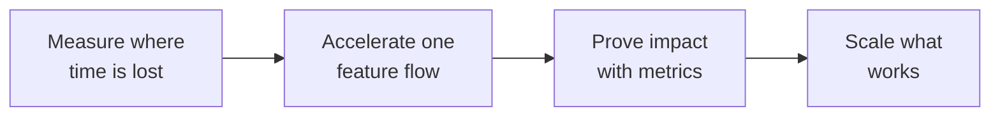

# More Features. Less Time per Feature.

> Accelerate the path from product intent to a validated feature in production—without increasing defects or rework.

%%
Internal links:
- [[Clients/AutoDS/ai-transformation-one-pager|Russian version]]
- [[Clients/AutoDS/ai-transformation-tender-prep|Tender preparation]]
- [[ai-transformation-mini-deck|AI-Native PDLC mini-deck]]
%%

## Delivery Objective

The objective is measurable delivery acceleration: more validated features and less time per feature. Existing AI practices matter when they remove waiting, clarification, rework, review, testing, or release delays across the full product-to-production flow.

The program quantifies the calendar days and engineering hours lost across 3–5 completed features and targets the constraint with the greatest impact on cycle time and throughput.

## 90-Day Acceleration Program

### 1. Find Where Time Is Lost

Map the current feature flow, establish baseline cycle time, throughput, defects, and rework, and select one team or feature type with the highest acceleration potential.

### 2. Accelerate One Feature Flow

Selected interventions may include:

- **agent-ready specifications:** machine-readable requirements, AI-generated acceptance criteria and edge cases, reviewed by Product;
- **controlled agentic delivery:** agents generate code, tests, and documentation within defined context and architecture constraints;
- **shift-left quality:** agentic review, automated quality and security checks, and an updated Definition of Done;
- **operating model changes:** explicit roles, human decision gates, metrics, and escalation paths.

### 3. Prove Impact and Scale

Compare cycle time, throughput, deployment frequency, defects, and rework with the baseline. Identify repeatable practices and provide the CTO with a decision package: scale, adjust, or stop.

**Primary outcome:** lower cycle time and higher throughput. **Guardrails:** defects and rework do not increase. Exact targets are agreed after the baseline.

## De-Risking the Decision

This is a delivery acceleration pilot, not a test of AI tools. After the baseline, AutoDS agrees success and exit criteria and proceeds only with evidence-supported interventions. Commercial terms can be staged.

## Engagement Models and Pricing

| Model                            | Base 90-day scope                                                                                                                                              | AutoDS role                       |    Fee from |
| -------------------------------- | -------------------------------------------------------------------------------------------------------------------------------------------------------------- | --------------------------------- | ----------: |
| **Independent Advisory**         | One team or feature flow; baseline, acceleration design, weekly leadership advisory, metrics, and decision package                                             | Coordinates execution             | **$40,000** |
| **Artel Transformation Support** | One or two connected workstreams; Independent Advisory plus project management, cross-functional coordination, and control of actions, dependencies, and risks | Owns decisions and implementation | **$70,000** |

Artel is Vladimir’s consulting team, combining executive advisory, project management, and targeted expertise. Data Science is available as a separate module. The final fixed fee depends on scope and engagement intensity.

## Case Snapshot — 3× Faster Delivery

|                           |                                                                                                                                                                                                                                             |
| ------------------------- | ------------------------------------------------------------------------------------------------------------------------------------------------------------------------------------------------------------------------------------------- |
| **Context**               | B2B marketplace with approximately 60 engineers; growth required more output without proportional headcount growth.                                                                                                                         |
| **Starting point**        | Delivery speed was constrained by manual execution and uneven agentic adoption across teams.                                                                                                                                                |
| **Transformation**        | Role redesign, agent-ready requirements, shift-left testing, CI/CD quality controls, adoption metrics, and a CTO-led enablement model.                                                                                                      |
| **Acceleration evidence** | The delivery cycle was reduced 3×—from three weeks to one. Within five months, selected teams moved 50–75% of their tasks into the agentic delivery flow. The primary constraint then shifted from execution to test strategy and coverage. |
| **Vladimir’s role**       | Advisor to Engineering Leadership as adoption owners: management cadence, adoption metrics, quality risks, accountability, and cross-functional change.                                                                                     |

**Vladimir Semenyuk — Former CTO & CIO | MBA**

## Next Step

**A 60-minute acceleration scoping session** with the CTO and relevant functional leaders to select the feature flow with the highest time-saving potential and confirm success criteria and fixed fee.
