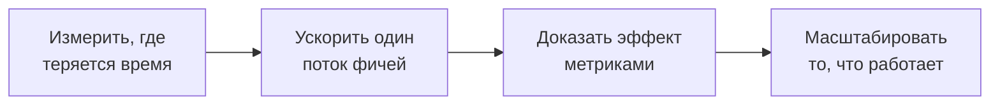

# Больше фичей. Меньше времени на каждую.

> Ускорить путь от продуктового намерения до проверенной фичи в production — без роста дефектов и переделок.

%%
Внутренние связи:
- [[Clients/AutoDS/ai-transformation-tender-prep|Подготовка к тендеру]]
- [[Clients/AutoDS/Антон/Context|Антон / AutoDS Context]]
- [[ai-transformation-mini-deck|Мини-презентация: AI-native PDLC]]
- [[Frameworks/maps/ai-pdlc|AI PDLC]]
%%

## Цель для поставки продукта

Цель — измеримое ускорение поставки: больше проверенных фичей и меньше времени на каждую. Существующие AI-практики имеют ценность, когда они сокращают ожидание, уточнения, переделки, проверки, тестирование или задержки выпуска во всем потоке от продукта до production.

Программа измеряет календарные дни и инженерные часы, потерянные на 3–5 завершенных фичах, и воздействует на ограничение с наибольшим влиянием на время цикла и объем поставки.

## 90-дневная программа ускорения

### 1. Найти, где теряется время

Описать текущий поток фичи, зафиксировать исходные показатели времени цикла, объема поставки, дефектов и переделок, выбрать одну команду или тип фичей с наибольшим потенциалом ускорения.

### 2. Ускорить один поток фичей

Возможные изменения:

- **готовые для AI-агентов спецификации:** машиночитаемые требования, сформированные AI критерии приемки и крайние случаи с проверкой со стороны Product;
- **управляемая агентная разработка:** агенты создают код, тесты и документацию в заданном контексте и архитектурных ограничениях;
- **shift-left качество:** агентная проверка, автоматический контроль качества и безопасности, обновленный Definition of Done;
- **изменение операционной модели:** явные роли, точки принятия решений людьми, метрики и порядок эскалации.

### 3. Доказать эффект и масштабировать

Сравнить с исходной точкой время цикла, объем поставки, частоту выпусков, дефекты и переделки. Определить повторяемые практики и подготовить для CTO пакет решений: масштабировать, скорректировать или остановить.

**Главный результат:** меньшее время цикла и больший объем поставки. **Ограничения:** дефекты и переделки не растут. Точные цели согласуются после сбора исходных данных.

## Снижение риска решения

Это пилот ускорения поставки, а не проверка AI-инструментов. После сбора исходных данных AutoDS согласует критерии успеха и остановки и продолжает только изменения, подтвержденные данными собственного потока фичей. Коммерческие условия можно разделить на этапы.

## Форматы участия и стоимость

| Формат | Базовый объем на 90 дней | Роль AutoDS | Цена от |
| --- | --- | --- | ---: |
| **Independent Advisory** | Одна команда или поток фичей; исходные данные, дизайн ускорения, еженедельная работа с руководителями, метрики и пакет решений | Координирует исполнение | **$40,000** |
| **Artel Transformation Support** | Один-два связанных потока; Independent Advisory, проектное управление, координация функций, контроль действий, зависимостей и рисков | Владеет решениями и реализацией | **$70,000** |

Artel — консалтинговая команда Владимира, объединяющая работу с руководителями, проектное управление и точечную экспертизу. Data Science доступна как отдельный модуль. Итоговая фиксированная стоимость зависит от объема и интенсивности сопровождения.

## Кейс — ускорение поставки в 3 раза

| | |
| --- | --- |
| **Контекст** | B2B-маркетплейс, около 60 инженеров; рост требовал увеличивать выпуск без пропорционального расширения штата. |
| **Отправная точка** | Скорость поставки ограничивали ручное исполнение и неравномерное внедрение агентного процесса по командам. |
| **Трансформация** | Пересборка ролей, готовые для агентов требования, shift-left тестирование, контрольные точки CI/CD, метрики внедрения и контур под мандатом CTO. |
| **Доказательство ускорения** | Цикл поставки сократился в 3 раза — с трех недель до одной. За пять месяцев отдельные команды перевели 50–75% задач в агентный процесс. После ускорения главное ограничение сместилось с исполнения на тестовую стратегию и покрытие. |
| **Роль Владимира** | Advisor для Engineering Managers как владельцев внедрения: управленческий ритм, метрики, риски качества, ответственность и изменения между функциями. |

**Владимир Семенюк — бывший CTO и CIO | MBA**

## Следующий шаг

**60-минутная встреча для определения контура ускорения** с CTO и соответствующими функциональными руководителями: выбрать поток фичей с наибольшим потенциалом сокращения времени и подтвердить критерии успеха и фиксированную стоимость.
