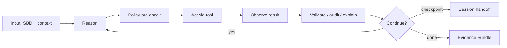

# Agent Runtime

Agent Runtime - среда исполнения вокруг LLM-модели, которая превращает стохастическую модель в управляемый инженерный исполнитель с контекстом, инструментами, правами, аудитом и восстановлением.

## Коротко

Модель генерирует рассуждение и действия. Runtime делает их пригодными для промышленной среды:

- переводит намерение и контекст в машиночитаемый вход;
- вызывает инструменты в пределах прав и квот;
- фиксирует наблюдения и результаты;
- применяет политики до и после действий;
- восстанавливает состояние при сбоях;
- создает аудит и объяснения.

Поэтому стратегический актив организации - не конкретная модель, а детерминированная оболочка вокруг нее.

## Базовый цикл

## Подсистемы runtime

| Подсистема | Зачем нужна |
| --- | --- |
| Sandbox executor | изоляция файлов, сети, секретов и вычислений |
| Tool registry & dispatch | управляемый доступ к инструментам и API |
| Policy Hook Framework | проверки до/после действия, остановка, откат |
| Context management | сжатие, доставка just-in-time, сохранение состояния |
| Long-running runtime | checkpoint, resume, handoff, планирование длительных сессий |
| Real-time explainability | структурированное объяснение действий |
| Append-only audit | доказуемый журнал действий агента |

## Long-running agents

Для длительных задач runtime должен поддерживать два цикла:

- внутренний: edit -> test -> run -> fix внутри одной сессии;
- внешний: progress -> checkpoint -> resume -> handoff -> next session.

Стандартный handoff включает:

- `init.sh` для восстановления среды;
- `progress.md` для состояния выполнения;
- `feature-list.json` для списка подзадач;
- evidence pointer для накопления [[Frameworks/ai-transformation/ai-pdlc/evidence-bundle|Evidence Bundle]].

## Связь с IDP

[[Frameworks/ai-transformation/internal-developer-platform|Internal Developer Platform]] - более широкий слой: спецификации, реестры, evals, политики, наблюдаемость, жизненный цикл агентов, экономику токенов и команды-владельцы.

Agent Runtime - центральный технический компонент IDP, где агент фактически действует.

## Риски без runtime

- агент работает с неполным или устаревшим контекстом;
- права задаются вручную и не пересчитываются по риску;
- long-running задачи теряют состояние;
- аудит неполный или не пригоден для расследования;
- shadow AI растет быстрее управляемой платформы;
- стоимость токенов не связана с результатом.

## Advisory use

Полезная формула для CTO:

> Если вы можете заменить модель, не переписывая рабочие процессы, у вас есть Agent Runtime. Если каждая модель требует перестройки процесса, у вас есть набор интеграций, а не платформа.

## Связанные заметки

- [[Frameworks/ai-transformation/internal-developer-platform|Internal Developer Platform]]
- [[Frameworks/ai-transformation/ai-pdlc/ai-native-pdlc|AI-native PDLC]]
- [[Frameworks/ai-transformation/ai-pdlc/governance-mesh|Governance Mesh]]
- [[Frameworks/ai-transformation/ai-pdlc/risk-adaptive-agent-autonomy-r0-r5|Risk-adaptive agent autonomy R0-R5]]
- [[Frameworks/ai-transformation/ai-pdlc/evidence-bundle|Evidence Bundle]]
