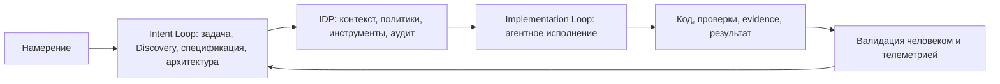

# AI-Disrupt PDLC Whitepaper 2026

## Коротко

Whitepaper описывает AI-Disrupt PDLC как переход от разработки вокруг кода к разработке вокруг намерения, спецификации и управляемого агентного исполнения.

Главный тезис: конкурентное преимущество будет определяться не доступом к AI-инструментам, а качеством среды, в которой люди формулируют намерения, агенты исполняют задачи, а платформа удерживает контекст, безопасность, аудит и проверку результата.

Документ полезен как executive-нарратив для обсуждения [[Frameworks/ai-transformation/ai-native-organization|AI-native organization]], [[Frameworks/ai-transformation/internal-developer-platform|Internal Developer Platform]] и перехода от локальной продуктивности разработчиков к управляемой операционной модели разработки.

## Самое важное для моей базы знаний

### 1. AI-трансформация разработки не сводится к инструментам

Документ проводит границу между AI как ассистентом и AI как изменением жизненного цикла разработки. Поверхностное внедрение copilot-инструментов дает локальный прирост, но не меняет способность организации создавать продукты быстрее и безопаснее.

Практический вывод:

> AI в разработке должен рассматриваться как изменение операционной модели, а не как закупка инструментов индивидуальной продуктивности.

### 2. Двухпетлевая модель разделяет намерение и исполнение

Модель делит разработку на два контура:

| Контур | Субъект | Такт | Основные артефакты |
| --- | --- | --- | --- |
| Intent Loop | человек | дни | постановка задачи, спецификация, архитектурные решения, валидация результата |
| Implementation Loop | агентная система | минуты / часы | код, проверки, автоматическая реализация по спецификации |

Между петлями стоит IDP. Без нее намерение и агентное исполнение не становятся единым процессом: контекст теряется, проверка ручная, а корпоративные правила не попадают в работу агента.

### 3. Harness важнее модели

Документ подчеркивает, что качество AI-native разработки определяется не только выбранной моделью, а всей средой вокруг нее: контекстом, инструментами, правами, аудитом, наблюдаемостью, политиками и маршрутом от спецификации до production.

Это близко к тезису [[Frameworks/governance/architecture-of-manageability|architecture of manageability]]: управляемость создается архитектурой среды, а не героизмом отдельных инженеров.

### 4. IDP становится точкой пересечения человека и агента

IDP в документе выполняет несколько функций:

- переводит намерение в формализованную спецификацию;
- поставляет агенту корпоративный контекст;
- подключает инструменты и мастер-системы через стандартизированные протоколы;
- фиксирует действия агентов, токены, события сжатия контекста и переходы между агентами;
- превращает корпоративные нормативы в часть рабочего контекста, а не в ручную проверку в конце.

Отдельно важен риск shadow AI: документ указывает, что без IDP значительная доля AI-взаимодействий может уходить в неуправляемые каналы, создавая риски утечки данных и регуляторные риски.

### 5. Три горизонта трансформации

Whitepaper предлагает не линейный план, а три горизонта движения:

| Горизонт | Смысл | Управленческий результат |
| --- | --- | --- |
| 1. Устранение ограничений | baseline метрик, дисциплина контекста и спецификаций, минимальный Agent Runtime, пилот | управляемая среда для предсказуемого агентного исполнения |
| 2. AI-native процессы | обязательный SDD, расширенная IDP, Golden Path, автоматические политики, мультиагентные сценарии | переход от отдельных агентов к процессам |
| 3. AI-native организация | агенты выполняют рутинное исполнение, люди держат намерение, архитектуру, надзор и продуктовую стратегию | новая структура ролей и ответственности |

### 6. Первый шаг начинается с измерения

В документе сильный управленческий тезис: AI-трансформация начинается не с выбора инструмента и не с найма AI-инженеров, а с фиксации baseline. Без точки отсчета организация не сможет отличить прогресс от набора ярких, но несравнимых эпизодов.

Минимальная последовательность первых решений:

- измерить текущее состояние инженерной организации;
- выбрать пилотную команду 3-5 инженеров;
- назначить AI Champion как фокус-точку накопления и распространения практик.

## Ключевые модели

### Двухпетлевая модель

### IDP как слой управляемости

| Функция IDP | Что меняет |
| --- | --- |
| Корпоративный контекст | агент не реконструирует правила организации каждый раз заново |
| Инструменты и протоколы | интеграции становятся стандартной поверхностью, а не набором ручных подключений |
| Observability | действия агента становятся проверяемыми |
| Политики и аудит | управление встраивается в процесс, а не прикручивается после реализации |
| Библиотека skills / workflows | успешные практики переиспользуются между командами |

## Практическая интерпретация для CEO / CTO / engineering leaders

- Для CEO: AI в разработке нужно оценивать не по количеству лицензий, а по способности организации быстрее превращать намерение в проверенный бизнес-результат.
- Для CTO: ключевая инвестиция не модель, а [[Frameworks/ai-transformation/ai-pdlc/agent-runtime|Agent Runtime]], IDP, контекст, evals, политики и повторяемые маршруты.
- Для CISO / risk leaders: безопасность должна быть встроена в спецификацию, права агента и журнал аудита, иначе скорость AI усилит поверхность риска.
- Для engineering leaders: главный сдвиг роли инженера - от ручного исполнения к формулированию намерения, спецификации, проверке и управлению контуром.

## Диагностические вопросы

- Есть ли baseline инженерных метрик до внедрения AI?
- Где сейчас находится граница между human intent и agent execution?
- Какие корпоративные правила агент получает как машиночитаемый контекст, а какие остаются в головах людей?
- Есть ли единая IDP или команды используют разрозненные AI-инструменты?
- Как организация фиксирует доказательства результата, а не только факт генерации кода?

## Возможные идеи для постов

- "AI в разработке не заменяет инженера. Он меняет дефицит: с кода на качество намерения."
- "Главный актив AI-native разработки - не модель, а среда исполнения вокруг модели."
- "Почему copilot-внедрение не равно AI-трансформации engineering."
- "Без baseline AI-трансформация превращается в набор несравнимых эпизодов."

## Ограничения и что проверить

- Документ является стратегическим whitepaper, а не независимым исследованием.
- Часть прогнозов и отраслевых чисел требует отдельного фактчекинга перед публичным использованием.
- Извлеченный PDF-текст содержит OCR/spacing-искажения; смысловые разделы читаются надежно, но дословные цитаты лучше сверять по оригинальному PDF.

## Связанные заметки

- [[Frameworks/ai-transformation/ai-pdlc/ai-native-pdlc|AI-native PDLC]]
- [[Frameworks/ai-transformation/ai-pdlc/agent-runtime|Agent Runtime]]
- [[Frameworks/ai-transformation/internal-developer-platform|Internal Developer Platform]]
- [[Frameworks/ai-transformation/ai-native-organization|AI-native organization]]
- [[Frameworks/ai-transformation/ai-pdlc/specification-driven-development|Specification-Driven Development]]
- [[Frameworks/ai-transformation/ai-pdlc/risk-adaptive-agent-autonomy-r0-r5|Risk-adaptive agent autonomy R0-R5]]

## Источник

- PDF: [[Frameworks/ai-transformation/ai-pdlc/sources/ai-disrupt-pdlc-whitepaper-2026.pdf|AI-Disrupt PDLC Whitepaper 2026]]
- Автор: Кирилл Меньшов, Сбер
- Дата: май 2026
