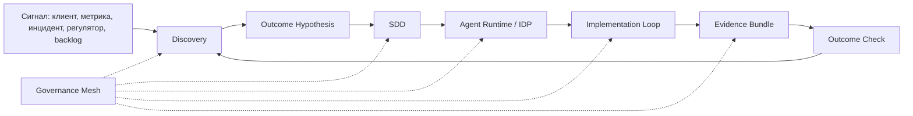

# AI-native PDLC

AI-native PDLC - операционная модель разработки, в которой человек отвечает за намерение, спецификацию, архитектурные решения и проверку результата, а агентная среда отвечает за ускоренное исполнение в заданных границах.

## Коротко

Сдвиг не в том, что код пишется быстрее. Сдвиг в том, что жизненный цикл разработки разделяется на два разных ритма:

- **Intent Loop**: формулирование возможности, Discovery, гипотеза результата, спецификация, карта участия человека.
- **Implementation Loop**: агентное исполнение, тесты, исправления, проверки, пакет доказательств, передача сессии.

Между ними нужен [[Frameworks/ai-transformation/internal-developer-platform|Internal Developer Platform]], иначе две петли работают параллельно, но не становятся единой управляемой системой.

## Модель

## Ключевые принципы

- Среда работы агента важнее модели: модель можно заменить, а [[Frameworks/ai-transformation/ai-pdlc/agent-runtime|Agent Runtime]] накапливает организационный контекст, проверки и аудит.
- Discovery важнее prompt: плохое намерение нельзя компенсировать длинной инструкцией агенту.
- Validation важнее скорости поставки: ускорение реализации без ускорения проверки создает новое узкое место.
- Управление в процессе важнее проверок постфактум: [[Frameworks/ai-transformation/ai-pdlc/governance-mesh|Governance Mesh]] должен быть встроен в спецификацию, runtime и аудит.

## Отличие от классического PDLC

| Элемент | Классический PDLC | AI-native PDLC |
| --- | --- | --- |
| Первичный артефакт | задача / код | намерение, SDD, eval plan, Evidence Bundle |
| Главный исполнитель | человек | человек + агентная среда |
| Ограничение скорости | человеческое исполнение | качество намерения, контекста и валидации |
| Контроль качества | ревью и тесты на поздних стадиях | evals, policy hooks, review agents и telemetry внутри процесса |
| Управление риском | stage gates | adaptive controls в runtime |

## Операционный минимум

Минимальный стартовый набор:

- Discovery-ритуалы: PR/FAQ, Outcome Hypothesis, решение "адаптация или перепроектирование".
- [[Frameworks/ai-transformation/ai-pdlc/specification-driven-development|SDD]] как контракт изменения.
- Review-agent в теневом режиме.
- Базовый [[Frameworks/ai-transformation/ai-pdlc/evidence-bundle|Evidence Bundle]].
- Метрики: lead time, change failure rate, Outcome Validation Rate, Reallocation Rate.

## Advisory use

Эта заметка полезна как рамка диагностики: клиент не "внедряет AI в разработку", пока у него нет изменения PDLC. До этого он внедряет инструменты индивидуальной продуктивности.

Вопрос для executive-дискуссии:

> Что в вашей инженерной организации изменилось в контуре намерения, проверки результата и управления риском, кроме появления AI-инструментов у разработчиков?

## Связанные заметки

- [[Frameworks/ai-transformation/ai-pdlc/specification-driven-development|Specification-Driven Development]]
- [[Frameworks/ai-transformation/ai-pdlc/evidence-bundle|Evidence Bundle]]
- [[Frameworks/ai-transformation/ai-pdlc/governance-mesh|Governance Mesh]]
- [[Frameworks/ai-transformation/ai-pdlc/agent-runtime|Agent Runtime]]
- [[Frameworks/ai-transformation/ai-pdlc/ai-native-engineering-metrics|AI-native engineering metrics]]
- [[Frameworks/governance/architecture-of-manageability|architecture of manageability]]
