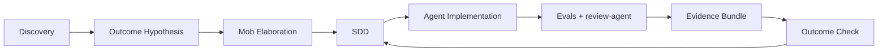

# Specification-Driven Development

Specification-Driven Development (SDD) - практика, в которой спецификация становится контрактом изменения между циклом намерения и циклом агентной реализации.

## Коротко

В AI-native PDLC SDD - не "длинный тикет" и не традиционное ТЗ. Это машиночитаемый контракт, который фиксирует:

- что меняется в существующей системе;
- зачем это изменение нужно;
- какую бизнес-гипотезу оно должно подтвердить;
- какой уровень автономии допустим;
- какие evals и regression checks обязательны;
- кто и когда валидирует результат;
- как будет доказано, что задача завершена.

## Почему SDD становится обязательным

Агент не обладает человеческой интуицией по поводу скрытых требований, истории системы и неформальных договоренностей. Если контекст не сформулирован явно, агент либо запрашивает уточнение, либо достраивает недостающие части сам.

SDD снижает эту неопределенность через явные контракты, инварианты, критерии приемки и план проверки.

## Обязательные блоки SDD

| Блок | Что фиксирует |
| --- | --- |
| Бизнес-контекст | зачем существует задача и кто заинтересован в результате |
| Outcome Hypothesis | метрика, leading indicator, период подтверждения, fallback |
| Класс применимости агента | deterministic / AI-augmented / AI-native / agentic |
| Autonomy Level | допустимый уровень R0-R5 |
| Human-in-the-loop Decision Map | кто и когда валидирует результат агента |
| Контракты с существующими модулями | инварианты, API, backward compatibility, feature flags |
| Acceptance criteria | условия приемки |
| Property-based + regression tests | новые свойства и защита legacy-путей |
| Eval Plan | capability, regression, session-length и escalation evals |
| Evidence Bundle Requirements | состав пакета доказательств |
| Pattern Library Reference | переиспользуемый шаблон или workflow |
| Rollback / Recovery Plan | как откатить или восстановить изменение |
| Post-deploy Outcome Check | как будет проверен результат после деплоя |

## Workflow SDD

## Типовые провалы

| Провал | Симптом | Структурная защита |
| --- | --- | --- |
| SDD как длинный тикет | много текста, мало контрактов и evals | template enforcement в IDP |
| SDD как ТЗ | слишком подробно описывает "как", не оставляя агенту свободы | обучение формулировать "что" и "зачем" |
| SDD без Discovery | спецификация формализует случайный запрос | обязательная ссылка на PR/FAQ и Outcome Hypothesis |
| SDD без human-in-the-loop map | либо over-validation, либо опасная автономия | явные точки проверки, владельцы, критерии, эскалация |

## Важное различение

SDD в этой рамке относится к доработке классических ИТ-систем: legacy core, ERP/CRM, internal services, продуктовые приложения.

Разработка агентных систем как продукта требует отдельной Agent Specification: там нужно описывать поведение агента, refusal behavior, escalation conditions, multi-turn coherence и red-teaming.

## Advisory use

SDD удобно использовать как диагностический инструмент зрелости:

> Если команда не может явно описать outcome, contracts, eval plan и human-in-the-loop map, она еще не готова масштабировать агентное исполнение.

## Связанные заметки

- [[Frameworks/ai-transformation/ai-pdlc/ai-native-pdlc|AI-native PDLC]]
- [[Frameworks/ai-transformation/ai-pdlc/evidence-bundle|Evidence Bundle]]
- [[Frameworks/ai-transformation/ai-pdlc/risk-adaptive-agent-autonomy-r0-r5|Risk-adaptive agent autonomy R0-R5]]
- [[Frameworks/ai-transformation/ai-pdlc/governance-mesh|Governance Mesh]]
- [[Frameworks/ai-transformation/internal-developer-platform|Internal Developer Platform]]
