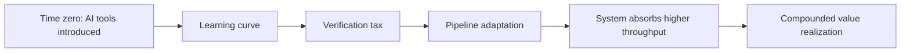
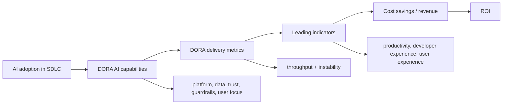
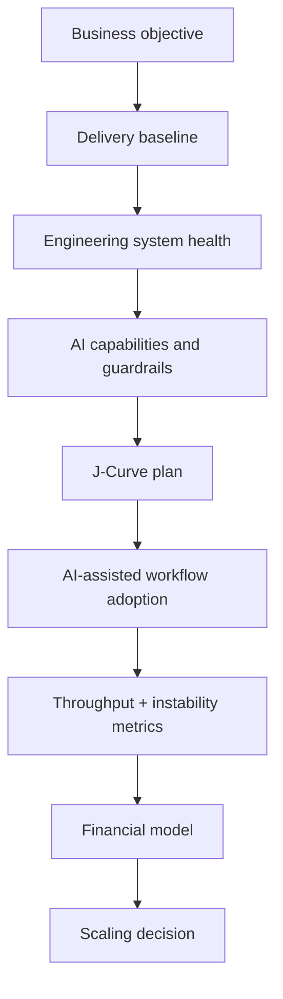

# DORA: The ROI of AI-assisted Software Development 2026

## Executive Summary

Отчет полезен как финансово-операционная рамка для оценки AI-assisted software development.

Главный тезис: AI в разработке является усилителем инженерной системы. Он повышает отдачу зрелых команд и одновременно усиливает хаос там, где слабые платформы, неясные workflow, ручная проверка, плохие данные и нестабильный delivery process.

Для advisory это источник под тезис:

- ROI от AI нельзя считать по количеству купленных лицензий или строк кода;
- базовая единица оценки - не индивидуальная продуктивность, а способность организации безопасно превращать возросший throughput в user value и business value;
- AI adoption почти неизбежно проходит через J-Curve: временное падение продуктивности, verification tax и перестройку pipeline;
- финансовая модель должна учитывать не только license cost, но и training, infrastructure, J-Curve cost, instability cost и governance cost;
- [[Frameworks/governance/architecture-of-manageability|architecture of manageability]] становится условием AI ROI: платформы, данные, guardrails, метрики и ownership важнее самой модели.

## Самое важное для моей базы знаний

### 1. AI is an amplifier

DORA формулирует AI не как standalone productivity tool, а как усилитель существующей инженерной системы.

Если система зрелая:

- есть качественный [[Frameworks/ai-transformation/internal-developer-platform|Internal Developer Platform]];
- deployment pipeline способен переваривать рост throughput;
- данные и документация пригодны для AI;
- code review, testing и security gates автоматизированы;
- команды ориентированы на user value;
- метрики throughput и instability уже измеряются.

Тогда AI быстрее превращается в delivery capacity и business value.

Если система слабая:

- AI ускоряет генерацию кода, но не ускоряет проверку, release и обратную связь;
- растет verification tax;
- растет change failure rate;
- локальная продуктивность теряется в downstream chaos;
- больше кода становится не активом, а будущей maintenance liability.

Практический вывод:

> AI-assisted development нужно внедрять как изменение [[Frameworks/governance/organizational-operating-model|organizational operating model]], а не как закупку developer tooling.

### 2. J-Curve: adoption сначала ухудшает систему, потом дает эффект

Отчет предлагает J-Curve of AI value realization:

- learning curve: команды учатся новым интерфейсам, prompt/context/specification practices;
- verification tax: разработчики тратят время на проверку AI output, hallucinations и security/architecture комплаенс;
- pipeline adaptation: testing, approvals и deployment process должны масштабироваться под больший поток изменений;
- eventual growth: value появляется после перестройки системы, а не сразу после выдачи лицензий.

Это важный управленческий тезис:

> ранний productivity dip не обязательно провал; провал начинается, когда leadership не заложил этот dip в budget, roadmap и expectations.

Для C-level это означает: AI ROI должен планироваться как transformation curve, а не как немедленная экономия.

### 3. Software delivery performance связывает engineering metrics с финансовым результатом

DORA предлагает оценивать AI через две группы delivery metrics:

| Группа      | Что показывает                       | Финансовый смысл                                    |
| ----------- | ------------------------------------ | --------------------------------------------------- |
| Throughput  | volume и velocity изменений          | быстрее time-to-market, раньше recognition of value |
| Instability | reliability и success rate изменений | rework, downtime, reputational risk, lost revenue   |

Высокий ROI возможен не от "больше кода", а от комбинации:

- high throughput;
- low instability;
- меньше rework;
- быстрее проверка гипотез;
- больше capacity для innovation.

Это хорошо ложится на рамку [[Frameworks/governance/decision-systems|decision systems]]:

> AI investment должен проходить через delivery dashboard, где velocity смотрят вместе с instability, cost и user value.

### 4. Productivity gains не равны headcount reduction

DORA явно не рекомендует строить AI case как сокращение headcount.

Логика отчета:

- saved engineering time лучше считать как reinvestment capacity;
- освобожденная емкость может заменить необходимость нанимать дополнительных разработчиков;
- retention и training дешевле, чем потеря институциональной памяти;
- headcount-reduction strategy ухудшает morale, culture и стимулы к улучшению процессов.

Формулировка для advisory:

> правильный AI ROI narrative для engineering - не "заменим разработчиков", а "снимем systemic toil и переведем capacity в innovation, experiments и user value".

### 5. ROI model полезен как conversation model, не как точная финансовая истина

Отчет прямо предупреждает: calculator - high-uncertainty estimate, который должен запускать обсуждение, а не подменять финансовую верификацию.

Особенно слабые места модели:

- revenue impact от дополнительных features трудно доказать;
- feature success rate требует локального baseline;
- productivity savings легко double count;
- downtime cost часто строится на грубых assumptions;
- эффект AI на legacy brownfield code ниже, чем на simple greenfield tasks.

Практический вывод:

> AI ROI model должен быть scenario-based и baseline-based. Без "before" организация будет спорить о мнениях, а не управлять investment case.

## Модели / фреймворки / формулы

### Модель 1. J-Curve of AI value realization



Управленческий смысл:

- J-Curve нужно бюджетировать заранее;
- dip зависит от technical maturity, learning culture и health of internal developer platforms;
- automated testing и continuous integration помогают сократить глубину и длительность dip;
- metrics должны показывать, что команда проходит через curve, а не просто пережидает хаос.

### Модель 2. Google Cloud value framework для AI-assisted software development

| Value pillar         | Как проявляется                                                 | Комментарий для advisory                           |
| -------------------- | --------------------------------------------------------------- | -------------------------------------------------- |
| Cost efficiency      | savings в development, IT infrastructure и broader IT processes | самый измеримый, но не единственный слой           |
| Productivity         | больше useful work и faster delivery                            | нельзя считать без verification tax                |
| Developer experience | меньше repetitive work, выше engagement, ниже attrition risk    | измерять survey и attrition, не только output      |
| User experience      | лучше product performance, быстрее iteration                    | связь с AI менее прямая, нужна cohort / NPS логика |
| Business growth      | leads, conversion, revenue                                      | самый важный, но самый сложный для attribution     |

Чем правее value pillar, тем слабее direct attribution к AI и тем сильнее нужна управленческая дисциплина измерения.

### Модель 3. From adoption to ROI



Ключевой смысл Figure 5:

- AI adoption сам по себе не равен value;
- capabilities превращают локальную скорость в управляемую систему;
- DORA metrics показывают, не покупается ли velocity ценой instability;
- financial value появляется как lagging indicator.

### Модель 4. Landscape of AI impact

Figure 4 показывает, что AI adoption в DORA 2025 связан не только с положительными эффектами.

| Outcome                       | Направление эффекта в отчете         | Advisory signal                                         |
| ----------------------------- | ------------------------------------ | ------------------------------------------------------- |
| Individual effectiveness      | positive, strongest effect           | главный прямой productivity signal                      |
| Software delivery instability | positive, second-largest effect      | ускорение создает risk/verification burden              |
| Organizational performance    | positive                             | эффект зависит от системы, не только от разработчика    |
| Valuable work                 | positive                             | AI может освобождать людей от части routine work        |
| Code quality                  | positive                             | качество может расти, если есть guardrails              |
| Product performance           | positive                             | связь с user value есть, но требует attribution         |
| Software delivery throughput  | positive                             | AI может увеличивать flow of changes                    |
| Team performance              | positive                             | командный эффект важнее индивидуального output          |
| Burnout                       | не подтверждено как простое снижение | technology alone не лечит burnout                       |
| Friction                      | не исчезает автоматически            | friction often moves into verification and coordination |

Ключевой вывод:

> AI может одновременно повышать productivity и instability. Поэтому AI ROI нельзя считать без stability metrics.

### Модель 5. Five systemic keys of adoption

| Key                         | Что значит                                                              | Риск при отсутствии                            |
| --------------------------- | ----------------------------------------------------------------------- | ---------------------------------------------- |
| Trust in AI                 | расчетная уверенность в AI output через правила, компетенции и проверку | deep J-Curve, ручное перепроверивание всего    |
| Clear AI stance             | понятная позиция организации по использованию AI                        | shadow practices, страх, inconsistent adoption |
| Quality internal platform   | IDP как context provider и risk mitigator для agents                    | AI генерирует bloat и архитектурные отклонения |
| AI-accessible internal data | documentation, APIs, knowledge graph, healthy data ecosystem            | generic output без business context            |
| Automated guardrails        | nonoptional quality/security gates, tests, CI, pre-commit checks        | рост incidents вместе с ростом throughput      |

### Модель 6. AI investment roadmap

| Этап                          | Primary investment                                                      | Метрики                                             |
| ----------------------------- | ----------------------------------------------------------------------- | --------------------------------------------------- |
| Build the context layer       | quality IDP, healthy data ecosystems, machine-readable documentation    | friction, lead time, reuse, context quality         |
| Empower the human in the loop | context engineering, verification training, trust in AI                 | verification tax, adoption, confidence, review load |
| Validate progress             | experiment frequency, deployment frequency, change failure rate, rework | early proof that system absorbs AI safely           |
| Scale financial value         | features, product outcomes, downtime reduction, reinvested capacity     | annual value, ROI, payback period                   |

### Формулы из отчета

```text
ROI (%) =
(Value - Investment) / Investment
```

```text
First year benefit =
First year return - First year investment
```

```text
Headcount reinvestment capacity =
Staff size * Fully loaded salary * Net time saved per developer
```

```text
Revenue from extra feature deployments =
(Target features deployed - Current features deployed)
* Idea success rate
* Revenue impact
* Portfolio revenue
```

```text
Downtime impact =
(Current deploys * Current CFR * FDRT * Cost of downtime per hour)
- (Target deploys * Target CFR * FDRT * Cost of downtime per hour)
```

```text
Direct hard costs =
((License cost + Additional AI costs + Training cost) * Staff size)
+ Additional infrastructure costs
```

```text
J-Curve cost =
Staff size * Salary * J-Curve productivity drop * J-Curve duration in months / 12
```

```text
First year investment =
Direct hard costs + J-Curve cost
```

```text
Payback period =
First year investment / First year return
```

```text
Adjusted scenario value = Baseline value * Value multiplier
Adjusted scenario cost = Baseline cost * Cost multiplier
```

## Цифры и доказательная база

### Findings из DORA / связанных источников внутри отчета

| Показатель                                                   |                                    Значение | Интерпретация                                                             |
| ------------------------------------------------------------ | ------------------------------------------: | ------------------------------------------------------------------------- |
| Respondents reporting AI increased productivity in DORA 2025 |                               more than 80% | сильный сигнал perceived productivity, но не полный ROI                   |
| AI productivity gain on simple greenfield tasks              |                                      35-40% | применимо к простым задачам, нельзя переносить на весь engineering        |
| AI productivity gain on complex legacy brownfield code       |                           often 10% or less | legacy context ограничивает эффект AI                                     |
| Raw inference cost decline                                   | factor of 280 between Nov 2022 and Oct 2024 | cost pressure смещается с inference к governance, verification, workflows |
| Google Cloud AI customer ROI                                 |               average 727% over three years | market signal из Google Cloud research, не DORA calculator                |
| Average AI payback period from Google Cloud global data      |                          about eight months | полезный benchmark, но зависит от контекста                               |
| Target payback for agile teams                               |                                  6-9 months | ориентир для сильных adoption cases                                       |
| Acceptable payback for larger enterprise rollouts            |                                12-18 months | governance-heavy transformations требуют длиннее horizon                  |
| Executives reporting ROI from at least one gen AI use case   |                                         78% | из Google Cloud ROI research                                              |
| Agentic AI early adopters seeing positive returns            |                                         88% | adoption depth коррелирует с value realization                            |

### Sample calculator inputs

| Input                                         | Sample value | Комментарий                                             |
| --------------------------------------------- | -----------: | ------------------------------------------------------- |
| Technical staff size                          |      500 FTE | includes SDLC roles, not only software engineers        |
| Fully loaded technical staff salary           |     $176,000 | blended rate; loaded cost varies by region              |
| Product portfolio revenue                     | $100,000,000 | annual revenue driven by software in scope              |
| Cost of downtime per hour                     |     $100,000 | includes lost revenue and reputational cost assumptions |
| Current deployments per year                  |           50 | about once per week                                     |
| Target deployments per year                   |           56 | 12% increase                                            |
| Current features per year                     |           50 | proxy based on deployments                              |
| Target features per year                      |           56 | 12% increase                                            |
| Idea success rate                             |          33% | about one-third of shipped features increase revenue    |
| Average revenue impact per successful feature |         0.5% | report recommends conservative 0.01-1% range            |
| Current change failure rate                   |           5% | baseline CFR                                            |
| Target change failure rate                    |           6% | 20% increase, reflecting instability tax                |
| Failed deployment recovery time               |      4 hours | kept constant in sample                                 |
| Net time saved per developer                  |        12.5% | about one hour of an eight-hour day                     |
| Annual AI license cost per user               |         $250 | slightly above $20/month                                |
| Additional annual AI costs per user           |          $80 | API/token or similar variable costs                     |
| Additional AI infrastructure costs            |     $100,000 | compute, networking, storage, monitoring                |
| Annual training costs per user                |       $9,600 | enablement and change cost                              |
| J-Curve productivity drop                     |          15% | temporary productivity decrease                         |
| J-Curve duration                              |     3 months | sample disruption period                                |

### Sample calculator outputs

| Output                                 |                   Sample value | Интерпретация                                           |
| -------------------------------------- | -----------------------------: | ------------------------------------------------------- |
| Total hard costs                       |                     $5,065,000 | tooling, AI costs, training, infrastructure             |
| J-Curve cost                           |                     $3,300,000 | financial equivalent of temporary productivity drop     |
| Total first-year investment            |                     $8,365,000 | hard costs plus J-Curve cost                            |
| Headcount reinvestment capacity        |                    $11,000,000 | avoided hiring / freed capacity for higher-value work   |
| Revenue from extra feature deployments |                       $990,000 | speculative, depends on success rate and revenue impact |
| Downtime impact                        |                      -$344,000 | instability tax in sample                               |
| Total first-year value                 |                    $11,646,000 | annual return in sample                                 |
| First-year benefit                     |                     $3,281,000 | annual return minus first-year investment               |
| ROI                                    |                            39% | sample only, not universal benchmark                    |
| Payback period                         | 0.7 years / about eight months | first-year investment divided by annual return          |

## Advisory interpretation

### Для CEO

- AI-assisted software development должен рассматриваться как investment in operating capacity, а не как IT tooling line item.
- Правильный вопрос: какая часть engineering bottlenecks будет снята и как это отразится на user value, revenue, downtime и optionality?
- Финансовая модель должна включать J-Curve, training, verification tax и instability risk.
- Не стоит обещать headcount reduction как основной ROI. Сильнее и безопаснее позиция: reinvested capacity и ускорение product learning.
- Если компания не измеряет delivery baseline, у нее нет надежного способа доказать AI ROI.

### Для CTO / VP Engineering

- AI rollout нужно начинать с оценки платформы, CI/CD, тестов, documentation quality и guardrails.
- Главный dashboard: throughput + instability + rework + experiment frequency.
- Internal Developer Platform становится не только developer experience tool, но и context/risk layer для AI agents.
- Verification tax должен быть отдельной метрикой или хотя бы управленческим объектом: review load, lead time, PR cycle time, defect escape, security review load.
- На legacy brownfield системах эффект AI нужно считать консервативно: контекст и architecture constraints важнее raw model capability.

### Для Engineering Managers

- AI adoption нужно встраивать в team workflow, а не оставлять на уровне индивидуальных привычек.
- Команды должны учиться писать context, intent и specifications, а не только prompts.
- Важно следить, не растет ли объем кода быстрее, чем способность команды его проверять и поддерживать.
- Если AI освобождает время, это время должно быть явно переинвестировано: experiments, quality, customer problems, tech debt reduction.
- Рост deployment frequency без контроля CFR и recovery time может ухудшить финансовый результат.

## Диагностические вопросы

- Есть ли baseline по lead time, deployment frequency, change failure rate, failed deployment recovery time и rework?
- Где сейчас bottleneck: code generation, review, testing, approvals, deployment, discovery или user feedback?
- Какой expected J-Curve: глубина productivity dip, длительность, affected teams, owner recovery plan?
- Кто отвечает за AI stance: что разрешено, где human-in-the-loop обязателен, какие outputs нельзя принимать без проверки?
- Достаточно ли IDP стандартизирован, чтобы AI agents могли безопасно действовать внутри платформы?
- Машиночитаема ли внутренняя документация: architecture decisions, APIs, service ownership, runbooks?
- Как измеряется verification tax: review time, reviewer load, rejected AI code, security findings, rework?
- Какой финансовый смысл у увеличения throughput: additional revenue, faster experiments, avoided hiring, reduced downtime?
- Не double count ли модель: один и тот же saved hour нельзя одновременно полностью считать как avoided hiring и как full revenue uplift.
- Что будет считаться evidence of ROI через 3, 6 и 12 месяцев?

## Возможные фреймворки на основе отчета

### AI ROI readiness stack



### AI-assisted engineering ROI equation

```text
AI-assisted engineering ROI =
reinvested engineering capacity
+ revenue from faster validated features
+ cost avoided through reduced downtime / rework
- AI tooling and infrastructure cost
- enablement cost
- J-Curve cost
- verification and governance cost
```

Это не прямая формула из отчета, а advisory-обобщение его логики.

### Experiment frequency as option value

DORA предлагает важную финансовую интерпретацию experiment frequency:

- каждый experiment/prototype - это option;
- AI снижает option premium, то есть стоимость создания варианта;
- организация "exercises the option" только после validation;
- высокая experiment frequency снижает риск большого upfront bet на неверную feature.

Это сильная связка между AI, product discovery и financial governance:

> AI повышает ROI не только через faster coding, но и через снижение стоимости управляемого поиска решений.

## Идеи для постов

### Пост 1: AI ROI нельзя считать по лицензиям

Hook:

> AI в разработке окупается не там, где купили Copilot всем инженерам. Он окупается там, где инженерная система умеет переварить рост скорости.

Тезис:

- AI увеличивает throughput;
- без платформы, тестов, данных и guardrails растет instability;
- ROI появляется, когда velocity превращается в user value, а не в больше rework.

### Пост 2: J-Curve как нормальная цена трансформации

Hook:

> Если после внедрения AI команда сначала стала медленнее, это не обязательно провал.

Тезис:

- есть learning curve;
- есть verification tax;
- есть adaptation of pipeline;
- провал не в dip, а в отсутствии budget и management system для выхода из него.

### Пост 3: Почему AI не должен быть headcount reduction case

Hook:

> Самая слабая версия AI ROI: "мы сократим разработчиков".

Тезис:

- DORA предлагает считать saved time как reinvestment capacity;
- высвобожденная емкость должна уходить в innovation, quality и experiments;
- сокращения ухудшают incentives и скрывают реальные bottlenecks.

## Связанные заметки

- [[Frameworks/ai-transformation/ai-native-organization|AI-native organization]]
- [[Frameworks/governance/architecture-of-manageability|architecture of manageability]]
- [[Frameworks/governance/decision-systems|decision systems]]
- [[Frameworks/governance/organizational-operating-model|organizational operating model]]
- [[Frameworks/governance/quality-and-risks|quality and risks]]
- [[Frameworks/governance/systemic-management|systemic management]]
- [[google-cloud-roi-of-ai-2025]]
- [[mit-nanda-genai-divide-state-of-ai-in-business-2025]]
- [[stanford-hai-ai-index-report-2025]]

## Source

- PDF: [[Frameworks/ai-transformation/sources/dora-roi-of-ai-assisted-software-development-2026.pdf|dora-roi-of-ai-assisted-software-development-2026.pdf]]
- Local file: `Frameworks/ai-transformation/sources/dora-roi-of-ai-assisted-software-development-2026.pdf`
- Extracted text: `/private/tmp/dora-roi-ai-2026.txt`
- License note in PDF: CC BY-NC-SA 4.0
- Citations in report retrieved: February 2026 unless otherwise noted
