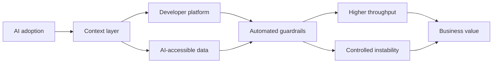
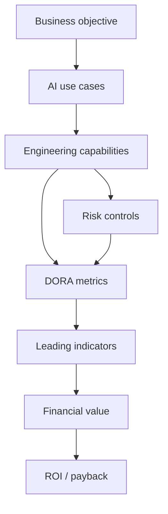

# DORA ROI of AI-assisted Software Development 2026

## Коротко

Отчет DORA полезен не как очередное доказательство, что AI повышает продуктивность, а как аргумент против инструментального внедрения AI.

Главная идея: **AI усиливает существующую инженерную систему**. В зрелой системе он увеличивает throughput и скорость экспериментов. В незрелой — ускоряет накопление технического долга, перегружает review / security / deployment pipeline и делает хаос дороже.

Для advisory это хороший источник под тезис:

- ROI от AI зависит не от покупки лицензий;
- ключевой актив — зрелость [[organizational operating model]];
- AI transformation должна начинаться с [[architecture of manageability]], а не с раскатки инструмента;
- экономический эффект появляется через снятие системных bottlenecks, а не через сокращение разработчиков.

## Самое важное для моей базы знаний

### 1. AI — усилитель организационной системы

DORA формулирует AI как amplifier:

- сильные инженерные системы получают больше value;
- слабые системы получают больше нестабильности;
- локальная продуктивность разработчика теряется, если downstream-процессы не готовы;
- AI повышает объем кода, а значит увеличивает нагрузку на verification, security, architecture и delivery.

Практический вывод:

> Нельзя оценивать AI adoption только по скорости написания кода. Нужно смотреть, выдерживает ли организационная система увеличенный поток изменений.

Для [[AI-native organization]] это означает: AI-ready компания — это не компания с доступом к моделям, а компания с управляемым контуром поставки изменений.

### 2. ROI лежит не в headcount reduction

DORA явно не рекомендует строить ROI-модель вокруг сокращения разработчиков.

Более правильная логика:

- AI освобождает capacity;
- capacity реинвестируется в продукт, эксперименты, устранение долга и инновации;
- экономический эффект считается как avoided cost, reduced rework, faster value delivery и lower downtime;
- удержание и развитие людей дешевле, чем замена и потеря institutional knowledge.

Полезная формула из отчета:

```text
Headcount reinvestment capacity =
Staff size * Fully loaded salary * Net time saved per developer
```

Интерпретация для CEO / CTO:

- вопрос не "сколько людей можно убрать";
- вопрос "какие bottlenecks мы можем убрать, чтобы та же команда производила больше бизнес-результата".

### 3. J-Curve — нормальная экономика внедрения AI

DORA предлагает ожидать временную просадку продуктивности в начале AI adoption.

Причины:

- learning curve: команда учится работать с новыми workflow;
- verification tax: растет объем проверки AI-generated output;
- pipeline adaptation: существующие review, test, security и release-процессы не успевают за ростом throughput.

Это важно для управления ожиданиями:

- первые месяцы могут выглядеть как ухудшение;
- это не обязательно провал;
- провалом становится отсутствие baseline, governance и системной работы с bottlenecks.

Формула для стоимости J-Curve:

```text
J-Curve cost =
Staff size * Salary * J-Curve drop * J-Curve duration / 12
```

В примере DORA:

| Параметр | Значение |
|---|---:|
| Technical staff | 500 FTE |
| Fully loaded salary | $176,000 |
| Productivity drop | 15% |
| Duration | 3 months |
| J-Curve cost | $3.3M |

### 4. Verification tax — центральный риск AI-assisted development

AI снижает стоимость генерации кода, но не отменяет стоимость понимания, проверки и эксплуатации.

Verification tax проявляется как:

- больше времени на code review;
- больше нагрузки на automated tests;
- рост change failure rate;
- увеличение lead time for changes;
- больше архитектурных решений, которые надо явно зафиксировать;
- риск code bloat и дублирования решений.

Практический вывод:

> Если verification не автоматизирована и не встроена в delivery system, AI ускоряет не value delivery, а производство непроверенной сложности.

### 5. DORA metrics становятся языком ROI

Отчет предлагает связывать AI investments с DORA software delivery performance:

| Метрика | Что показывает | Финансовая логика |
|---|---|---|
| Lead time for changes | скорость прохождения изменений | быстрее time-to-market |
| Deployment frequency | throughput системы | больше проверяемых продуктовых гипотез |
| Change failure rate | доля изменений с деградацией сервиса | стоимость нестабильности и rework |
| Failed deployment recovery time | время восстановления | стоимость downtime и операционного риска |

Для advisory это сильный мост между engineering metrics и board-level conversation:

- throughput = скорость монетизации изменений;
- instability = стоимость риска;
- rework = замороженная capacity;
- experiment frequency = финансовая optionality.

### 6. Experiment frequency как leading financial indicator

Один из самых полезных фрагментов отчета: AI повышает ценность не только через "быстрее писать код", а через снижение стоимости экспериментов.

Логика:

- большинство продуктовых идей не улучшают бизнес-метрики;
- AI снижает стоимость создания вариантов и прототипов;
- команда может проверять больше гипотез;
- организация "исполняет опцион" только там, где эксперимент доказал value.

Формулировка для фреймворка:

> AI снижает option premium в software development. Поэтому experiment frequency становится не инженерной vanity metric, а leading indicator качества инвестиционного процесса.

### 7. Пять организационных условий ROI

DORA выделяет системные условия, без которых AI value не масштабируется:

| Условие | Управленческий смысл |
|---|---|
| Clear AI stance / trust | команда понимает правила, ожидания и границы применения AI |
| Quality internal developer platform | AI и люди работают в стандартизированной среде |
| AI-accessible internal data | AI имеет доступ к актуальному техническому и бизнес-контексту |
| User-centric focus | скорость направлена на user value, а не на volume of code |
| Automated guardrails | проверка качества, security и compliance встроена в pipeline |

Это можно использовать как диагностический контур AI readiness:



## ROI-модель из отчета

Базовая формула:

```text
ROI (%) =
(Value - Investment) / Investment
```

### Value drivers

| Value driver | Как считать / оценивать |
|---|---|
| Headcount reinvestment capacity | высвобожденное время как avoided hiring cost |
| Revenue from extra features | дополнительные фичи * success rate * revenue impact |
| Downtime impact | изменение стоимости простоев из-за CFR и recovery time |
| Developer experience | качественный аргумент через retention, survey, attrition |
| User experience | linkage через NPS, cohort analysis, retention |

Формула revenue from extra features:

```text
(Target features - Current features)
* Idea success rate
* Revenue impact
* Portfolio revenue
```

Формула downtime impact:

```text
(Current deploys * Current CFR * FDRT * Downtime cost)
-
(Target deploys * Target CFR * FDRT * Downtime cost)
```

### Investment drivers

| Cost driver | Смысл |
|---|---|
| Licenses and usage fees | subscriptions, API, token costs |
| Infrastructure | compute, networking, storage, monitoring |
| Enablement | training, change management, context engineering |
| J-Curve cost | временная потеря productivity в период адаптации |
| Verification tax | косвенная стоимость проверки и governance |
| Maintenance and monitoring | drift, API changes, data upkeep, security |

Формула hard costs:

```text
Direct hard costs =
((License cost + Additional AI costs + Training cost) * Staff size)
+ Additional infrastructure costs
```

## Цифры из примера DORA

Это не benchmark, а демонстрационная модель.

| Показатель | Значение |
|---|---:|
| Staff size | 500 FTE |
| Fully loaded salary | $176,000 |
| Net time saved per developer | 12.5% |
| Annual AI license cost per user | $250 |
| Additional AI costs per user | $80 |
| Training cost per user | $9,600 |
| Additional AI infrastructure | $100,000 |
| Current deployments / year | 50 |
| Target deployments / year | 56 |
| Current CFR | 5% |
| Target CFR | 6% |
| FDRT | 4 hours |
| Cost of downtime / hour | $100,000 |
| J-Curve productivity drop | 15% |
| J-Curve duration | 3 months |

Результаты модели:

| Результат | Значение |
|---|---:|
| Total hard costs | $5.065M |
| J-Curve cost | $3.3M |
| Total first-year investment | $8.365M |
| Headcount reinvestment capacity | $11M |
| Revenue from extra features | $990K |
| Downtime impact | -$344K |
| Total first-year value | $11.646M |
| First-year benefit | $3.281M |
| ROI | 39% |
| Payback period | 0.7 years / около 8 месяцев |

## Advisory interpretation

### Для CEO

AI adoption не должен продаваться как tooling initiative.

Правильный вопрос:

- какие bottlenecks ограничивают скорость превращения инженерной работы в бизнес-результат;
- где AI снижает стоимость эксперимента;
- где AI увеличивает риск нестабильности;
- какие governance и delivery capabilities нужны до масштабирования.

### Для CTO / VP Engineering

AI strategy должна быть связана с инженерной системой:

- developer platform;
- CI / CD;
- automated testing;
- architecture decision records;
- internal documentation;
- code ownership;
- small batches;
- observability;
- security guardrails.

Без этого AI увеличивает throughput на входе и congestion на выходе.

### Для Engineering Managers

Роль менеджера смещается:

- от контроля занятости к управлению потоком value;
- от оценки individual output к оценке system throughput;
- от "использует ли команда AI" к "уменьшает ли AI rework и bottlenecks";
- от локальной productivity к командной способности безопасно менять систему.

## Диагностические вопросы

### AI readiness

- Есть ли baseline по DORA metrics до внедрения AI?
- Где сейчас главный bottleneck: coding, review, testing, security, deployment, product validation?
- Что произойдет, если объем кода вырастет на 20-40%?
- Есть ли понятная AI stance: что можно, что нельзя, кто отвечает?
- Есть ли internal documentation, пригодная для машинного чтения?
- Может ли AI agent понять архитектурные стандарты команды?

### ROI readiness

- Какой value driver мы считаем главным: productivity, avoided hiring, revenue, downtime, retention?
- Согласен ли CFO с логикой расчета?
- Как мы считаем J-Curve cost?
- Где учитывается verification tax?
- Что будет считаться leading indicator в первые 3 месяца?
- Когда ожидается payback: 6-9 месяцев, 12-18 месяцев или дольше?

### Risk readiness

- Что будет происходить с change failure rate?
- Где AI может увеличить technical debt?
- Какие проверки должны стать nonoptional?
- Где возможен shadow AI?
- Что нужно автоматизировать до широкого rollout?

## Возможные фреймворки на основе отчета

### 1. AI ROI Operating Model



### 2. AI Adoption Risk Equation

```text
AI ROI =
Local productivity gains
- Verification tax
- Instability cost
- Coordination drag
+ Experiment optionality
+ Reinvested engineering capacity
```

### 3. AI-native Engineering System

Минимальные компоненты:

- clear AI stance;
- context layer;
- internal developer platform;
- AI-accessible documentation;
- automated quality and security gates;
- user-centric product discovery;
- DORA metrics baseline;
- scenario-based ROI model.

## Связанные заметки

- [[AI-native organization]]
- [[architecture of manageability]]
- [[decision systems]]
- [[organizational operating model]]
- [[quality and risks]]
- [[systemic management]]
- [[Три взгляда на ROI от внедрения ИИ]]
- [[ИИ делает команды продуктивнее и слабее.]]

## Идеи для постов

### Пост 1: AI не снижает стоимость разработки, он снижает стоимость эксперимента

Hook:

> Главная ошибка в расчете ROI от AI — считать сэкономленные часы разработчиков.

Тезис:

- AI важен не только тем, что быстрее пишет код;
- он снижает стоимость продуктовых опционов;
- больше экспериментов = выше шанс найти работающий value;
- но только если delivery system выдерживает поток.

### Пост 2: Verification tax съедает AI productivity

Hook:

> AI ускоряет написание кода. Но не ускоряет доверие к нему.

Тезис:

- генерация стала дешевой;
- проверка осталась дорогой;
- без guardrails компании получают не ROI, а рост review bottleneck;
- зрелость AI adoption видна по тому, как устроена verification system.

### Пост 3: AI transformation начинается не с модели, а с operating model

Hook:

> Покупка AI-инструментов не делает компанию AI-native.

Тезис:

- AI усиливает текущую систему;
- слабая система получает больше хаоса;
- сильная система получает больше throughput;
- CEO / CTO должны проектировать AI adoption как изменение operating model.

## Source

- PDF: `/Users/vladimir/Downloads/dora-roi-of-ai-assisted-software-development-2026 (1).pdf`
- Report: DORA ROI of AI-assisted Software Development, Google Cloud DORA, v. 2026.1
- License in report: CC BY-NC-SA 4.0
- Calculator: https://dora.dev/ai/roi/calculator
- DORA AI research: https://dora.dev/ai
