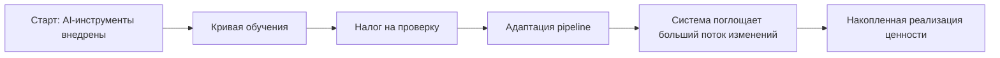
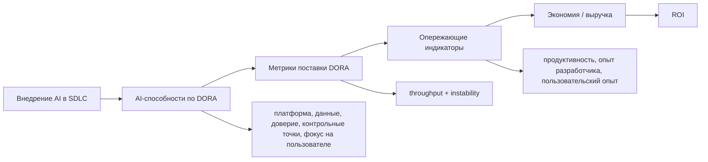
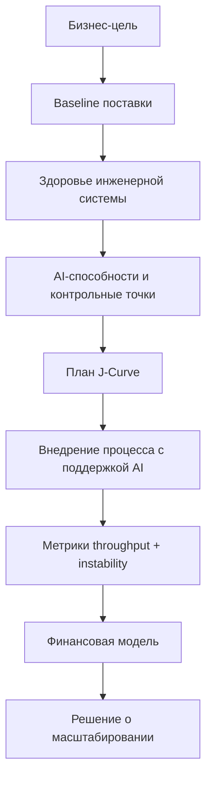

# DORA: The ROI of AI-assisted Software Development 2026

## Резюме

Отчет полезен как финансово-операционная рамка для оценки разработки ПО с поддержкой AI.

Главный тезис: AI в разработке является усилителем инженерной системы. Он повышает отдачу зрелых команд и одновременно усиливает хаос там, где слабые платформы, неясные процессы, ручная проверка, плохие данные и нестабильный процесс поставки.

Для консультационной работы это источник под тезис:

- ROI от AI нельзя считать по количеству купленных лицензий или строк кода;
- базовая единица оценки - не индивидуальная продуктивность, а способность организации безопасно превращать возросшую пропускную способность изменений в ценность для пользователей и бизнеса;
- внедрение AI почти неизбежно проходит через J-Curve: временное падение продуктивности, налог на проверку и перестройку pipeline поставки;
- финансовая модель должна учитывать не только стоимость лицензий, но и обучение, инфраструктуру, стоимость J-Curve, стоимость нестабильности и управленческого контура;
- [[Frameworks/governance/architecture-of-manageability|architecture of manageability]] становится условием AI ROI: платформы, данные, контрольные точки, метрики и зоны ответственности важнее самой модели.

## Самое важное для моей базы знаний

### 1. AI как усилитель инженерной системы

DORA формулирует AI не как отдельный инструмент продуктивности, а как усилитель существующей инженерной системы.

Если система зрелая:

- есть качественный [[Frameworks/ai-transformation/internal-developer-platform|Internal Developer Platform]];
- pipeline поставки способен переваривать рост пропускной способности изменений;
- данные и документация пригодны для AI;
- code review, тестирование и контрольные точки безопасности автоматизированы;
- команды ориентированы на ценность для пользователя;
- метрики throughput и instability уже измеряются.

Тогда AI быстрее превращается в способность поставки и ценность для бизнеса.

Если система слабая:

- AI ускоряет генерацию кода, но не ускоряет проверку, выпуск и обратную связь;
- растет налог на проверку;
- растет change failure rate;
- локальная продуктивность теряется в последующем хаосе;
- больше кода становится не активом, а будущим обязательством по сопровождению.

Практический вывод:

> Разработку с поддержкой AI нужно внедрять как изменение [[Frameworks/governance/organizational-operating-model|организационной операционной модели]], а не как закупку инструментов для разработчиков.

### 2. J-Curve: внедрение сначала ухудшает систему, потом дает эффект

Отчет предлагает J-Curve реализации ценности AI:

- кривая обучения: команды осваивают новые интерфейсы, практики prompt, контекста и спецификаций;
- налог на проверку: разработчики тратят время на проверку вывода AI, галлюцинаций и соблюдения требований безопасности и архитектуры;
- адаптация pipeline: тестирование, согласования и процесс поставки должны масштабироваться под больший поток изменений;
- последующий рост: ценность появляется после перестройки системы, а не сразу после выдачи лицензий.

Это важный управленческий тезис:

> раннее падение продуктивности не обязательно провал; провал начинается, когда руководство не заложило это падение в бюджет, план развития и ожидания.

Для C-level это означает: AI ROI должен планироваться как кривая трансформации, а не как немедленная экономия.

### 3. Результативность поставки ПО связывает инженерные метрики с финансовым результатом

DORA предлагает оценивать AI через две группы метрик поставки:

| Группа      | Что показывает                       | Финансовый смысл                                    |
| ----------- | ------------------------------------ | --------------------------------------------------- |
| Throughput  | объем и скорость изменений           | быстрее выход на рынок, раньше признание ценности   |
| Instability | надежность и успешность изменений    | доработка, простой, репутационный риск, потеря выручки |

Высокий ROI возможен не от "больше кода", а от комбинации:

- высокий throughput;
- низкая instability;
- меньше доработок;
- быстрее проверка гипотез;
- больше ресурса для инноваций.

Это хорошо ложится на рамку [[Frameworks/governance/decision-systems|систем принятия решений]]:

> инвестиции в AI должны проходить через панель поставки, где скорость изменений смотрят вместе с нестабильностью, стоимостью и ценностью для пользователя.

### 4. Рост продуктивности не равен сокращению команды

DORA явно не рекомендует строить AI-кейс как сокращение численности команды.

Логика отчета:

- сохраненное инженерное время лучше считать как ресурс для переинвестирования;
- освобожденная емкость может заменить необходимость нанимать дополнительных разработчиков;
- удержание людей и обучение дешевле, чем потеря институциональной памяти;
- стратегия сокращения команды ухудшает мораль, культуру и стимулы к улучшению процессов.

Формулировка для консультационной работы:

> правильная логика AI ROI для инженерной организации - не "заменим разработчиков", а "снимем системную операционную нагрузку и переведем ресурс в инновации, эксперименты и ценность для пользователя".

### 5. Модель ROI полезна как модель обсуждения, а не как точная финансовая истина

Отчет прямо предупреждает: калькулятор - оценка с высокой неопределенностью, которая должна запускать обсуждение, а не подменять финансовую верификацию.

Особенно слабые места модели:

- влияние дополнительных функций на выручку трудно доказать;
- доля успешных функций требует локального baseline;
- экономию продуктивности легко посчитать дважды;
- стоимость простоя часто строится на грубых допущениях;
- эффект AI на legacy brownfield code ниже, чем на простых greenfield-задачах.

Практический вывод:

> модель AI ROI должна опираться на сценарии и baseline. Без состояния "до" организация будет спорить о мнениях, а не управлять инвестиционным кейсом.

## Модели / фреймворки / формулы

### Модель 1. J-Curve реализации ценности AI



Управленческий смысл:

- J-Curve нужно бюджетировать заранее;
- падение зависит от технической зрелости, культуры обучения и состояния IDP;
- автоматизированное тестирование и continuous integration помогают сократить глубину и длительность падения;
- метрики должны показывать, что команда проходит через кривую, а не просто пережидает хаос.

### Модель 2. Рамка ценности Google Cloud для разработки ПО с поддержкой AI

| Компонент ценности   | Как проявляется                                                 | Комментарий для консультационной работы            |
| -------------------- | --------------------------------------------------------------- | -------------------------------------------------- |
| Экономическая эффективность | экономия в разработке, IT-инфраструктуре и смежных IT-процессах | самый измеримый, но не единственный слой |
| Продуктивность       | больше полезной работы и быстрее поставка                      | нельзя считать без налога на проверку              |
| Опыт разработчика    | меньше повторяющейся работы, выше вовлеченность, ниже риск оттока | измерять опросы и отток, не только результат       |
| Пользовательский опыт | лучше результативность продукта, быстрее итерации              | связь с AI менее прямая, нужна когортная / NPS-логика |
| Рост бизнеса         | лиды, конверсия, выручка                                        | самый важный, но самый сложный для атрибуции       |

Чем правее компонент ценности, тем слабее прямая атрибуция к AI и тем сильнее нужна управленческая дисциплина измерения.

### Модель 3. От внедрения к ROI



Ключевой смысл Figure 5:

- внедрение AI само по себе не равно ценности;
- способности превращают локальную скорость в управляемую систему;
- метрики DORA показывают, не покупается ли скорость изменений ценой нестабильности;
- финансовая ценность появляется как запаздывающий индикатор.

### Модель 4. Карта влияния AI

Figure 4 показывает, что внедрение AI в DORA 2025 связано не только с положительными эффектами.

| Результат                     | Направление эффекта в отчете         | Сигнал для консультационной работы                      |
| ----------------------------- | ------------------------------------ | ------------------------------------------------------- |
| Индивидуальная результативность | положительный, самый сильный эффект | главный прямой сигнал продуктивности                    |
| Нестабильность поставки ПО    | положительный, второй по силе эффект | ускорение создает риск и нагрузку на проверку           |
| Результативность организации  | положительный                        | эффект зависит от системы, не только от разработчика    |
| Ценная работа                 | положительный                        | AI может освобождать людей от части рутинной работы     |
| Качество кода                 | положительный                        | качество может расти, если есть контрольные точки       |
| Результативность продукта     | положительный                        | связь с ценностью для пользователя есть, но требует атрибуции |
| Пропускная способность поставки ПО | положительный                   | AI может увеличивать поток изменений                    |
| Результативность команды      | положительный                        | командный эффект важнее индивидуального результата      |
| Выгорание                     | не подтверждено как простое снижение | технология сама по себе не лечит выгорание              |
| Трение                        | не исчезает автоматически            | трение часто переезжает в проверку и координацию        |

Ключевой вывод:

> AI может одновременно повышать продуктивность и нестабильность. Поэтому AI ROI нельзя считать без метрик стабильности.

### Модель 5. Пять системных ключей внедрения

| Ключ                        | Что значит                                                              | Риск при отсутствии                            |
| --------------------------- | ----------------------------------------------------------------------- | ---------------------------------------------- |
| Доверие к AI                | расчетная уверенность в выводе AI через правила, компетенции и проверку | глубокая J-Curve, ручное перепроверивание всего |
| Понятная позиция по AI      | ясные правила организации по использованию AI                           | теневые практики, страх, несогласованное внедрение |
| Качественная внутренняя платформа | IDP как поставщик контекста и слой снижения рисков для AI agents   | AI генерирует лишний код и архитектурные отклонения |
| Внутренние данные, доступные для AI | документация, API, knowledge graph, здоровая экосистема данных | общий вывод без бизнес-контекста               |
| Автоматизированные контрольные точки | обязательные quality/security gates, тесты, CI, pre-commit checks | рост инцидентов вместе с ростом throughput     |

### Модель 6. Дорожная карта инвестиций в AI

| Этап                          | Основная инвестиция                                                     | Метрики                                             |
| ----------------------------- | ----------------------------------------------------------------------- | --------------------------------------------------- |
| Построить слой контекста      | качественная IDP, здоровые экосистемы данных, машиночитаемая документация | трение, lead time, повторное использование, качество контекста |
| Усилить человека в контуре    | context engineering, обучение проверке, доверие к AI                   | налог на проверку, внедрение, уверенность, нагрузка на review |
| Проверить прогресс            | частота экспериментов, частота поставок, change failure rate, доработки | раннее доказательство, что система безопасно поглощает AI |
| Масштабировать финансовую ценность | функции, продуктовые результаты, снижение простоя, переинвестированный ресурс | годовая ценность, ROI, срок окупаемости |

### Формулы из отчета

```text
ROI (%) =
(Ценность - Инвестиции) / Инвестиции
```

```text
Выгода первого года =
Отдача первого года - Инвестиции первого года
```

```text
Ресурс для переинвестирования =
Размер команды * Полная стоимость сотрудника * Чистая экономия времени на разработчика
```

```text
Выручка от дополнительных поставок функций =
(Целевые поставленные функции - Текущие поставленные функции)
* Доля успешных идей
* Влияние на выручку
* Выручка портфеля
```

```text
Влияние простоя =
(Текущие поставки * Текущий CFR * FDRT * Стоимость часа простоя)
- (Целевые поставки * Целевой CFR * FDRT * Стоимость часа простоя)
```

```text
Прямые затраты =
((Стоимость лицензии + Дополнительные AI-затраты + Стоимость обучения) * Размер команды)
+ Дополнительные инфраструктурные затраты
```

```text
Стоимость J-Curve =
Размер команды * Зарплата * Падение продуктивности на J-Curve * Длительность J-Curve в месяцах / 12
```

```text
Инвестиции первого года =
Прямые затраты + Стоимость J-Curve
```

```text
Срок окупаемости =
Инвестиции первого года / Отдача первого года
```

```text
Скорректированная ценность сценария = Baseline-ценность * Множитель ценности
Скорректированная стоимость сценария = Baseline-стоимость * Множитель стоимости
```

## Цифры и доказательная база

### Выводы из DORA / связанных источников внутри отчета

| Показатель                                                   |                                    Значение | Интерпретация                                                             |
| ------------------------------------------------------------ | ------------------------------------------: | ------------------------------------------------------------------------- |
| Респонденты DORA 2025, сообщившие о росте продуктивности от AI |                               более 80% | сильный сигнал воспринимаемой продуктивности, но не полный ROI |
| Прирост продуктивности AI на простых greenfield-задачах      |                                      35-40% | применимо к простым задачам, нельзя переносить на всю инженерную организацию |
| Прирост продуктивности AI на сложном legacy brownfield code   |                           часто 10% или меньше | legacy-контекст ограничивает эффект AI                    |
| Снижение базовой стоимости inference                          | в 280 раз между ноябрем 2022 и октябрем 2024 | давление затрат смещается с inference к управлению, проверке и процессам |
| ROI клиентов Google Cloud от AI                               |               в среднем 727% за три года | рыночный сигнал из исследования Google Cloud, не калькулятор DORA |
| Средний срок окупаемости AI по глобальным данным Google Cloud |                          около восьми месяцев | полезный ориентир, но зависит от контекста                 |
| Целевой срок окупаемости для agile-команд                     |                                  6-9 месяцев | ориентир для сильных кейсов внедрения                     |
| Приемлемый срок окупаемости для крупных корпоративных внедрений |                                12-18 месяцев | трансформации с тяжелым управленческим контуром требуют более длинного горизонта |
| Руководители, сообщившие о ROI хотя бы от одного gen AI use case |                                         78% | из исследования ROI Google Cloud                          |
| Ранние пользователи agentic AI с положительной отдачей        |                                         88% | глубина внедрения коррелирует с реализацией ценности      |

### Пример входных данных калькулятора

| Входной параметр                              | Пример значения | Комментарий                                             |
| --------------------------------------------- | --------------: | ------------------------------------------------------- |
| Размер технической команды                    |         500 FTE | включает роли SDLC, не только разработчиков             |
| Полная стоимость технического сотрудника      |        $176,000 | смешанная ставка; полная стоимость зависит от региона   |
| Выручка продуктового портфеля                 |    $100,000,000 | годовая выручка от ПО в выбранной рамке                 |
| Стоимость часа простоя                        |        $100,000 | включает допущения о потере выручки и репутационных затратах |
| Текущие поставки в год                        |              50 | примерно раз в неделю                                   |
| Целевые поставки в год                        |              56 | рост на 12%                                             |
| Текущие функции в год                         |              50 | proxy на основе поставок                                |
| Целевые функции в год                         |              56 | рост на 12%                                             |
| Доля успешных идей                            |             33% | примерно треть поставленных функций увеличивает выручку |
| Среднее влияние успешной функции на выручку   |            0.5% | отчет рекомендует консервативный диапазон 0.01-1%       |
| Текущий change failure rate                   |              5% | baseline CFR                                            |
| Целевой change failure rate                   |              6% | рост на 20%, отражает налог нестабильности              |
| Время восстановления после неудачной поставки |         4 часа | в примере сохраняется постоянным                        |
| Чистая экономия времени на разработчика       |           12.5% | примерно один час из восьмичасового дня                 |
| Годовая стоимость AI-лицензии на пользователя |            $250 | немного выше $20/месяц                                  |
| Дополнительные годовые AI-затраты на пользователя |         $80 | API/токены или похожие переменные затраты               |
| Дополнительные затраты на AI-инфраструктуру   |        $100,000 | вычисления, сеть, хранение, мониторинг                  |
| Годовые затраты на обучение на пользователя   |          $9,600 | поддержка внедрения и стоимость изменений               |
| Падение продуктивности на J-Curve             |             15% | временное снижение продуктивности                       |
| Длительность J-Curve                          |        3 месяца | примерный период нарушения работы                       |

### Пример результатов калькулятора

| Результат                              |                Пример значения | Интерпретация                                           |
| -------------------------------------- | -----------------------------: | ------------------------------------------------------- |
| Общие прямые затраты                   |                     $5,065,000 | инструменты, AI-затраты, обучение, инфраструктура       |
| Стоимость J-Curve                      |                     $3,300,000 | финансовый эквивалент временного падения продуктивности |
| Общая инвестиция первого года          |                     $8,365,000 | прямые затраты плюс стоимость J-Curve                   |
| Ресурс для переинвестирования          |                    $11,000,000 | предотвращенный найм / высвобожденный ресурс для более ценной работы |
| Выручка от дополнительных поставок функций |                    $990,000 | спекулятивно; зависит от доли успеха и влияния на выручку |
| Влияние простоя                        |                      -$344,000 | налог нестабильности в примере                          |
| Общая ценность первого года            |                    $11,646,000 | годовая отдача в примере                                |
| Выгода первого года                    |                     $3,281,000 | годовая отдача минус инвестиция первого года            |
| ROI                                    |                            39% | только пример, не универсальный ориентир                |
| Срок окупаемости                       | 0.7 года / около восьми месяцев | инвестиция первого года, деленная на годовую отдачу     |

## Консультационная интерпретация

### Для CEO

- Разработку ПО с поддержкой AI нужно рассматривать как инвестицию в операционную способность, а не как строку IT-инструментов.
- Правильный вопрос: какая часть инженерных узких мест будет снята и как это отразится на ценности для пользователя, выручке, простое и стратегической опциональности?
- Финансовая модель должна включать J-Curve, обучение, налог на проверку и риск нестабильности.
- Не стоит обещать сокращение команды как основной ROI. Сильнее и безопаснее позиция: переинвестированный ресурс и ускорение продуктового обучения.
- Если компания не измеряет baseline поставки, у нее нет надежного способа доказать AI ROI.

### Для CTO / VP Engineering

- Внедрение AI нужно начинать с оценки платформы, CI/CD, тестов, качества документации и контрольных точек.
- Главная панель управления: throughput + instability + доработки + частота экспериментов.
- Internal Developer Platform становится не только инструментом для опыта разработчика, но и контекстным риск-контуром для AI agents.
- Налог на проверку должен быть отдельной метрикой или хотя бы управленческим объектом: нагрузка на review, lead time, PR cycle time, утечки дефектов, нагрузка на security review.
- На legacy brownfield системах эффект AI нужно считать консервативно: контекст и архитектурные ограничения важнее базовых возможностей модели.

### Для Engineering Managers

- Внедрение AI нужно встраивать в командный процесс, а не оставлять на уровне индивидуальных привычек.
- Команды должны учиться писать контекст, намерение и спецификации, а не только prompts.
- Важно следить, не растет ли объем кода быстрее, чем способность команды его проверять и поддерживать.
- Если AI освобождает время, это время должно быть явно переинвестировано: эксперименты, качество, клиентские проблемы, снижение технического долга.
- Рост deployment frequency без контроля CFR и времени восстановления может ухудшить финансовый результат.

## Диагностические вопросы

- Есть ли baseline по lead time, deployment frequency, change failure rate, failed deployment recovery time и доработкам?
- Где сейчас узкое место: генерация кода, review, тестирование, согласования, поставка, discovery или обратная связь от пользователей?
- Какая ожидается J-Curve: глубина падения продуктивности, длительность, затронутые команды, владелец плана восстановления?
- Кто отвечает за позицию по AI: что разрешено, где human-in-the-loop обязателен, какие результаты нельзя принимать без проверки?
- Достаточно ли IDP стандартизирован, чтобы AI agents могли безопасно действовать внутри платформы?
- Машиночитаема ли внутренняя документация: архитектурные решения, API, зоны ответственности сервисов, runbooks?
- Как измеряется налог на проверку: время review, нагрузка на reviewer, отклоненный AI-код, выводы security review, доработки?
- Какой финансовый смысл у увеличения throughput: дополнительная выручка, более быстрые эксперименты, предотвращенный найм, снижение простоя?
- Не считает ли модель одно и то же дважды: один и тот же сохраненный час нельзя одновременно полностью считать как предотвращенный найм и как полный прирост выручки.
- Что будет считаться доказательством ROI через 3, 6 и 12 месяцев?

## Возможные фреймворки на основе отчета

### Стек готовности к AI ROI



### Уравнение ROI для инженерии с поддержкой AI

```text
ROI инженерии с поддержкой AI =
переинвестированный инженерный ресурс
+ выручка от быстрее проверенных функций
+ затраты, предотвращенные за счет снижения простоя / доработок
- стоимость AI-инструментов и инфраструктуры
- стоимость поддержки внедрения
- стоимость J-Curve
- стоимость проверки и управленческого контура
```

Это не прямая формула из отчета, а консультационное обобщение его логики.

### Частота экспериментов как опционная ценность

DORA предлагает важную финансовую интерпретацию частоты экспериментов:

- каждый эксперимент или прототип - это опцион;
- AI снижает премию опциона, то есть стоимость создания варианта;
- организация реализует опцион только после валидации;
- высокая частота экспериментов снижает риск большой авансовой ставки на неверную функцию.

Это сильная связка между AI, product discovery и финансовым управлением:

> AI повышает ROI не только через более быстрое написание кода, но и через снижение стоимости управляемого поиска решений.

## Идеи для постов

### Пост 1: AI ROI нельзя считать по лицензиям

Хук:

> AI в разработке окупается не там, где купили Copilot всем инженерам. Он окупается там, где инженерная система умеет переварить рост скорости.

Тезис:

- AI увеличивает throughput;
- без платформы, тестов, данных и контрольных точек растет instability;
- ROI появляется, когда скорость изменений превращается в ценность для пользователя, а не в больший объем доработок.

### Пост 2: J-Curve как нормальная цена трансформации

Хук:

> Если после внедрения AI команда сначала стала медленнее, это не обязательно провал.

Тезис:

- есть learning curve;
- есть налог на проверку;
- есть адаптация pipeline;
- провал не в падении, а в отсутствии бюджета и системы управления для выхода из него.

### Пост 3: Почему AI не должен быть кейсом сокращения команды

Хук:

> Самая слабая версия AI ROI: "мы сократим разработчиков".

Тезис:

- DORA предлагает считать сохраненное время как ресурс для переинвестирования;
- высвобожденная емкость должна уходить в инновации, качество и эксперименты;
- сокращения ухудшают стимулы и скрывают реальные узкие места.

## Связанные заметки

- [[Frameworks/ai-transformation/ai-native-organization|AI-native organization]]
- [[Frameworks/governance/architecture-of-manageability|architecture of manageability]]
- [[Frameworks/governance/decision-systems|системы принятия решений]]
- [[Frameworks/governance/organizational-operating-model|организационная операционная модель]]
- [[Frameworks/governance/quality-and-risks|качество и риски]]
- [[Frameworks/governance/systemic-management|системное управление]]
- [[google-cloud-roi-of-ai-2025]]
- [[mit-nanda-genai-divide-state-of-ai-in-business-2025]]
- [[stanford-hai-ai-index-report-2025]]

## Источник

- PDF: [[Frameworks/ai-transformation/sources/dora-roi-of-ai-assisted-software-development-2026.pdf|dora-roi-of-ai-assisted-software-development-2026.pdf]]
- Локальный файл: `Frameworks/ai-transformation/sources/dora-roi-of-ai-assisted-software-development-2026.pdf`
- Извлеченный текст: `/private/tmp/dora-roi-ai-2026.txt`
- Лицензия в PDF: CC BY-NC-SA 4.0
- Даты обращения к источникам в отчете: февраль 2026, если не указано иное
