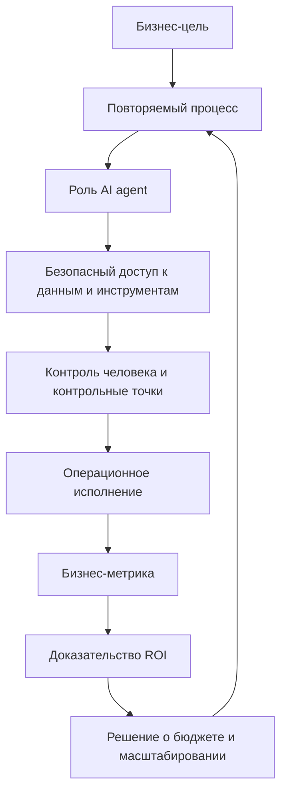
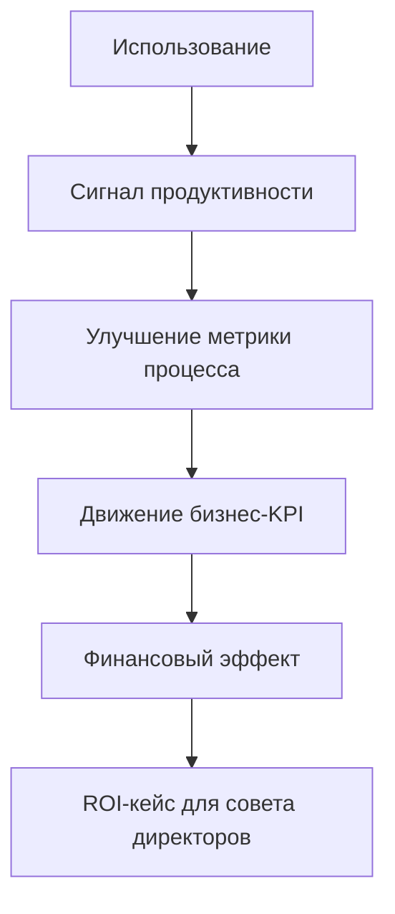

# Google Cloud: The ROI of AI 2025

## Резюме

Отчет полезен как ориентир по переходу от generative AI к agentic AI.

Главный тезис: ROI от AI становится более измеримым там, где компания переходит от отдельных инструментов продуктивности к агентам, встроенным в реальные процессы, данные, управленческий контур и ритм работы руководства.

Для консультационной работы это источник под тезис:

- [[Frameworks/ai-transformation/ai-native-organization|AI-native organization]] строится не вокруг "доступа к модели", а вокруг управляемых процессов с поддержкой AI;
- agentic AI требует [[Frameworks/governance/organizational-operating-model|организационной операционной модели]], а не только бюджета на инструменты;
- C-level sponsorship коррелирует с ROI, но сам по себе не решает управление данными, интеграцию и безопасность;
- зрелость внедрения AI видна по тому, есть ли у агента доступ к системам, контексту, правилам и ответственному владельцу;
- self-reported ROI нужно использовать как рыночный сигнал, а не как строгое причинное доказательство.

## Самое важное для моей базы знаний

### 1. Agentic shift: от ассистента к операционному исполнителю

Google Cloud определяет AI agents как специализированные LLM-системы с ролями, контекстом и целями, которые могут планировать, рассуждать, выполнять задачи, обращаться к данным и API, а при необходимости взаимодействовать с другими агентами.

Ключевой сдвиг:

- gen AI как помощник повышает локальную продуктивность;
- AI agent как компонент процесса начинает менять операционную модель;
- ценность появляется не в "умном ответе", а в способности выполнить часть процесса под контролем человека и с контрольными точками;
- зрелость зависит от доступа к данным, интеграций, правил и контроля.

Практический вывод:

> Agentic AI нельзя внедрять как новый интерфейс к LLM. Его нужно проектировать как управляемый слой исполнения внутри бизнес-процесса.

### 2. Ранние пользователи получают преимущество через глубину внедрения

Отчет выделяет когорту ранних пользователей agentic AI: организации, которые направляют минимум 50% будущего AI-бюджета на агентов и уже глубоко встроили их в операции.

Сигналы ранних пользователей:

- 82% ранних пользователей развернули более 10 AI agents против 39% по общей выборке;
- 78% используют gen AI в production больше года против 52% по общей выборке;
- 88% ранних пользователей видят ROI хотя бы в одном gen AI use case против 74% по общей выборке;
- средняя доля годового IT-бюджета, выделенная на AI, у ранних пользователей 39% против 26% по общей выборке.

Интерпретация:

> Преимущество ранних пользователей не в одном сильном use case, а в накоплении организационной способности: бюджет, опыт production, несколько агентов, поддержка руководства, дисциплина данных и интеграции.

### 3. ROI распределен по пяти бизнес-зонам

Отчет фиксирует пять зон, где компании чаще всего видят ценность от gen AI:

| Зона                | Доля руководителей, сообщивших об эффекте | Сигнал для консультационной работы                              |
| ------------------- | ---------------------------------: | -------------------------------------------------------------------- |
| Продуктивность      |                                70% | быстрый слой внедрения, но риск показной продуктивности              |
| Клиентский опыт     |                                63% | сильная зона для агентов из-за повторяемых обращений и каналов       |
| Рост бизнеса        |                                56% | ценность через влияние на выручку, но self-reported оценка требует проверки |
| Маркетинг           |                                55% | высокая применимость к контенту, кампаниям и сегментации             |
| Безопасность        |                                49% | ценность через обнаружение, реакцию, снижение tickets и стоимости риска |

Это полезно для проектирования AI-портфеля:

- продуктивность лучше использовать как точку входа;
- клиентский опыт, маркетинг и безопасность лучше подходят для agentic workflows;
- рост бизнеса требует связи с P&L-логикой, а не только с активностью;
- ROI нужно измерять по бизнес-результату, а не по количеству созданных AI-помощников.

### 4. Поддержка C-suite остается системным условием ROI

78% руководителей из организаций с комплексной поддержкой C-level и ясным корпоративным видением сообщают ROI хотя бы в одном gen AI use case в 2025.

Сравнение по поддержке руководства:

| Год  | Комплексная поддержка C-suite | Без комплексной поддержки |
| ---- | --------------------------------: | ----------------------------: |
| 2024 |                               78% |                           71% |
| 2025 |                               78% |                           72% |

Вывод не в том, что поддержка руководства гарантирует ROI. Разрыв умеренный. Но она нужна для другого:

- выбрать приоритетные use cases;
- снять межфункциональные препятствия;
- выделить бюджет;
- согласовать управленческий контур;
- привязать внедрение AI к бизнес-целям;
- защитить инициативу от распада на локальные эксперименты.

### 5. Основные препятствия лежат в базовой работе

Ключевые ограничения в отчете не про "модель недостаточно умная", а про управляемость:

- приватность данных и безопасность;
- интеграция с существующими системами;
- стоимость;
- управление данными и знаниями;
- управление изменениями;
- таланты и обучение;
- управление рисками;
- измерение эффекта AI.

Это совпадает с рамкой [[Frameworks/governance/architecture-of-manageability|architecture of manageability]]:

> AI agents масштабируются только там, где организация умеет давать им контекст, доступ, границы, метрики и владельца результата.

## Модели / фреймворки / формулы

### Модель 1. Уровни зрелости AI agents

| Уровень                        | Логика                                     | Примеры из отчета                                 |
| ------------------------------ | ------------------------------------------ | ------------------------------------------------- |
| Уровень 1: простые задачи      | AI выполняет ограниченные задачи           | chatbots, information retrieval, image generation |
| Уровень 2: приложения AI agents | агент работает в конкретной бизнес-функции | customer service agents, creative agents          |
| Уровень 3: multi-agent workflows | несколько агентов управляют процессом     | agentic workflows, agent orchestration            |

Управленческий смысл:

- уровень 1 можно внедрять как слой продуктивности;
- уровень 2 требует владельца процесса и KPI;
- уровень 3 требует операционной модели, управленческого контура, архитектуры интеграции и модели инцидентов.

### Модель 2. Операционный контур agentic ROI



### Модель 3. Стек готовности к AI agent

| Слой        | Что должно быть решено                                                |
| ----------- | --------------------------------------------------------------------- |
| Стратегия   | ясная бизнес-цель, поддержка руководства, приоритеты портфеля         |
| Процесс     | повторяемый процесс, владелец, путь эскалации, human-in-the-loop      |
| Данные      | управляемый доступ, качество знаний, ясность system of record         |
| Интеграция  | API, корпоративные системы, права доступа, аудитируемость             |
| Риск        | приватность, безопасность, комплаенс, контроль галлюцинаций           |
| Измерение   | бизнес-KPI, метрика внедрения, стоимость, качество, индикатор риска   |

### Формула для консультационной работы, не из отчета

В отчете нет строгой универсальной ROI-формулы. Для работы с клиентами полезна такая операционная декомпозиция:

```text
ROI agentic AI =
прирост бизнес-результата
+ предотвращенные затраты процесса
+ снижение риска
- стоимость технологии и интеграции
- стоимость управления и проверки
- стоимость внедрения и изменений
```

## Цифры и доказательная база

Методологическая оговорка: если не указано иное, статистика в отчете основана на survey и включает организации, которые используют gen AI в production.

| Показатель                                                    |             Значение | Интерпретация                                                          |
| ------------------------------------------------------------- | -------------------: | ---------------------------------------------------------------------- |
| Размер выборки survey                                         | 3,466 senior leaders | глобальные компании с выручкой $10M+; полевые работы 18 апреля - 3 июня 2025 |
| Организации, использующие gen AI и AI agents                  |                  52% | агенты уже вышли за пределы пилотов                                    |
| Организации с более чем 10 AI agents                          |                  39% | multi-agent footprint становится нормальным у части рынка              |
| Ранние пользователи agentic AI с ROI хотя бы в одном use case |                  88% | глубина внедрения коррелирует с ROI                                    |
| Все организации с ROI хотя бы в одном use case                |                  74% | широкий рыночный сигнал, но self-reported                              |
| Руководители с C-level sponsorship, видящие ROI               |                  78% | поддержка помогает, но не заменяет базовые способности организации     |
| Средняя доля годового IT-бюджета на AI                        |                  26% | AI становится заметной статьей IT-инвестиций                           |
| Доля годового IT-бюджета на AI у ранних пользователей         |                  39% | ранние пользователи делают более концентрированную ставку              |
| Рост расходов на gen AI при снижении технологических затрат   |                  77% | снижение unit cost не уменьшает расходы, а расширяет внедрение         |
| Новый отдельный бюджет на gen AI                              |                  58% | AI часто получает отдельный инвестиционный контур                      |
| Перераспределение не-AI бюджета в gen AI                      |                  48% | AI конкурирует за бюджет с существующими инициативами                  |
| Приватность данных / безопасность как фактор выбора LLM provider |               37% | главный критерий выбора поставщика                                     |
| Интеграция с существующими системами                          |                  28% | агентам нужны корпоративные инструменты, а не только chat UI           |
| Стоимость как фактор выбора поставщика                        |                  27% | стоимость важна, но ниже приватности, безопасности и интеграции        |

### Прямые меры ценности

| Мера                    |                                                   Результат 2025 | Смысл                                                            |
| ----------------------- | ------------------------------------------------------------: | ---------------------------------------------------------------- |
| ROI                     |                          74% сообщают ROI в течение первого года | AI уже требует не нарратива исследования, а управления инвестициями |
| Рост годовой выручки    | 53% среди сообщивших о росте выручки оценивают прирост в 6-10% | заявления о выручке нужно проверять через внутренний baseline    |
| Выход на рынок          |     51% сообщают 3-6 месяцев от идеи до use case в production | скорость вывода в production становится отдельной способностью   |

### Межотраслевые use cases для агентов

| Use case                        | Доля среди организаций, использующих agentic AI |
| ------------------------------- | --------------------------------------------: |
| Customer service and experience |                                           49% |
| Marketing                       |                                           46% |
| Security ops and cybersecurity  |                                           46% |
| Tech support                    |                                           45% |
| Product innovation and design   |                                           43% |
| Productivity and research       |                                           43% |
| Software development            |                                           40% |
| Finance and accounting          |                                           38% |
| Sales                           |                                           35% |
| HR                              |                                           31% |
| Personalization                 |                                           29% |
| Legal                           |                                           15% |

### Основные области инвестиций для ускорения внедрения AI

| Область инвестиций                           | Доля руководителей |
| -------------------------------------------- | --------------: |
| Управление изменениями для принятия пользователями |       42% |
| Качество данных и управление знаниями        |             41% |
| Таланты, повышение квалификации, партнерства по аутсорсингу | 40% |
| Инструменты и вычислительные ресурсы         |             37% |
| Управленческий контур и управление рисками   |             33% |
| Развертывание AI agents                      |             31% |
| Организационная структура и операционная модель |          29% |
| Измерение эффекта AI                         |             28% |

### Доказательства из заказных кейсов, не survey benchmark

Эти цифры относятся к отдельным клиентским и заказным исследованиям Google Cloud и не должны использоваться как универсальный ориентир:

| Источник в отчете                                  |                                                           Показатель |
| -------------------------------------------------- | -------------------------------------------------------------------: |
| IDC Google Cloud Generative AI white paper         |                                          727% average three-year ROI |
| IDC                                                |                    $250K average annual benefits per 1,000 employees |
| IDC                                                |                                       50% more productive developers |
| IDC                                                |                                        36% more productive end users |
| Forrester Customer Engagement Suite with Google AI |                                                  207% three-year ROI |
| Forrester                                          |       120 seconds saved per contact in year 1, 130 seconds by year 3 |
| Forrester                                          |                      $2M additional revenue in year 1, $4M by year 3 |
| Forrester Google SecOps                            |                                         $1.2M saved over three years |
| Forrester Google SecOps                            |                           70% reduction in risk and cost of a breach |
| Forrester Google SecOps                            | 50% faster mean time to respond, 65% faster mean time to investigate |

## Консультационная интерпретация

### Для CEO

AI agents нужно рассматривать как изменение операционной модели, а не как закупку еще одного инструмента продуктивности.

Вопросы CEO:

- где агент может выполнить повторяемую часть процесса, а не просто "помочь сотруднику";
- какие бизнес-метрики станут доказательством ROI;
- кто владеет результатом: функция, продукт, общая платформа или AI office;
- какие процессы получат приоритетный доступ к данным и интеграциям;
- какие риски неприемлемы даже при сильном ROI.

### Для CTO / VP Engineering

Техническая задача не сводится к выбору LLM provider.

Нужна архитектура:

- безопасный доступ к корпоративным системам;
- identity, права доступа и audit trail для агентов;
- управление данными и знаниями;
- наблюдаемость действий агентов;
- модель инцидентов и отката;
- интеграционная платформа;
- human-in-the-loop там, где решение влияет на клиента, деньги, безопасность или комплаенс.

Важно: software development занимает 40% среди межотраслевых use cases для агентов. Но эффект будет ограничен, если система поставки не готова к увеличению throughput и нагрузки на проверку.

### Для Engineering Managers

Для EM отчет полезен как аргумент против "каждый пусть сам использует AI".

Менеджеру нужно проектировать командную способность:

- какие повторяемые процессы команда хочет усилить агентами;
- какие задачи остаются у человека;
- где появляются новые узкие места в review и проверке;
- как фиксируются промпты, правила, исключения и извлеченные уроки;
- как использование AI связано с качеством, cycle time, эффектом для клиента и риском.

## Диагностические вопросы

### Agentic readiness

- Есть ли процесс, где AI agent может выполнить понятный фрагмент работы от входа до результата?
- Есть ли владелец процесса и метрика результата?
- Какие системы и данные нужны агенту для реального выполнения задачи?
- Кто утверждает действия агента и в каких случаях human-in-the-loop обязателен?
- Есть ли audit trail действий агента?
- Как будет измеряться качество результата, а не только использование?

### ROI readiness

- Какой тип ценности ожидается: продуктивность, выручка, клиентский опыт, снижение риска, предотвращение затрат?
- Есть ли baseline до внедрения?
- Кто признает ROI: функция, CFO, product owner, security или operations?
- Какие расходы считаются полностью: лицензии, интеграции, очистка данных, управление изменениями, управление, мониторинг?
- Где self-reported продуктивность может маскировать рост последующих затрат?

### Governance readiness

- Какие данные агент не должен видеть?
- Какие действия агент не должен выполнять автономно?
- Что считается security incident в agentic workflow?
- Есть ли единый AI rulebook для всей компании?
- Как контролируется shadow AI?
- Как обновляются правила при изменении процессов, моделей и регуляторных требований?

## Возможные фреймворки на основе отчета

### 1. Матрица портфеля agentic AI

|                       | Низкая критичность процесса   | Высокая критичность процесса                           |
| --------------------- | ----------------------------- | ------------------------------------------------------- |
| Низкая чувствительность данных | Эксперименты продуктивности | Автоматизация процесса с легким согласованием           |
| Высокая чувствительность данных | Контролируемый внутренний ассистент | Управляемый agentic workflow с аудитом и утверждением человеком |

### 2. Лестница доказательств ROI



### 3. Чеклист операционной модели agentic AI

- executive sponsor;
- владелец бизнес-результата;
- владелец процесса;
- владелец данных;
- владелец риска;
- владелец интеграции;
- измеримый бизнес-результат;
- human-in-the-loop rule;
- audit trail;
- критерии масштабирования / остановки.

## Идеи для постов

### Пост 1: AI agents требуют операционной модели

Хук:

> AI agent без владельца процесса — это не автоматизация. Это новый источник операционного риска.

Тезис:

- agent может действовать, а значит должен иметь границы;
- границы задаются не промптом, а операционной моделью;
- нужны зона ответственности, доступ к данным, эскалация, аудит и бизнес-метрика;
- зрелость внедрения AI видна не в количестве агентов, а в управляемости их действий.

### Пост 2: ROI от AI стал темой совета директоров, но доказательность разная

Хук:

> 74% компаний говорят, что уже видят ROI от gen AI. Это не значит, что 74% научились им управлять.

Тезис:

- self-reported survey показывает направление рынка;
- заказные case studies показывают возможный потенциал;
- для управления нужна внутренняя baseline-модель;
- без baseline ROI превращается в презентационный аргумент.

### Пост 3: Главное узкое место agentic AI — не модель

Хук:

> AI agents упираются не в интеллект модели, а в доступ к данным, системам и правилам.

Тезис:

- агенту нужен контекст;
- контекст живет в корпоративных системах;
- доступ к системам требует управленческого контура;
- поэтому AI transformation начинается с architecture of manageability.

## Связанные заметки

- [[Frameworks/ai-transformation/ai-native-organization|AI-native organization]]
- [[Frameworks/governance/architecture-of-manageability|architecture of manageability]]
- [[Frameworks/governance/decision-systems|системы принятия решений]]
- [[Frameworks/governance/organizational-operating-model|организационная операционная модель]]
- [[Frameworks/governance/quality-and-risks|качество и риски]]
- [[Frameworks/governance/systemic-management|системное управление]]
- [[dora-roi-of-ai-assisted-software-development-2026|DORA ROI of AI-assisted Software Development 2026]]
- [[mit-nanda-genai-divide-state-of-ai-in-business-2025|MIT NANDA: The GenAI Divide. State of AI in Business 2025]]
- [[Posts/published/2026-05-05-tri-vzglyada-na-roi-ot-vnedreniya-ii|Три взгляда на ROI от внедрения ИИ]]

## Источник

- PDF: `/Users/vladimir/Obsidian/KnowledgeOS/Frameworks/ai-transformation/sources/google_cloud_roi_of_ai_2025.pdf`
- Отчет: The ROI of AI 2025. How agents are unlocking the next wave of AI-driven business value
- Издатель: Google Cloud
- Исследовательский партнер: National Research Group
- Методология: 16-минутный онлайн-опрос, 3,466 senior business leaders, компании с 100+ сотрудниками и годовой выручкой $10M+, полевые работы 18 апреля - 3 июня 2025
