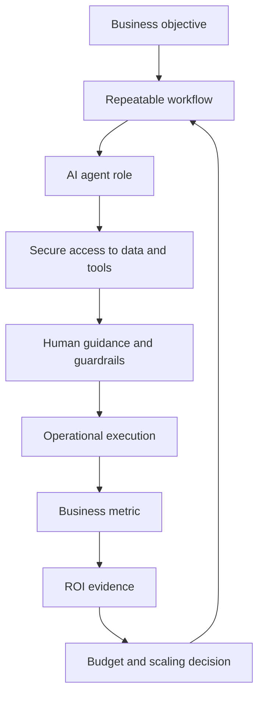
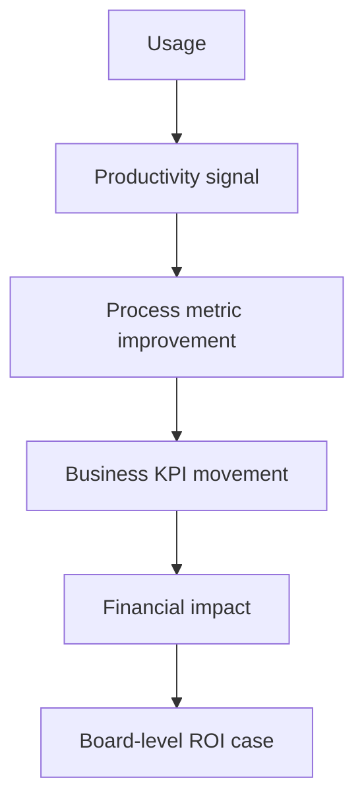

# Google Cloud: The ROI of AI 2025

## Executive Summary

Отчет полезен как benchmark по переходу от generative AI к agentic AI.

Главный тезис: ROI от AI становится более измеримым там, где компания переходит от отдельных productivity tools к агентам, встроенным в реальные процессы, данные, governance и executive operating rhythm.

Для advisory это источник под тезис:

- [[Frameworks/ai-transformation/ai-native-organization|AI-native organization]] строится не вокруг "доступа к модели", а вокруг управляемых AI-enabled workflows;
- agentic AI требует [[Frameworks/governance/organizational-operating-model|organizational operating model]], а не только tooling budget;
- C-level sponsorship коррелирует с ROI, но сам по себе не решает data governance, integration и security;
- зрелость AI adoption видна по тому, есть ли у агента доступ к системам, контексту, правилам и ответственному владельцу;
- self-reported ROI нужно использовать как market signal, а не как строгий causal proof.

## Самое важное для моей базы знаний

### 1. Agentic shift: от ассистента к операционному исполнителю

Google Cloud определяет AI agents как специализированные LLM-системы с ролями, контекстом и целями, которые могут планировать, рассуждать, выполнять задачи, обращаться к данным и API, а при необходимости взаимодействовать с другими агентами.

Ключевой сдвиг:

- gen AI как помощник повышает локальную продуктивность;
- AI agent как workflow component начинает менять операционную модель;
- ценность появляется не в "умном ответе", а в способности выполнить часть процесса под human guidance и guardrails;
- зрелость зависит от доступа к данным, интеграций, правил и контроля.

Практический вывод:

> Agentic AI нельзя внедрять как новый интерфейс к LLM. Его нужно проектировать как управляемый слой исполнения внутри бизнес-процесса.

### 2. Early adopters получают преимущество через глубину внедрения

Отчет выделяет cohort agentic AI early adopters: организации, которые направляют минимум 50% будущего AI-бюджета на агентов и уже глубоко встроили их в операции.

Сигналы ранних adopters:

- 82% early adopters развернули более 10 AI agents против 39% по общей выборке;
- 78% используют gen AI в production больше года против 52% по общей выборке;
- 88% early adopters видят ROI хотя бы в одном gen AI use case против 74% по общей выборке;
- средняя доля total annual IT spend, выделенная на AI, у early adopters 39% против 26% по общей выборке.

Интерпретация:

> Преимущество early adopters не в одном сильном use case, а в накоплении организационной способности: бюджет, production experience, multiple agents, executive sponsorship, data/integration discipline.

### 3. ROI распределен по пяти business areas

Отчет фиксирует пять зон, где компании чаще всего видят value от gen AI:

| Зона                | Доля executives, сообщивших impact | Advisory signal                                                      |
| ------------------- | ---------------------------------: | -------------------------------------------------------------------- |
| Productivity        |                                70% | быстрый слой adoption, но риск vanity productivity                   |
| Customer experience |                                63% | сильная зона для agents из-за повторяемых обращений и каналов        |
| Business growth     |                                56% | value через revenue impact, но self-reported оценка требует проверки |
| Marketing           |                                55% | высокая применимость к content, campaigns, segmentation              |
| Security            |                                49% | value через detection, response, ticket reduction и risk cost        |

Это полезно для AI portfolio design:

- productivity лучше использовать как entry point;
- customer experience, marketing и security лучше подходят для agentic workflows;
- business growth требует связи с P&L logic, а не только с активностью;
- ROI нужно измерять по business outcome, а не по количеству созданных AI-помощников.

### 4. C-suite sponsorship остается системным условием ROI

78% executives из организаций с comprehensive C-level sponsorship и clear corporate vision сообщают ROI хотя бы в одном gen AI use case в 2025.

Сравнение по sponsorship:

| Год  | Comprehensive C-suite sponsorship | Без comprehensive sponsorship |
| ---- | --------------------------------: | ----------------------------: |
| 2024 |                               78% |                           71% |
| 2025 |                               78% |                           72% |

Вывод не в том, что sponsorship гарантирует ROI. Разрыв умеренный. Но sponsorship нужен для другого:

- выбрать приоритетные use cases;
- снять cross-functional roadblocks;
- выделить бюджет;
- согласовать governance;
- привязать AI adoption к business objectives;
- защитить инициативу от распада на локальные эксперименты.

### 5. Основные roadblocks лежат в foundational work

Ключевые ограничения в отчете не про "модель недостаточно умная", а про управляемость:

- data privacy and security;
- integration with existing systems;
- cost;
- data and knowledge management;
- change management;
- talent and education;
- risk governance;
- measurement of AI impact.

Это совпадает с рамкой [[Frameworks/governance/architecture-of-manageability|architecture of manageability]]:

> AI agents масштабируются только там, где организация умеет давать им контекст, доступ, границы, метрики и владельца результата.

## Модели / фреймворки / формулы

### Модель 1. Уровни зрелости AI agents

| Уровень                        | Логика                                     | Примеры из отчета                                 |
| ------------------------------ | ------------------------------------------ | ------------------------------------------------- |
| Level 1: Simple tasks          | AI выполняет ограниченные задачи           | chatbots, information retrieval, image generation |
| Level 2: AI agent applications | агент работает в конкретной бизнес-функции | customer service agents, creative agents          |
| Level 3: Multi-agent workflows | несколько агентов управляют workflow       | agentic workflows, agent orchestration            |

Управленческий смысл:

- Level 1 можно внедрять как productivity layer;
- Level 2 требует владельца процесса и KPI;
- Level 3 требует operating model, governance, integration architecture и incident model.

### Модель 2. Agentic ROI operating loop



### Модель 3. AI agent readiness stack

| Слой        | Что должно быть решено                                                |
| ----------- | --------------------------------------------------------------------- |
| Strategy    | clear business objective, executive sponsorship, portfolio priorities |
| Process     | repeatable workflow, owner, escalation path, human-in-the-loop        |
| Data        | governed access, knowledge quality, system-of-record clarity          |
| Integration | APIs, enterprise systems, permissions, auditability                   |
| Risk        | privacy, security, комплаенс, hallucination controls                  |
| Measurement | business KPI, adoption metric, cost, quality, risk indicator          |

### Формула для advisory, не из отчета

В отчете нет строгой универсальной ROI-формулы. Для работы с клиентами полезна такая операционная декомпозиция:

```text
Agentic AI ROI =
Business outcome uplift
+ avoided process cost
+ risk reduction
- technology and integration cost
- governance and verification cost
- adoption and change cost
```

## Цифры и доказательная база

Методологическая оговорка: если не указано иное, статистика в отчете основана на survey и включает организации, которые используют gen AI в production.

| Показатель                                                    |             Значение | Интерпретация                                                          |
| ------------------------------------------------------------- | -------------------: | ---------------------------------------------------------------------- |
| Survey sample                                                 | 3,466 senior leaders | global enterprises with $10M+ revenue; fieldwork April 18-June 3, 2025 |
| Organizations using gen AI that also leverage AI agents       |                  52% | agents уже вышли за пределы пилотов                                    |
| Organizations with more than 10 AI agents                     |                  39% | multi-agent footprint становится нормальным у части рынка              |
| Agentic AI early adopters seeing ROI on at least one use case |                  88% | depth of adoption correlates with ROI                                  |
| All organizations seeing ROI on at least one use case         |                  74% | broad market signal, но self-reported                                  |
| Executives with C-level sponsorship seeing ROI                |                  78% | sponsorship помогает, но не заменяет foundational capabilities         |
| Mean annual IT spend allocated to AI                          |                  26% | AI становится заметной статьей IT-инвестиций                           |
| Early adopters' annual IT spend allocated to AI               |                  39% | early adopters делают более концентрированную ставку                   |
| Increased gen AI spend as tech costs fall                     |                  77% | снижение unit cost не уменьшает spend, а расширяет adoption            |
| Net new budget for gen AI                                     |                  58% | AI часто получает отдельный инвестиционный контур                      |
| Reallocated non-AI budget to gen AI                           |                  48% | AI конкурирует за бюджет с существующими инициативами                  |
| Data privacy/security as top LLM provider factor              |                  37% | главный vendor-selection concern                                       |
| Integration with existing systems                             |                  28% | агентам нужны enterprise tools, а не только chat UI                    |
| Cost as provider factor                                       |                  27% | cost важен, но ниже privacy/security и integration                     |

### Direct value measures

| Measure                 |                                                   2025 result | Meaning                                                          |
| ----------------------- | ------------------------------------------------------------: | ---------------------------------------------------------------- |
| ROI                     |                          74% report ROI within the first year | AI уже требует не exploration narrative, а investment governance |
| Annual revenue increase | 53% of those reporting increased revenue estimate 6-10% gains | revenue claims нужно проверять через внутренний baseline         |
| Time to market          |     51% report 3-6 months from idea to use case in production | скорость productionization становится отдельной capability       |

### Cross-industry agent use cases

| Use case                        | Доля среди организаций, leveraging agentic AI |
| ------------------------------- | --------------------------------------------: |
| Customer service and experience |                                           49% |
| Marketing                       |                                           46% |
| Security ops and cybersecurity  |                                           46% |
| Tech support                    |                                           45% |
| Product innovation and design   |                                           43% |
| Productivity and research       |                                           43% |
| Software development            |                                           40% |
| Finance and accounting          |                                           38% |
| Sales                           |                                           35% |
| HR                              |                                           31% |
| Personalization                 |                                           29% |
| Legal                           |                                           15% |

### Top investment areas to accelerate AI adoption

| Investment area                              | Доля executives |
| -------------------------------------------- | --------------: |
| Change management for user adoption          |             42% |
| Data quality and knowledge management        |             41% |
| Talent, upskilling, outsourcing partnerships |             40% |
| Tooling and compute resources                |             37% |
| Governance and risk management               |             33% |
| Deploying AI agents                          |             31% |
| Organizational structure and operating model |             29% |
| Measuring AI impact                          |             28% |

### Commissioned case evidence, не survey benchmark

Эти цифры относятся к отдельным Google Cloud customer / commissioned studies и не должны использоваться как универсальный benchmark:

| Источник в отчете                                  |                                                           Показатель |
| -------------------------------------------------- | -------------------------------------------------------------------: |
| IDC Google Cloud Generative AI white paper         |                                          727% average three-year ROI |
| IDC                                                |                    $250K average annual benefits per 1,000 employees |
| IDC                                                |                                       50% more productive developers |
| IDC                                                |                                        36% more productive end users |
| Forrester Customer Engagement Suite with Google AI |                                                  207% three-year ROI |
| Forrester                                          |       120 seconds saved per contact in year 1, 130 seconds by year 3 |
| Forrester                                          |                      $2M additional revenue in year 1, $4M by year 3 |
| Forrester Google SecOps                            |                                         $1.2M saved over three years |
| Forrester Google SecOps                            |                           70% reduction in risk and cost of a breach |
| Forrester Google SecOps                            | 50% faster mean time to respond, 65% faster mean time to investigate |

## Advisory interpretation

### Для CEO

AI agents нужно рассматривать как изменение operating model, а не как закупку еще одного productivity tool.

Вопросы CEO:

- где агент может выполнить повторяемую часть процесса, а не просто "помочь сотруднику";
- какие business metrics станут доказательством ROI;
- кто владеет результатом: функция, продукт, shared platform или AI office;
- какие процессы получат приоритетный доступ к данным и интеграциям;
- какие риски неприемлемы даже при сильном ROI.

### Для CTO / VP Engineering

Техническая задача не сводится к выбору LLM provider.

Нужна архитектура:

- secure access к enterprise systems;
- identity, permissions и audit trail для агентов;
- data governance и knowledge management;
- observability для agent actions;
- incident and rollback model;
- integration platform;
- human-in-the-loop там, где решение влияет на клиента, деньги, безопасность или комплаенс.

Важно: software development занимает 40% среди cross-industry agent use cases. Но эффект будет ограничен, если delivery system не готова к увеличению throughput и verification load.

### Для Engineering Managers

Для EM отчет полезен как аргумент против "каждый пусть сам использует AI".

Менеджеру нужно проектировать командную способность:

- какие repeatable workflows команда хочет усилить агентами;
- какие задачи остаются у человека;
- где появляются новые review / verification bottlenecks;
- как фиксируются промпты, правила, exceptions и lessons learned;
- как AI usage связан с quality, cycle time, customer impact и risk.

## Диагностические вопросы

### Agentic readiness

- Есть ли процесс, где AI agent может выполнить понятный фрагмент работы от входа до результата?
- Есть ли владелец процесса и метрика результата?
- Какие системы и данные нужны агенту для реального выполнения задачи?
- Кто утверждает действия агента и в каких случаях human-in-the-loop обязателен?
- Есть ли audit trail действий агента?
- Как будет измеряться качество результата, а не только usage?

### ROI readiness

- Какой тип value ожидается: productivity, revenue, customer experience, risk reduction, cost avoidance?
- Есть ли baseline до внедрения?
- Кто признает ROI: функция, CFO, product owner, security, operations?
- Какие расходы считаются полностью: лицензии, интеграции, data cleanup, change management, governance, monitoring?
- Где self-reported productivity может маскировать рост downstream cost?

### Governance readiness

- Какие данные агент не должен видеть?
- Какие действия агент не должен выполнять автономно?
- Что считается security incident в agentic workflow?
- Есть ли enterprise-wide AI rulebook?
- Как контролируется shadow AI?
- Как обновляются правила при изменении процессов, моделей и регуляторных требований?

## Возможные фреймворки на основе отчета

### 1. Agentic AI Portfolio Matrix

|                       | Low process criticality       | High process criticality                                |
| --------------------- | ----------------------------- | ------------------------------------------------------- |
| Low data sensitivity  | Productivity experiments      | Process automation with light approval                  |
| High data sensitivity | Controlled internal assistant | Governed agentic workflow with audit and human approval |

### 2. ROI Evidence Ladder



### 3. Agentic Operating Model Checklist

- executive sponsor;
- business owner;
- workflow owner;
- data owner;
- risk owner;
- integration owner;
- measurable business outcome;
- human-in-the-loop rule;
- audit trail;
- scale / stop criteria.

## Идеи для постов

### Пост 1: AI agents требуют operating model

Hook:

> AI agent без владельца процесса — это не automation. Это новый источник операционного риска.

Тезис:

- agent может действовать, а значит должен иметь границы;
- границы задаются не промптом, а operating model;
- нужны ownership, data access, escalation, audit и business metric;
- зрелость AI adoption видна не в количестве агентов, а в управляемости их действий.

### Пост 2: ROI от AI стал board-level темой, но доказательность разная

Hook:

> 74% компаний говорят, что уже видят ROI от gen AI. Это не значит, что 74% научились им управлять.

Тезис:

- self-reported survey показывает направление рынка;
- commissioned case studies показывают возможный upside;
- для управления нужна внутренняя baseline-модель;
- без baseline ROI превращается в презентационный аргумент.

### Пост 3: Главный bottleneck agentic AI — не модель

Hook:

> AI agents упираются не в интеллект модели, а в доступ к данным, системам и правилам.

Тезис:

- агенту нужен контекст;
- контекст живет в enterprise systems;
- доступ к systems требует governance;
- поэтому AI transformation начинается с architecture of manageability.

## Связанные заметки

- [[Frameworks/ai-transformation/ai-native-organization|AI-native organization]]
- [[Frameworks/governance/architecture-of-manageability|architecture of manageability]]
- [[Frameworks/governance/decision-systems|decision systems]]
- [[Frameworks/governance/organizational-operating-model|organizational operating model]]
- [[Frameworks/governance/quality-and-risks|quality and risks]]
- [[Frameworks/governance/systemic-management|systemic management]]
- [[dora-roi-of-ai-assisted-software-development-2026|DORA ROI of AI-assisted Software Development 2026]]
- [[mit-nanda-genai-divide-state-of-ai-in-business-2025|MIT NANDA: The GenAI Divide. State of AI in Business 2025]]
- [[Posts/published/2026-05-05-tri-vzglyada-na-roi-ot-vnedreniya-ii|Три взгляда на ROI от внедрения ИИ]]

## Source

- PDF: `/Users/vladimir/Obsidian/KnowledgeOS/Frameworks/ai-transformation/sources/google_cloud_roi_of_ai_2025.pdf`
- Report: The ROI of AI 2025. How agents are unlocking the next wave of AI-driven business value
- Publisher: Google Cloud
- Research partner: National Research Group
- Methodology: 16-minute online survey, 3,466 senior business leaders, enterprises with 100+ employees and $10M+ annual revenue, fieldwork April 18-June 3, 2025
