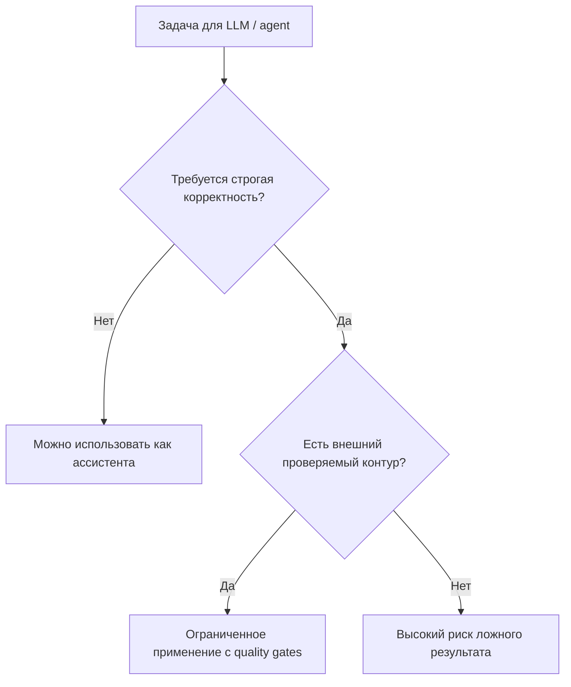
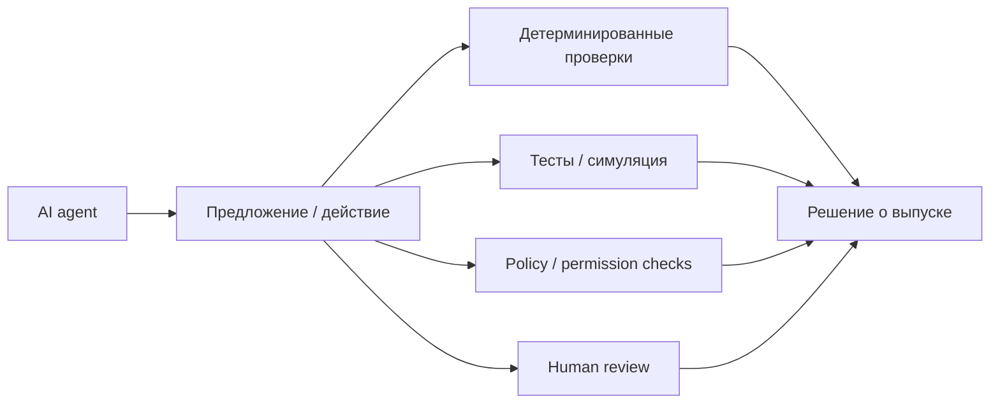

# Hallucination Stations: limitations of transformer-based language models

## Коротко

Документ полезен как критический источник для обсуждения ограничений LLM и AI agents.

Главный тезис авторов: если задача, заданная в prompt, требует вычислительной сложности выше вычислительного контура inference LLM, модель или LLM-based agent не может надежно выполнить задачу или проверить корректность решения.

Для базы знаний источник стоит использовать осторожно:

- как аргумент против наивного доверия к автономным AI agents;
- как framing для внешней проверки, quality gates и ограниченной автономии;
- не как единственное доказательство невозможности сложного рассуждения у LLM.

## Самое важное для моей базы знаний

### 1. Agent не должен быть собственным контуром проверки

Самый ценный практический вывод: LLM-based agent не может считаться надежным валидатором другого LLM-based agent, если проверка требует строгой вычислительной или логической верификации.

Это усиливает рамку [[Frameworks/governance/quality-and-risks|качества и рисков]]:

> Для задач с высокой ценой ошибки нужен внешний проверяемый контур: алгоритмы, тесты, формальные ограничения, audit trail, human review и путь эскалации.

### 2. Сложность задачи важнее уверенности ответа

Авторы рассматривают hallucination не только как ложный факт, но и как ситуацию, где модель дает ответ на задачу, которую фактически не могла корректно решить.

Практический смысл:

- уверенный ответ LLM не равен выполненной проверке;
- длинная цепочка рассуждений не гарантирует достаточного вычислительного бюджета;
- reasoning tokens могут улучшать поведение, но не отменяют требования к внешней верификации;
- для сложных задач нужно проектировать систему исполнения, а не доверять текстовому объяснению модели.

### 3. Agentic AI требует архитектуры управляемости

Документ особенно полезен против простого нарратива "agents can automate end-to-end workflows".

Если агент может:

- принимать решения;
- вызывать инструменты;
- совершать действия в реальном мире;
- работать с финансами, юридическими документами, логистикой, бронированием, производством или software delivery;

то его нужно проектировать как часть [[Frameworks/governance/architecture-of-manageability|architecture of manageability]], а не как автономного исполнителя.

## Ключевые рамки и формулы из документа

### Рамка 1. Граница надежного применения LLM

### Рамка 2. Проверка сложнее генерации

Авторы используют примеры, где проверка решения сама требует высокой сложности:

| Пример | Смысл для AI governance |
| ------ | ------------------------ |
| Traveling Salesperson Problem | проверка оптимальности может требовать перебора большого числа маршрутов |
| Vehicle routing / scheduling / bin packing | agent может предложить решение, но не гарантировать оптимальность без внешнего solver |
| Formal verification | рост числа состояний делает полную проверку трудно масштабируемой |
| Software verification | AI-generated code требует независимых тестов, статического анализа, review и runtime safeguards |

### Рамка 3. Не "модель проверяет модель", а система проверяет действие

## Практическая интерпретация для CEO / CTO / engineering leaders

- AI agents нельзя масштабировать только через выдачу доступа к инструментам.
- Для процессов с высокой ценой ошибки нужна карта задач, где явно разделены генерация, исполнение и проверка.
- LLM может быть хорошим интерфейсом, планировщиком или генератором вариантов, но не должен быть единственным источником истины.
- Чем выше автономия агента, тем важнее права доступа, журнал действий, откат, тестовый контур, мониторинг и владелец результата.
- В software engineering AI-assisted development требует усиления [[Frameworks/ai-transformation/internal-developer-platform|Internal Developer Platform]], CI, тестов, review и quality gates.

## Ограничения источника

Документ полезен как позиционный технический аргумент, но его нельзя использовать без оговорок.

Слабые места:

- авторы местами слишком прямо переносят вычислительную сложность inference на способность составных AI-систем;
- tool use, code execution, внешние solvers и workflow orchestration меняют практическую картину;
- ошибка в вычислительной задаче не всегда равна hallucination в привычном смысле;
- утверждение "unavoidably hallucinate" стоит трактовать как сильный тезис авторов, а не как общепринятый консенсус.

Лучшая формулировка для консультационной работы:

> AI agents должны быть встроены в проверяемую операционную систему. Чем выше цена ошибки, тем меньше должно быть доверия к "рассуждению модели" и больше к независимым контурам проверки.

## Диагностические вопросы

- Какие задачи мы пытаемся отдать AI agent: генерация, решение, проверка или действие?
- Где проверка результата требует внешнего алгоритма, теста, solver, правил или эксперта?
- Может ли агент совершить действие с материальными последствиями без человеческого подтверждения?
- Какие действия агента логируются и могут быть воспроизведены?
- Где находится kill switch или процедура отката?
- Кто владелец результата, если agent выполнил задачу формально, но результат оказался неверным?
- Какие задачи нельзя валидировать вторым LLM без независимого контура проверки?

## Возможные идеи для постов

### Пост 1: AI agent не должен быть своим аудитором

Воронка: [[Personal/marketing/linkedin-gtm-playbook#MOFU средний этап контентной воронки|MOFU]]

Тезис:

> Главный риск agentic AI не в том, что модель иногда ошибается. Риск в том, что компания строит процесс, где ошибку должна обнаружить та же категория системы, которая ее произвела.

### Пост 2: Reasoning не заменяет governance

Воронка: [[Personal/marketing/linkedin-gtm-playbook#TOFU верхний этап контентной воронки|TOFU]]

Тезис:

> Более длинное рассуждение модели не заменяет тесты, контроль доступа, audit trail и владельца решения.

### Пост 3: Автономия агента должна расти медленнее, чем контур контроля

Воронка: [[Personal/marketing/linkedin-gtm-playbook#MOFU средний этап контентной воронки|MOFU]]

Тезис:

> AI agents можно масштабировать только там, где организация уже умеет проверять работу быстрее, чем агент создает новые действия.

## Связанные заметки

- [[Frameworks/ai-transformation/ai-native-organization|AI-native organization]]
- [[Frameworks/ai-transformation/internal-developer-platform|Internal Developer Platform]]
- [[Frameworks/governance/architecture-of-manageability|architecture of manageability]]
- [[Frameworks/governance/decision-systems|системы принятия решений]]
- [[Frameworks/governance/quality-and-risks|качество и риски]]
- [[Frameworks/ai-transformation/google-cloud-roi-of-ai-2025|Google Cloud ROI of AI 2025]]
- [[Frameworks/ai-transformation/stanford-hai-ai-index-report-2025|Stanford HAI AI Index Report 2025]]
- [[Frameworks/ai-transformation/dora-roi-of-ai-assisted-software-development-2026|DORA ROI of AI-assisted Software Development 2026]]

## Источник

- PDF: [[Frameworks/ai-transformation/sources/2507.07505v3.pdf|2507.07505v3.pdf]]
- Локальный файл: `Frameworks/ai-transformation/sources/2507.07505v3.pdf`
- Название: `Hallucination Stations. On Some Basic Limitations of Transformer-Based Language Models`
- Авторы: Varin Sikka, Vishal Sikka
- Версия: arXiv 2507.07505v3
