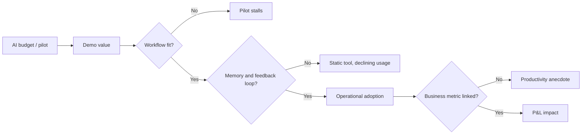
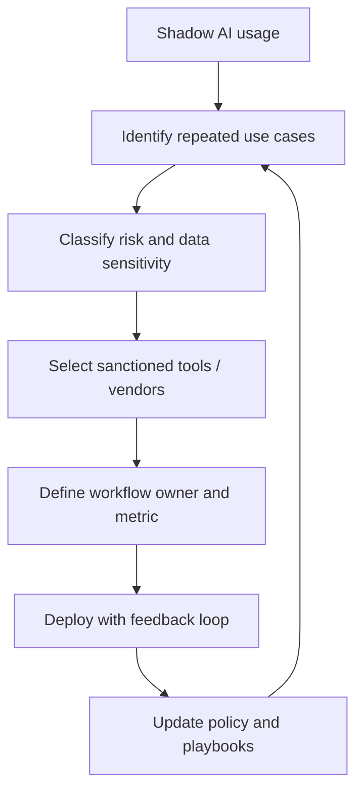

# MIT NANDA: The GenAI Divide. State of AI in Business 2025

## Коротко

Отчет полезен как сильный аргумент против поверхностного AI adoption.

Главный тезис: компании массово покупают и пилотируют GenAI, но редко превращают его в управляемую операционную способность. Проблема не в моделях, не в бюджете и не только в regulation. Проблема в том, что большинство внедрений не встроены в реальные workflow, не накапливают контекст и не учатся от обратной связи.

Для advisory это источник под тезис:

- AI transformation нельзя мерить количеством пилотов;
- индивидуальная продуктивность не равна P&L impact;
- [[Frameworks/ai-transformation/ai-native-organization|AI-native organization]] строится вокруг learning loops, ownership и workflow integration;
- высокий ROI чаще находится в back-office и external spend, а не в видимых front-office use cases;
- buy/partner часто практичнее, чем internal build, если vendor способен глубоко адаптироваться под процесс.

## Самое важное для моей базы знаний

### 1. GenAI Divide: высокая активность, низкая трансформация

Отчет описывает разрыв между adoption и transformation:

- $30-40B enterprise investment в GenAI;
- более 80% организаций исследовали или пилотировали general-purpose tools;
- около 40% сообщили о deployment general-purpose LLM tools;
- только 5% integrated AI pilots дают измеримый P&L impact;
- 7 из 9 крупных секторов показывают мало структурных изменений.

Практический вывод:

> AI adoption без изменения operating model создает активность, но не управляемый бизнес-результат.

Это поддерживает рамку [[Frameworks/governance/architecture-of-manageability|architecture of manageability]]: AI должен быть встроен в систему принятия решений, ответственности, данных, контроля качества и обратной связи.

### 2. Главный bottleneck — learning gap

Отчет формулирует ключевую причину провала пилотов: инструменты не учатся.

Типовые симптомы:

- система требует каждый раз заново вводить контекст;
- не помнит предпочтения, решения и исправления;
- ломается на edge cases;
- плохо встраивается в существующие workflow;
- выглядит полезной в demo, но не выдерживает операционную реальность.

Это важнее, чем "качество модели" само по себе. Пользователи уже видят, как выглядит хороший personal AI experience, поэтому хуже терпят корпоративные статичные инструменты.

### 3. Shadow AI показывает реальную траекторию adoption

Официальная закупка LLM subscription есть примерно у 40% компаний, но сотрудники из более чем 90% опрошенных компаний регулярно используют личные AI tools для работы.

Это не просто security risk. Это диагностический сигнал:

- сотрудники уже нашли реальные use cases;
- официальная AI-программа часто отстает от фактической практики;
- ценность рождается ближе к work surface, а не в центральной лаборатории;
- запрет shadow AI без легального канала переводит практику в серую зону.

Практический вывод для [[Frameworks/governance/organizational-operating-model|organizational operating model]]:

> Shadow AI нужно не только контролировать, но и использовать как discovery-механизм: где люди сами применяют AI, там часто находится реальная операционная боль.

### 4. Enterprise paradox: больше ресурсов, хуже scale-up

Enterprise-компании запускают больше пилотов и выделяют больше людей, но хуже переводят инициативы в production. Mid-market действует быстрее: лучшие компании сообщали о пути от пилота до внедрения примерно за 90 дней, тогда как enterprise часто занимал 9 месяцев и больше.

Интерпретация:

- проблема не в "медленном принятии AI";
- проблема в сложности governance, procurement, ownership и интеграции;
- centralized AI program без полномочий у line managers часто производит portfolio of pilots, а не business capability.

### 5. ROI смещен не туда

По данным интервью, значительная часть бюджета идет в sales и marketing, потому что там легче показать board-friendly метрики: demo volume, response time, lead scoring, outbound volume.

Но более устойчивый ROI часто лежит в back-office:

- customer service и document processing;
- finance / procurement;
- risk checks;
- agency spend;
- BPO replacement;
- internal workflow orchestration.

Это хороший аргумент против AI portfolio, собранного только по visibility. Нужен контур выбора use cases по экономике процесса, а не по презентабельности.

### 6. Buy/partner часто сильнее internal build

В выборке отчета strategic partnerships достигали deployment примерно в 2 раза чаще, чем internal builds:

- external partnership: около 66-67% deployments;
- internal build: около 33% deployments.

Ограничение: это self-reported sample, не строгая causal inference. Но управленческий сигнал сильный: internal build часто недооценивает сложность workflow fit, adoption, maintenance и continuous learning.

Для CTO это не означает "не строить". Это означает:

- строить только там, где есть стратегический контекст, данные и ownership;
- покупать/партнериться там, где vendor быстрее встроится в процесс;
- оценивать не model benchmark, а operational outcome.

## Модели / фреймворки / формулы

### Модель 1. AI pilot-to-production funnel

| Категория | Investigated | Piloted | Successfully implemented |
|---|---:|---:|---:|
| General-purpose LLMs | 80% | 60% | 50% |
| Embedded / task-specific GenAI | 60% | 20% | 5% |

Интерпретация:

- general-purpose tools выигрывают как personal productivity layer;
- task-specific systems выигрывают только при workflow integration и learning capability;
- procurement success нельзя считать по количеству пилотов.

### Модель 2. Disruption index by industry

| Сектор | Оценка disruption | Сигнал |
|---|---:|---|
| Technology | выше остальных | AI-native challengers, изменения workflow |
| Media & Telecom | 2.0 | AI-native content, changing ad dynamics |
| Professional Services | 1.5 | efficiency gains, но delivery model в основном прежняя |
| Healthcare & Pharma | 0.5 | documentation / transcription pilots |
| Consumer & Retail | 0.5 | support automation, мало влияния на loyalty |
| Financial Services | 0.5 | backend automation, устойчивые customer relationships |
| Advanced Industries | 0.5 | maintenance pilots, мало supply chain shifts |
| Energy & Materials | 0 | почти нет adoption |

Вывод:

> GenAI уже меняет отдельные workflow, но еще редко меняет отраслевую структуру.

### Модель 3. Learning capability matrix

| | Low memory / learning | High memory / learning |
|---|---|---|
| Low customization | Copilot, GPT wrappers | ChatGPT with memory |
| High customization | fragile internal builds | agentic workflows, vertical SaaS |

Управленческий смысл:

- низкая кастомизация годится для ad-hoc work;
- высокая кастомизация без learning превращается в brittle internal tool;
- зона стратегической ценности: process-specific systems, которые помнят, адаптируются и улучшаются.

### Модель 4. Где ломается AI implementation



### Модель 5. Buyer operating model

Успешные buyers действуют не как SaaS-покупатели, а как клиенты BPO / consulting:

| Практика | Что это меняет |
|---|---|
| Deep customization под внутренний процесс | меньше gap между demo и work reality |
| Operational metrics вместо model benchmarks | меньше vanity AI adoption |
| Co-evolution с vendor | инструмент учится вместе с процессом |
| Use cases от frontline managers | ближе к реальным bottlenecks |
| Executive accountability | меньше бесхозных пилотов |

## Цифры и доказательная база

| Показатель | Значение | Интерпретация |
|---|---:|---|
| Enterprise investment в GenAI | $30-40B | большой объем spending не конвертируется автоматически в P&L |
| Integrated AI pilots с измеримой value | 5% | основной разрыв между experimentation и transformation |
| Organizations explored / piloted general-purpose tools | >80% | adoption высокий |
| Organizations reporting deployment of general-purpose tools | ~40% | deployment есть, но часто на уровне personal productivity |
| Enterprise-grade systems evaluated | 60% | интерес высокий |
| Enterprise-grade systems reached pilot | 20% | большой drop-off до пилота |
| Enterprise-grade systems reached production | 5% | production остается редким |
| Companies with official LLM subscription | 40% | формальный adoption отстает |
| Employees regularly using personal AI tools | >90% | фактический adoption уже произошел |
| AI preferred for quick tasks | 70% | AI выиграл simple work |
| Human preferred for complex high-stakes work | 90% | memory, accountability и judgment остаются критичны |
| Executives wanting systems that learn from feedback | 66% | learning capability становится procurement criterion |
| Executives demanding context retention | 63% | memory важнее generic UX |
| External partnerships deployment rate | ~66-67% | partner model в выборке сильнее internal build |
| Internal build deployment rate | ~33% | build чаще застревает |
| Lead qualification speed improvement | 40% faster | front-office measurable win |
| Customer retention improvement | 10% | value через follow-up и messaging |
| BPO elimination | $2-10M annually | back-office ROI часто сильнее |
| Agency spend reduction | 30% | external spend reduction вместо layoffs |
| Outsourced risk management savings | $1M annually | финансовый ROI в operational control |
| Customer support / admin displacement | 5-20% | impact концентрируется в standardized outsourced functions |
| Current U.S. labor value automation potential | 2.27% | текущая автоматизация ограничена |
| Latent automation exposure | $2.3T / 39M positions | потенциал станет активным при memory + autonomous integration |

## Advisory interpretation

### Для CEO

- Не спрашивать "сколько AI-пилотов у нас запущено".
- Спрашивать: какие процессы уже дают measurable P&L impact, кто owner, какая метрика, какой feedback loop.
- Не строить AI strategy только вокруг sales / marketing visibility.
- Проверить back-office, BPO, agency spend, procurement, support, finance и risk operations.
- Считать AI не как software purchase, а как изменение operating model.

### Для CTO / CIO

- Разделить AI use cases на ad-hoc productivity и workflow-critical systems.
- Для workflow-critical systems требовать memory, context retention, feedback loop, integration и auditability.
- Не пытаться строить все internally: build only where strategic context and data create durable advantage.
- В procurement оценивать не model quality, а operational fit:
  - plug-in в существующие systems;
  - ownership за accuracy и exceptions;
  - data boundaries;
  - adaptation over time;
  - cost of switching after learning.

### Для COO / функциональных лидеров

- Использовать shadow AI как карту реальных pain points.
- Давать line managers право инициировать use cases, но фиксировать business accountability.
- Начинать с narrow workflows: visible pain, low setup burden, measurable outcome.
- Не автоматизировать неуправляемый процесс: сначала прояснить ownership, входы, выходы, exceptions и quality criteria.

### Для Engineering Managers

- Не сводить AI literacy к "умению писать prompts".
- Учить команду распознавать задачи, где AI подходит:
  - drafting;
  - summarization;
  - routine analysis;
  - repetitive engineering tasks.
- Отдельно фиксировать задачи, где нужен человек:
  - multi-week projects;
  - client management;
  - high-stakes decisions;
  - ambiguous ownership;
  - work requiring accumulated context and accountability.

## Диагностические вопросы

- Где у нас AI уже используется неофициально?
- Какие shadow AI сценарии повторяются у разных людей?
- Какие пилоты имеют owner, metric и decision date?
- Какие pilots существуют только как activity report?
- Где AI требует каждый раз ручного ввода одного и того же контекста?
- Какие инструменты не учатся на correction / feedback?
- Какие use cases выбраны из-за board visibility, а не из-за process economics?
- Где у нас самый большой external spend: BPO, agencies, consultants, outsourced processing?
- Какие процессы достаточно стандартизированы, чтобы дать быстрый AI ROI?
- Где internal build оправдан стратегически, а где это просто reflex контроля?
- Кто владеет adoption: central AI team или business process owner?
- Как мы измеряем value через 6 месяцев после пилота?

## Возможные фреймворки на основе отчета

### 1. AI Transformation Funnel

```text
Exploration -> Pilot -> Workflow Integration -> Learning Loop -> Business Metric -> Operating Model Change
```

Использование:

- аудит AI portfolio;
- разделение pilots на useful / stalled / vanity;
- board-level разговор о transformation вместо adoption.

### 2. Shadow AI Governance Loop



### 3. Build / Buy / Partner Decision

| Вопрос | Если да | Если нет |
|---|---|---|
| Это core strategic capability? | рассмотреть build / hybrid | buy / partner |
| У нас есть уникальные данные и process knowledge? | build может дать moat | vendor быстрее |
| Процесс стабилен и описан? | можно автоматизировать глубже | сначала управлять процессом |
| Vendor способен учиться на feedback? | partnership viable | риск статичного SaaS |
| Есть clear business metric? | scale candidate | оставить как experiment |

### 4. AI Value Map

| Область | Тип value | Риск ошибки |
|---|---|---|
| Personal productivity | time saving | не конвертируется в P&L |
| Sales / marketing | visible top-line metrics | overinvestment из-за visibility |
| Back-office | cost reduction / cycle time | недооценка из-за слабой атрибуции |
| Support / admin | BPO replacement | workforce / quality risk |
| Engineering | repetitive task acceleration | verification tax и code quality |
| Procurement / finance / risk | control and external spend reduction | data boundaries и auditability |

## Идеи для постов

### Пост 1: "95% AI pilots fail" — неправильный вывод

Hook:

> Проблема не в том, что AI не работает. Проблема в том, что компании внедряют AI как инструмент, а не как операционную способность.

Тезисы:

- adoption высокий, transformation низкая;
- ChatGPT работает для людей, но enterprise tools ломаются в workflow;
- ключевой дефицит — memory, learning, ownership;
- AI transformation начинается не с лицензий, а с operating model.

### Пост 2: Shadow AI как диагностика организации

Hook:

> Если сотрудники используют личный ChatGPT чаще, чем корпоративный AI-инструмент, это не только security problem. Это управленческий сигнал.

Тезисы:

- shadow AI показывает реальные pain points;
- запрет не создает управляемость;
- нужен governance loop: observe, classify, sanction, integrate, measure;
- power users могут стать источником AI portfolio.

### Пост 3: AI ROI чаще лежит не там, где его ищет board

Hook:

> Самые видимые AI use cases не всегда самые прибыльные.

Тезисы:

- sales/marketing получают бюджет из-за понятных метрик;
- back-office часто дает более прямой cost reduction;
- external spend reduction реалистичнее broad layoffs;
- AI portfolio надо строить по process economics.

## Связанные заметки

- [[Frameworks/ai-transformation/ai-native-organization|AI-native organization]]
- [[Frameworks/governance/architecture-of-manageability|architecture of manageability]]
- [[Frameworks/governance/decision-systems|decision systems]]
- [[Frameworks/governance/organizational-operating-model|organizational operating model]]
- [[Frameworks/governance/quality-and-risks|quality and risks]]
- [[Frameworks/governance/systemic-management|systemic management]]
- [[Frameworks/ai-transformation/dora-roi-of-ai-assisted-software-development-2026|DORA ROI of AI-assisted Software Development 2026]]

## Source

- PDF: `Frameworks/ai-transformation/sources/v0.1_State_of_AI_in_Business_2025_Report.pdf`
- Extracted text: `/private/tmp/state_ai_business_2025.txt`
- Methodology in report: 300+ public AI initiatives, 52 structured interviews, survey responses from 153 senior leaders.

## Caveats

- Report is marked as preliminary findings.
- Success rates and ROI figures are based on interviews, surveys and public implementation analysis, not audited financial reporting.
- Build-vs-buy comparison is directional: external partnerships may correlate with better organizational capabilities, not only with sourcing choice.
- Industry disruption index is based on observable indicators and may miss private/internal transformation.
