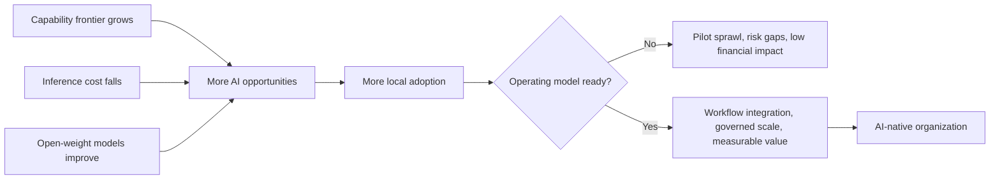
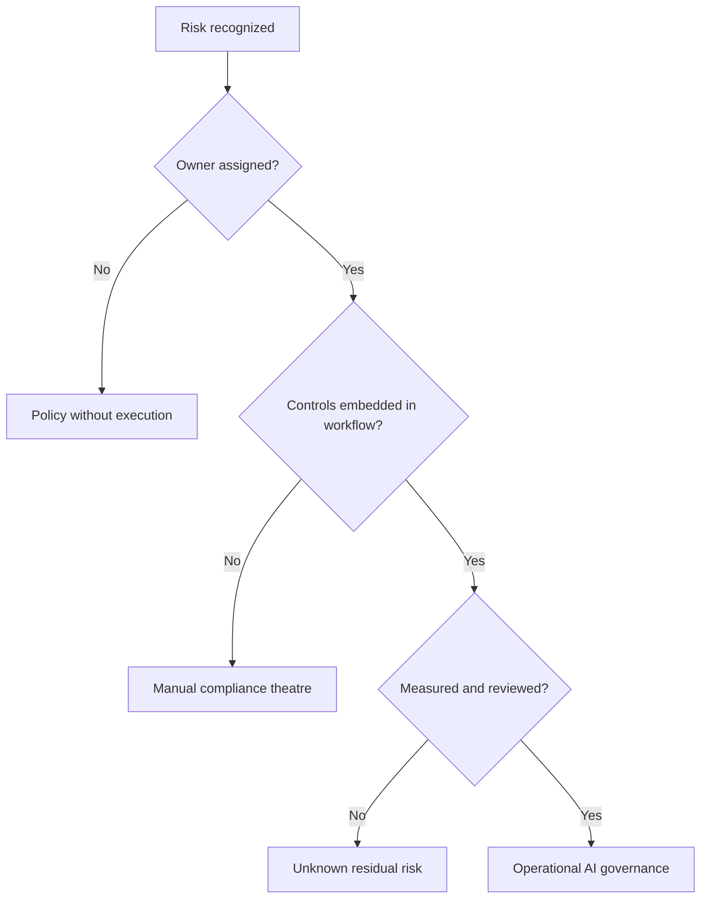

# Stanford HAI: AI Index Report 2025

## Коротко

AI Index 2025 полезен как опорный отчет для board-level разговора об AI transformation.

Главный вывод для базы: **AI становится дешевле, доступнее и мощнее быстрее, чем организации успевают перестроить управление, риски и operating model**.

Это не отчет про "какая модель лучше". Это отчет про системное давление на компанию:

- capability frontier быстро растет;
- inference cost резко падает;
- open-weight и закрытые модели сближаются;
- adoption в бизнесе стал массовым;
- финансовый эффект пока чаще низкий и локальный;
- responsible AI признан важным, но operational safeguards отстают;
- regulation и public infrastructure становятся частью конкурентной среды.

Для advisory это источник под тезис:

> AI advantage переходит от доступа к модели к способности организации управляемо встраивать AI в процессы, ответственность, данные, риски и принятие решений.

## Самое важное для моей базы знаний

### 1. AI adoption стал массовым, но transformation еще нет

По McKinsey-данным внутри отчета:

- 78% организаций используют AI хотя бы в одной функции в 2024 году;
- 71% используют generative AI хотя бы в одной функции;
- годом ранее показатели были 55% и 33%.

Но финансовый эффект остается ограниченным:

- cost savings чаще всего видны в service operations, supply chain и software engineering;
- большинство reported cost savings ниже 10%;
- revenue gains чаще видны в marketing/sales, supply chain и service operations;
- наиболее частый уровень revenue increase ниже 5%.

Практический вывод:

> AI adoption уже перестал быть differentiator. Differentiator — способность конвертировать AI use в управляемый экономический эффект.

Это поддерживает рамку [[Frameworks/ai-transformation/ai-native-organization|AI-native organization]]: важно не наличие инструментов, а способность операционной системы компании превращать новые capability в результат.

### 2. Стоимость AI резко падает, значит bottleneck смещается в организацию

Отчет фиксирует резкое снижение inference cost:

- стоимость запроса модели уровня GPT-3.5 на MMLU снизилась с $20 за 1M tokens в ноябре 2022 до $0.07 в октябре 2024;
- это более чем 280x снижение примерно за 18 месяцев;
- по оценке Epoch AI, в зависимости от задачи LLM inference cost падал от 9 до 900 раз в год.

Одновременно:

- hardware price-performance улучшается примерно на 30% в год;
- energy efficiency hardware растет примерно на 40% в год;
- small models становятся достаточно сильными для практических задач;
- open-weight gap к closed models сократился с 8.0% до 1.7% по Chatbot Arena.

Управленческий смысл:

> Когда technology cost падает, главным ограничением становится не доступ к AI, а качество [[Frameworks/governance/organizational-operating-model|organizational operating model]].

Компании, которые продолжают обсуждать AI как закупку лицензий, пропускают основной вопрос: есть ли у них контур выбора use cases, data access, quality gates, risk ownership и feedback loops.

### 3. Производительность растет, но ценность зависит от интеграции

Отчет суммирует исследования workplace productivity:

- AI дает productivity gains примерно 10-45% в разных доменах;
- в customer support рост resolved issues per hour составил 14.2%;
- в software development field experiment на 4,867 разработчиках показал +26.08% task completion;
- natural experiment на 187,489 разработчиках показал +12.4% core coding activities и -24.9% time spent on project management tasks;
- junior / low-skill workers часто получают больший прирост, чем senior / high-skill workers.

Но самый важный сигнал не в среднем проценте.

Отчет показывает, что high AI integration коррелирует с 72% вероятностью существенного productivity improvement, а minimal integration — только с 3.4%.

Практический вывод:

> AI productivity — это не свойство модели. Это результат интеграции модели в workflow, данные, роли, критерии качества и систему принятия решений.

Для CTO / VP Engineering это означает: локальный прирост скорости разработки может не стать business value, если downstream-система не готова к росту потока изменений.

### 4. Agentic AI силен на коротких горизонтах, но слабее на длинных

В RE-Bench frontier AI systems показывают сильный результат на коротких задачах:

- при 2-hour budget лучшие AI systems примерно в 4 раза выше human experts;
- при 8-hour budget люди уже немного впереди;
- при 32-hour budget люди превосходят AI примерно в 2 раза.

Это важный reality check против простого нарратива "agents replace teams".

Практический вывод:

> AI agents уже полезны как execution accelerator на коротких, хорошо ограниченных задачах. Но длинные, контекстные, конфликтные и управленческие задачи требуют operating model, а не только автономии агента.

Для [[Frameworks/governance/architecture-of-manageability|architecture of manageability]] это означает: agents нужно встраивать в систему контроля, handoff, escalation, audit trail и human judgment.

### 5. Software engineering capability быстро растет, но это увеличивает нагрузку на управление качеством

SWE-bench:

- в конце 2023 лучшая модель решала 4.4% задач;
- к началу 2025 top model решала 71.7% SWE-bench Verified.

Это резкий скачок в способности AI работать с реальными GitHub issues и multi-function code changes.

Но рост generation capability усиливает старые системные ограничения:

- code review;
- architecture consistency;
- automated testing;
- security checks;
- dependency governance;
- ownership of changes;
- incident response.

Практический вывод:

> AI снижает стоимость производства изменений, но не снижает автоматически стоимость понимания, проверки и эксплуатации этих изменений.

Это хорошо связывается с [[Frameworks/governance/quality-and-risks|quality and risks]] и DORA-логикой из [[dora-roi-of-ai-assisted-software-development-2026]].

### 6. Responsible AI: recognition есть, operational maturity отстает

Отчет показывает разрыв между признанием риска и управляемым действием.

AI risks considered relevant vs actively mitigated:

| Риск | Relevant | Actively mitigated | Gap |
|---|---:|---:|---:|
| Cybersecurity | 66% | 55% | 11 pp |
| Regulatory compliance | 63% | 53% | 10 pp |
| Personal privacy | 60% | 50% | 10 pp |
| Inaccuracy | 60% | 46% | 14 pp |
| Intellectual property infringement | 57% | 38% | 19 pp |
| Organizational reputation | 45% | 29% | 16 pp |
| Explainability | 40% | 31% | 9 pp |
| Equity and fairness | 34% | 26% | 8 pp |
| Workforce labor displacement | 20% | 12% | 8 pp |
| Environmental impact | 16% | 9% | 7 pp |
| National security | 11% | 7% | 4 pp |
| Political stability | 6% | 4% | 2 pp |
| Physical safety | 3% | 4% | -1 pp |

Gap = `Relevant - Actively mitigated`. В строке physical safety mitigated share чуть выше relevant share; оставляю как в исходной диаграмме.

Основные препятствия внедрения RAI:

- knowledge and training gaps — 51%;
- resource / budget constraints — 45%;
- regulatory uncertainty — 40%;
- lack of executive support — только 16%.

Практический вывод:

> Проблема Responsible AI уже не столько в отсутствии executive buy-in. Проблема в operationalization: компетенции, процессы, инструменты, ownership и регулярные проверки.

Это сильный аргумент для фреймворка AI governance как operating capability, а не как policy document.

### 7. Governance становится внешним ограничением и конкурентным фактором

Policy chapter фиксирует ускорение regulation и public investment:

- в 2024 году в США появилось 59 AI-related federal regulations против 25 в 2023;
- state-level AI laws в США выросли до 131 за год;
- AI mentions in legislative proceedings по 75 странам выросли на 21.3% в 2024 и более чем в 9 раз с 2016;
- EU AI Act принят European Parliament в марте 2024;
- NIST выпустил GenAI risk framework в июне 2024;
- AI safety institutes расширяются и координируются международно.

Управленческий смысл:

> AI governance перестает быть внутренней опцией. Она становится частью license to operate, procurement readiness и enterprise trust.

Для CEO это значит: AI strategy должна включать не только use cases и budget, но и regulatory posture, data rights, auditability и accountability.

### 8. Data commons сжимается

Отчет отмечает рост ограничений на использование публичного web data:

- в actively maintained domains из C4 common crawl доля restricted tokens выросла с 5-7% до 20-33% за 2023-2024.

Практический вывод:

> Доступ к данным становится стратегическим ограничением. AI-native organization должна управлять не только моделями, но и data rights, provenance, consent, licensing и internal knowledge accessibility.

Это особенно важно для компаний, которые хотят строить proprietary AI advantage на внутреннем контексте.

### 9. AI risk surface расширяется быстрее, чем практики контроля

В отчете есть важный риск-сигнал: AI risks перестали быть абстрактной темой ethics / policy и стали операционным классом рисков.

AI Incident Database зафиксировала:

- 233 reported AI incidents в 2024 году;
- это record high и +56.4% к 2023 году;
- реальное число, вероятно, выше, потому что база зависит от публичных media reports.

Примеры incidents в отчете показывают разные типы ущерба:

- false identification и репутационный ущерб от facial recognition;
- nonconsensual intimate deepfakes;
- unauthorized digital recreation / impersonation;
- harmful chatbot interaction в mental health context;
- election misinformation и deepfake-enabled erosion of trust.

Практический вывод:

> AI risk нельзя держать только в модели "model safety". Риск возникает на стыке модели, данных, интерфейса, пользователя, процесса, incentives и governance.

#### Карта рисков для AI transformation

| Класс риска | Как проявляется | Управленческий контур |
|---|---|---|
| Accuracy / hallucination | неверные ответы, ложные выводы, unreliable automation | evals, human review, confidence thresholds, rollback |
| Cybersecurity | prompt injection, jailbreaks, agent misuse, data exfiltration | threat modeling, red teaming, sandboxing, access control |
| Privacy / data governance | leakage of personal data, consent violations, unclear data rights | data classification, retention policy, access logs, DPA / DPIA |
| IP / copyright | training / output / reuse conflicts, unclear ownership | source tracking, licensing checks, vendor terms review |
| Bias / fairness | implicit discrimination despite explicit debiasing | bias testing, segment metrics, appeal process |
| Explainability | inability to justify outputs in high-stakes workflows | decision logs, rationale requirements, interpretable checks |
| Reputation | public failure, offensive outputs, harmful automation | escalation path, incident response, comms protocol |
| Regulatory compliance | EU AI Act, GDPR, sector rules, audit requirements | AI inventory, risk tiering, control evidence |
| Workforce risk | deskilling, displacement anxiety, shadow AI | adoption policy, training, role redesign, manager enablement |
| Environmental / infrastructure | rising power draw, carbon emissions, energy constraints | workload governance, model sizing, compute budgets |
| Societal / misinformation | deepfakes, liar's dividend, manipulation | provenance, watermarking where useful, media policy |
| National security / political stability | dual-use capabilities, export controls, influence operations | geopolitical risk review, vendor restrictions, policy monitoring |
| Physical safety | autonomous systems, robotics, safety-critical environments | formal safety case, simulation, human override |
| Agentic / multiagent risk | cascading failures, unauthorized actions, tool misuse | scoped autonomy, permissions, simulation, kill switches |

#### Почему agents требуют отдельного risk model

Отчет выделяет agentic AI как особую область RAI.

Причина: agents не просто генерируют текст. Они могут:

- планировать цепочки действий;
- использовать инструменты;
- взаимодействовать с внешними системами;
- менять состояние среды;
- действовать в unstructured scenarios;
- взаимодействовать с другими agents.

Исследование ToolEmu показало, что даже наиболее safety-optimized LM agents failed in 23.9% of critical scenarios. Ошибки включали dangerous commands, misdirected financial transactions и traffic control failures.

Отдельный сигнал — multiagent vulnerabilities. В симуляциях infectious jailbreak через одну adversarial image мог почти полностью распространиться по сети до 1 млн MLLM agents за 27-31 interaction rounds. Практических mitigation measures для такого класса риска отчет не фиксирует.

Практический вывод:

> Agentic AI нельзя масштабировать по тем же правилам, что chat assistants. Чем больше у агента tools, permissions и связей с другими agents, тем ближе он к операционному risk-bearing system.

#### Reasoning risk: сильные модели все еще ненадежны в логике

Отчет прямо отмечает, что complex reasoning остается проблемой:

- модели сильны на отдельных benchmarks и coding tasks;
- но все еще ненадежны на logic, arithmetic и planning tasks, где существуют provably correct solutions;
- это ограничивает suitability для high-risk applications.

Управленческий смысл:

> Высокий benchmark score не заменяет domain-specific verification. Для high-stakes процессов нужен не "лучший LLM", а проверяемая система принятия решений.

#### Safety benchmark gap

Отчет подчеркивает отсутствие консенсуса по стандартным safety / responsible AI benchmarks.

Ситуация:

- capability benchmarks вроде MMLU, GPQA, MATH используются широко;
- comparable consensus по RAI / safety benchmarks отсутствует;
- новые benchmarks появляются: HELM Safety, AIR-Bench, FACTS, SimpleQA;
- но adoption еще не стал industry standard.

Практический вывод:

> Компании не могут ждать зрелого рынка evals. Им нужен собственный минимальный eval stack под свои workflow, risk tolerance и regulatory exposure.

#### Environmental and infrastructure risk

Несмотря на рост hardware efficiency, total power draw frontier training растет:

- power required to train frontier models, по Epoch AI, doubling annually;
- GPT-3 training emissions оценены примерно в 588 tons CO2e;
- GPT-4 — 5,184 tons CO2e;
- Llama 3.1 405B — 8,930 tons CO2e.

Для большинства компаний это не прямой model-training risk, а indirect infrastructure / vendor / procurement risk:

- compute cost;
- energy availability;
- sustainability commitments;
- supplier concentration;
- workload governance.

Практический вывод:

> AI governance должен включать не только legal / security, но и compute governance: какие модели, для каких задач, с каким cost / latency / carbon / risk profile.

## Модели / фреймворки

### Модель 1. AI transformation pressure map

### Модель 2. From model access to organizational advantage

| Стадия | Что кажется главным | Что на самом деле ограничивает value |
|---|---|---|
| Access | Купить tools / API | Security, data access, procurement |
| Adoption | Поднять usage | Workflow fit, training, manager adoption |
| Integration | Встроить в процессы | Ownership, data quality, quality gates |
| Scale | Расширить на функции | Governance, metrics, operating model |
| Advantage | Получить стратегический эффект | Learning loops, proprietary context, decision systems |

### Модель 3. Responsible AI operating gap

### Модель 4. Agent deployment boundary

| Задача | AI agent fit | Управленческий контроль |
|---|---|---|
| Короткая, ограниченная, проверяемая | High | automated tests, review, rollback |
| Повторяемая операционная задача | Medium / high | SOP, metrics, escalation path |
| Длинная R&D-задача | Medium | milestones, human steering, audit trail |
| High-stakes decision | Low / assisted | human accountability, explainability |
| Cross-functional organizational change | Low | governance, ownership, decision forums |

## Цифры и доказательная база

| Показатель | Значение | Интерпретация |
|---|---:|---|
| Organizations using AI in at least one function | 78% | adoption стал массовым |
| Organizations using AI in at least one function, 2023 | 55% | рост adoption ускорился после стагнации |
| Organizations using GenAI in at least one function | 71% | GenAI перешел из эксперимента в рабочий слой |
| Organizations using GenAI in at least one function, 2023 | 33% | GenAI usage более чем удвоился |
| Global corporate AI investment, 2024 | $252.3B | рынок снова растет после замедления |
| Global corporate AI investment growth, 2024 | +25.5% | рост total corporate investment |
| Global private AI investment growth, 2024 | +44.5% | capital снова ускоряет AI ecosystem |
| Generative AI private investment, 2024 | $33.9B | более 20% private AI investment |
| Generative AI private investment growth, 2024 | +18.7% | GenAI funding продолжает расти |
| Newly funded AI companies, 2024 | 2,049 | startup activity снова растет |
| Newly funded GenAI companies, 2024 | 214 | почти 7x к 2019 году |
| U.S. private AI investment, 2024 | $109.1B | сильное лидерство США по capital allocation |
| Cost savings from AI in service operations | 49% respondents | самый частый reported cost-saving function |
| Cost savings from AI in supply chain / inventory | 43% respondents | второй по частоте reported cost-saving function |
| Cost savings from AI in software engineering | 41% respondents | engineering эффект уже виден, но чаще <10% |
| Revenue gains from AI in marketing and sales | 71% respondents | самый частый reported revenue-gain function |
| Revenue gains from AI in supply chain / inventory | 63% respondents | второй по частоте reported revenue-gain function |
| Revenue gains from AI in service operations | 57% respondents | третий по частоте reported revenue-gain function |
| Workplace productivity gains across studies | 10-45% | эффект зависит от контекста и интеграции |
| High vs minimal AI integration productivity probability | 72% vs 3.4% | value зависит от workflow integration |
| Inference cost drop for GPT-3.5-level MMLU | >280x | model access commoditizes |
| Open-weight vs closed-weight gap | 8.0% to 1.7% | frontier access becomes less concentrated |
| SWE-bench best score | 4.4% to 71.7% | coding capability быстро растет |
| ToolEmu critical scenario failure rate | 23.9% | agents требуют отдельного risk model |
| AI incidents reported in AI Incident Database, 2024 | 233 | risk surface растет |
| Incident growth vs 2023 | +56.4% | governance должен масштабироваться быстрее |
| Foundation Model Transparency Index average score | 37% to 58% | transparency улучшается, но остается неполной |
| U.S. AI-related federal regulations, 2024 | 59 | governance pressure растет |
| FDA-approved AI medical devices by 2023 | 223 | AI уже входит в regulated domains |

## Advisory interpretation

### Для CEO

- AI strategy нельзя строить вокруг "мы внедрили GenAI".
- Board-level вопрос: где AI меняет economics процесса, а где только добавляет активность.
- AI governance должен быть частью business operating model, а не приложением от legal / security.
- Главный риск: компания покупает capability быстрее, чем строит accountability.
- Главная возможность: снижение inference cost делает AI применимым к большему числу процессов, включая low-margin operational workflows.

### Для CTO / VP Engineering

- Open-weight и small models создают больше architectural choices: build / buy / host / fine-tune / RAG / agentic workflow.
- Быстрый рост coding capability увеличивает нагрузку на verification, architecture standards и platform engineering.
- AI value в engineering нужно считать не только по coding speed, а по lead time, change failure rate, review load, incident rate и rework.
- Agents нужно внедрять через controlled scopes, evals, observability и rollback.
- Internal data and context становятся важнее model novelty.

### Для COO / Transformation Lead

- Productivity gains требуют workflow integration, иначе остаются индивидуальной эффективностью.
- Нужно выбирать use cases по process economics: volume, variability, risk, verification cost, data availability.
- RAI blockers в основном операционные: skills, resources, uncertainty, technical limitations.
- Governance должен быть встроен в lifecycle: intake, design, deployment, monitoring, incident response.

### Для Engineering Managers

- AI сильнее помогает junior / lower-skill workers, но это требует новых стандартов review и mentoring.
- Manager role смещается от task assignment к управлению quality gates, context, learning loops и escalation.
- Ускорение разработки без clear ownership увеличивает скрытый coordination cost.

## Диагностические вопросы

- Какие AI use cases уже дают measurable P&L impact, а какие только usage metrics?
- Где AI уже используется shadow / unofficially, и что это говорит о реальных bottlenecks?
- Кто владеет AI risk в каждом бизнес-процессе: business, product, engineering, legal, security?
- Какие AI risks признаны relevant, но не mitigated?
- Есть ли AI inventory: systems, vendors, models, data sources, owners, risk level?
- Как измеряется AI productivity: output volume, cycle time, quality, rework, incidents, customer impact?
- Какие workflows имеют достаточный data access и quality gates для масштабирования AI?
- Где falling inference cost делает возможной автоматизацию, которая раньше была экономически невыгодной?
- Какие решения нельзя отдавать AI без human accountability?
- Какой минимальный governance контур нужен до масштабирования agents?

## Возможные фреймворки на основе отчета

### 1. AI Readiness Is Operating Readiness

Тезис:

- AI readiness = model access + workflow integration + governance + data rights + quality controls.
- Без operating readiness компания получает adoption без transformation.

### 2. The Governance Gap

Тезис:

- компании уже признают AI risks;
- но mitigation отстает почти по всем категориям;
- значит, проблема не awareness, а execution system.

### 3. AI Economics Shift

Тезис:

- когда inference cost падает на порядки, AI перестает быть дорогим экспериментом;
- появляется новая категория use cases в операционных процессах;
- bottleneck переносится в discovery, integration, governance и change management.

### 4. Agents Need Management Architecture

Тезис:

- agents сильны на коротких горизонтах;
- на длинных горизонтах выигрывает не автономия, а управляемый контур: milestones, ownership, review, escalation.

## Идеи для постов

### Пост 1: AI adoption больше не преимущество

Hook:

> 78% компаний уже используют AI. Значит, сам факт внедрения перестал быть стратегией.

Тезис:

- массовое adoption не равно transformation;
- финансовый эффект пока низкий;
- преимущество смещается в operating model.

### Пост 2: AI стал дешевле, управление стало дороже

Hook:

> Когда стоимость inference падает в 280 раз, главным bottleneck становится не модель.

Тезис:

- model access commoditizes;
- value ограничивают данные, ownership, quality gates и governance;
- AI transformation — это управленческая архитектура.

### Пост 3: Responsible AI проваливается не на уровне принципов

Hook:

> Большинство компаний уже видят AI risks. Но гораздо меньше компаний реально их mitigates.

Тезис:

- awareness есть;
- execution gap остается;
- RAI нужен как operating capability, а не как policy.

## Связанные заметки

- [[Frameworks/ai-transformation/ai-native-organization|AI-native organization]]
- [[Frameworks/governance/architecture-of-manageability|architecture of manageability]]
- [[Frameworks/governance/decision-systems|decision systems]]
- [[Frameworks/governance/organizational-operating-model|organizational operating model]]
- [[Frameworks/governance/quality-and-risks|quality and risks]]
- [[Frameworks/governance/systemic-management|systemic management]]
- [[dora-roi-of-ai-assisted-software-development-2026]]
- [[mit-nanda-genai-divide-state-of-ai-in-business-2025]]

## Source

- PDF: [[Frameworks/ai-transformation/sources/hai_ai_index_report_2025.pdf|hai_ai_index_report_2025.pdf]]
- Local path: `Frameworks/ai-transformation/sources/hai_ai_index_report_2025.pdf`
- Citation from report: Nestor Maslej et al., "The AI Index 2025 Annual Report," AI Index Steering Committee, Institute for Human-Centered AI, Stanford University, April 2025.
- DOI: `10.48550/arXiv.2504.07139`
- Extracted text used for processing: `/private/tmp/hai_ai_index_report_2025.txt`
