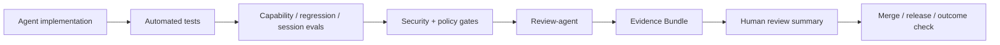

# Evidence Bundle

Evidence Bundle - пакет доказательств, подтверждающий, что агентная задача не просто выполнена, а проверена, объяснима, аудируема и связана с ожидаемым результатом.

## Коротко

В AI-native PDLC цикл реализации не считается завершенным, пока не сформирован Evidence Bundle. Это замена слабого сигнала "код готов" на управленческий сигнал "результат доказан".

## Состав

| Элемент | Что доказывает |
| --- | --- |
| Code changes | diff и ссылка на PR |
| Eval results | capability, regression, session-length, escalation evals |
| Token cost report | стоимость исполнения по моделям и сессиям |
| Audit trail | append-only log действий агента |
| Validation attestations | результаты review-agent, security gate, policy gate, release gate |
| Explanation artifact | структурированное объяснение действий R2+ |
| Output volume contribution | вклад в рост объема артефактов относительно baseline |
| Outcome check pointer | ссылка на post-deploy проверку бизнес-результата |

## Почему это важно

AI ускоряет создание артефактов, но не гарантирует:

- корректность результата;
- сохранение контрактов существующей системы;
- соответствие политикам;
- объяснимость решений агента;
- управляемую стоимость;
- связь с бизнес-гипотезой.

Evidence Bundle делает завершение задачи проверяемым событием, а не утверждением исполнителя.

## Связь с eval-driven development

Документ выделяет несколько классов evals:

| Класс evals | Что проверяет |
| --- | --- |
| Capability evals | агент умеет выполнить ожидаемую функцию |
| Regression evals | изменение не ломает критические пути |
| Session-length evals | качество не деградирует с ростом task horizon |
| Escalation evals | агент умеет просить помощи в неопределенной ситуации |

## Модель завершения задачи

## Метрики

- Evidence Bundle Completion Rate: доля задач с полным пакетом доказательств.
- Agent-introduced Regression Rate: доля регрессий, внесенных агентными изменениями.
- Escalation Quality Score: корректность эскалаций человеку.
- Outcome Validation Rate: доля задач, у которых результат подтвержден после деплоя.

## Advisory use

Evidence Bundle можно использовать как executive-level критерий зрелости:

> Пока организация не умеет показать доказательства агентного результата, она не управляет AI-native разработкой. Она доверяет ей.

## Связанные заметки

- [[Frameworks/models/specification-driven-development|Specification-Driven Development]]
- [[Frameworks/models/governance-mesh|Governance Mesh]]
- [[Frameworks/models/ai-native-engineering-metrics|AI-native engineering metrics]]
- [[Frameworks/models/quality-and-risks|quality and risks]]
