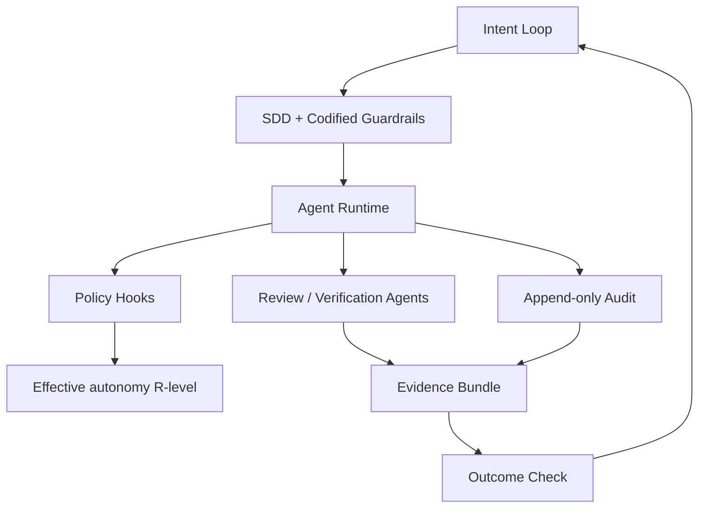

# Governance Mesh

Governance Mesh - сквозной слой управления AI-native разработкой, который действует внутри цикла намерения и цикла реализации, а не добавляется как финальная контрольная точка.

## Коротко

В AI-native PDLC классическое управление не успевает за скоростью агентного исполнения. Если оставить управление как проверку постфактум, оно становится узким местом или пропускает риск.

Governance Mesh отвечает на три вопроса одновременно:

| Измерение | Вопрос | Механизм |
| --- | --- | --- |
| Quality / validation | правильно ли сделано | evals, review-agent, regression checks, Evidence Bundle |
| Permission / policy | можно ли это делать | R0-R5, policy hooks, codified guardrails |
| Audit / compliance | как это доказать | append-only audit, structured explanations, policy event log |

## Три свойства

| Свойство | Смысл | Пример |
| --- | --- | --- |
| Autonomous | надзор работает на скорости агента | review agents, verification agents, autoremediation |
| Embedded | ограничения встроены в платформу и SDD | codified guardrails, policy-as-code |
| Adaptive | контроль зависит от контекста | пересчет effective R-level по критичности, риску и сложности |

## Почему это не финальный gate

Финальный gate работает в одной точке процесса. Mesh работает на каждом уровне:

- в Discovery фиксируются ограничения, гипотеза результата и карта участия человека;
- в SDD ограничения становятся машиночитаемыми;
- в runtime каждое действие агента проходит через policy hooks;
- в проверке результата формируется [[Frameworks/models/evidence-bundle|Evidence Bundle]];
- после деплоя telemetry возвращается в спецификацию.

## Governance Debt

Governance Debt - отложенный долг управления, который возникает, когда агентные операции не покрыты:

- автономным надзором;
- встроенными guardrails;
- адаптивной оценкой контекста;
- доказуемым аудитом.

Внешне организация может видеть рост скорости и output volume, но внутри накапливать стоимость будущих инцидентов, регуляторных нарушений и ручной remediation.

## Практическая модель

## Advisory use

Governance Mesh полезен как альтернатива двум слабым управленческим реакциям:

- запретить агентное исполнение, потому что риск непонятен;
- разрешить агентное исполнение без встроенного контура управления.

Зрелая позиция: автономность можно повышать только там, где управление стало исполняемым, проверяемым и адаптивным.

## Диагностические вопросы

- Какие правила безопасности и соответствия требованиям являются машиночитаемыми?
- Где пересчитывается уровень автономии агента: до запуска задачи или на каждой операции?
- Что является доказательством завершения агентной задачи?
- Есть ли отдельная метрика покрытия AI-инструментов платформенными политиками?
- Кто владеет lifecycle политики: создание, тесты, устаревание, вывод из эксплуатации?

## Связанные заметки

- [[Frameworks/models/risk-adaptive-agent-autonomy-r0-r5|Risk-adaptive agent autonomy R0-R5]]
- [[Frameworks/models/evidence-bundle|Evidence Bundle]]
- [[Frameworks/models/specification-driven-development|Specification-Driven Development]]
- [[Frameworks/models/agent-runtime|Agent Runtime]]
- [[Frameworks/models/quality-and-risks|quality and risks]]
- [[Frameworks/models/architecture-of-manageability|architecture of manageability]]
