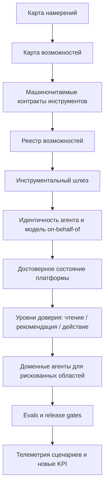

# Agent-first IDP: платформы для агентов

## Резюме

Статья полезна как аналитическая карта перехода от классической Internal Developer Platform к agent-first IDP: платформе, которую потребляют не только люди через GUI, но и агенты через управляемые возможности, контракты, идентичность, политики, оценочные проверки и телеметрию.

Главный тезис: задача платформенной команды - не "прикрутить MCP", а превратить платформу в управляемую среду для агентного потребления. Для этого нужны достоверное состояние платформы, семантические модели, безопасные инструменты, реестр возможностей, доменные агенты для рискованных областей и новые метрики успеха.

Для моей базы знаний статья особенно полезна как связка между [[Frameworks/models/internal-developer-platform|Internal Developer Platform]], [[Frameworks/models/agent-runtime|Agent Runtime]], [[Frameworks/models/architecture-of-manageability|architecture of manageability]] и [[Frameworks/models/risk-adaptive-agent-autonomy-r0-r5|Risk-adaptive agent autonomy R0-R5]].

## Статус источника

Это не первичный и не независимый исследовательский источник.

Использовать как:

- сильную вторичную аналитическую рамку;
- карту архитектурной сходимости вокруг agent-first платформ;
- источник гипотез, моделей и диагностических вопросов;
- навигацию к первичным материалам Block, Uber, LinkedIn, Spotify, AWS, Azure, Google Cloud, OWASP, OpenTelemetry и Anthropic.

Не использовать как:

- доказательство зрелости конкретных продуктов;
- независимый бенчмарк;
- единственный источник для публичных утверждений о вендорах;
- подтверждение чисел без проверки по первичным ссылкам.

## Самое важное для моей базы знаний

### 1. Главный пользователь IDP меняется

Классическая IDP проектировалась вокруг человека, GUI и портала. Agent-first IDP должна проектироваться вокруг намерений, инструментов, политик, аудита и машинно-потребляемых контрактов.

Практический вывод:

> Если агент становится потребителем платформы, IDP должна управлять не экранами, а возможностями.

GUI при этом не исчезает. Он становится контуром управления для людей: настройка, аудит, расследования, сравнение, исключения, согласования и визуальная проверка рискованных изменений.

### 2. MCP не является стратегией

MCP полезен как протокол доступа к инструментам, но не решает сам по себе главные управленческие вопросы:

- кто владеет возможностью;
- какие права нужны для вызова;
- где журнал аудита;
- как отозвать доступ;
- какие данные считаются достоверными;
- какие сценарии требуют согласования;
- как проверяется поведение агента;
- как измеряется успех.

Практический вывод:

> Превратить API в MCP-инструменты проще, чем превратить платформу в управляемую агентную поверхность.

### 3. Agent-first IDP требует базовой управленческой гигиены

До агентных действий должны работать:

- корпоративный провайдер идентичности;
- доверенный журнал аудита;
- владельцы у платформенных API;
- живой каталог сервисов с владельцами;
- вовлеченная команда безопасности.

Если двух и более предпосылок нет, реалистичная цель первого квартала - не автономные действия, а выявление спроса, чистка каталога и пилот на инструментах чтения.

### 4. Агентная платформа строится от намерений, а не от API

Первый артефакт - не MCP-сервер, а карта намерений: какие повторяющиеся задачи разработчики, SRE, безопасность, FinOps и платформенные команды уже пытаются решить через портал, тикеты, чаты и операционные инструкции.

Полезная классификация намерений:

| Ось | Варианты | Зачем нужна |
| --- | --- | --- |
| Режим | чтение / рекомендация / действие | определяет уровень риска и контроля |
| Частота | высокая / средняя / низкая | помогает выбрать пилот |
| Риск | низкий / средний / высокий | определяет требования к согласованию |
| Владелец | команда / домен / платформа | фиксирует ответственность |
| Артефакт ответа | объяснение / план / diff / действие | задает контракт результата |

### 5. Качество агента зависит от качества платформенного состояния

Для agent-first IDP семантический слой важнее интерфейса. Агенту нужны не просто документы, а достоверные данные о сервисах, владельцах, зависимостях, деплоях, SLO, окружениях, стоимости, политиках и операционных инструкциях.

Практический вывод:

> Грязный каталог превращает сильную модель в генератор уверенных ошибок.

### 6. Автономия выдается не агенту целиком, а конкретной возможности

Статья хорошо поддерживает risk-adaptive подход: одна и та же платформа может давать агентам широкий доступ на чтение, ограниченный режим рекомендаций и очень осторожный режим действий.

Управленческий сдвиг:

- не "включили автономного агента";
- а "эта конкретная возможность перешла от чтения к рекомендациям или действиям после доказанной надежности".

### 7. Evals становятся частью платформенной поставки

Для агентной поверхности оценочные проверки становятся регрессионным контуром, похожим на тесты API. Проверять нужно не только качество ответа, но и выбор инструмента, параметры вызова, отказ от опасного действия, соблюдение политик и поведение при устаревших данных.

Практический вывод:

> Agent-first IDP нельзя выпускать через демо в чате. Нужны golden tasks, release gates и проверка политик.

### 8. Метрики IDP меняются

Если агент успешно выполняет сценарии, использование GUI может падать. Это не обязательно провал платформы.

Новые метрики:

- доля возможностей, безопасно доступных агентам;
- доля успешно выполненных намерений;
- время до безопасного изменения;
- стоимость сценария;
- время прохождения согласований;
- частота нарушений политик;
- снижение нагрузки на платформенную поддержку;
- доля сценариев без ручной эскалации.

## Ключевые модели

### Модель 1. Три слоя agent-first платформы

| Слой | Роль | Что контролирует | Чем не является |
| --- | --- | --- | --- |
| Модельный шлюз | Единая точка доступа к LLM | аутентификация, квоты, кэш, стоимость, PII-фильтры | не каталог внутренних инструментов |
| Инструментальный шлюз | Управляемый доступ агентов к возможностям платформы | права, лимиты, аудит, вызовы инструментов, отключение | не источник истины о всех возможностях |
| Реестр возможностей | Каталог агентных интерфейсов | владельцы, версии, статусы, scopes, evals, поддержка | не механизм исполнения |

Смысл модели: эти слои сочетаются, но не заменяют друг друга. Реестр без шлюза не дает контроля. Модельный шлюз без реестра возможностей не управляет платформенными действиями.

### Модель 2. Стек agent-first IDP

### Модель 3. Машиночитаемый контракт инструмента

Минимальный контракт возможности должен включать:

| Элемент | Управленческий смысл |
| --- | --- |
| Назначение | для какого намерения существует инструмент |
| Входная схема | какие параметры допустимы |
| Форма ответа | что агент получает обратно |
| Побочные эффекты | меняет ли инструмент состояние |
| Идемпотентность | безопасен ли повторный вызов |
| Модель ошибок | что агент должен сделать после ошибки |
| Лимит размера ответа | защита контекста от перегрузки |
| Стоимость | учет затрат на сценарий |
| Ограничения политик | какие правила блокируют вызов |
| События аудита | что фиксируется для расследования |

Практический принцип: один инструмент - один уровень риска. Диагностику и изменение состояния нельзя смешивать в одной операции.

### Модель 4. Уровни доверия к агентной возможности

| Режим | Что разрешено | Что требуется |
| --- | --- | --- |
| Чтение | получать данные, объяснять состояние, искать владельцев | идентичность, scopes, квоты, аудит |
| Рекомендация | предлагать план, diff, оценку риска, следующий шаг | проверка политик, ссылка на согласование, запрет на применение изменений |
| Действие | менять состояние системы | policy-as-code, согласование, dry-run, ограничение радиуса воздействия, откат, аварийное отключение |

Связь с [[Frameworks/models/risk-adaptive-agent-autonomy-r0-r5|Risk-adaptive agent autonomy R0-R5]]: автономия должна повышаться по конкретной возможности после накопленной статистики надежности, а не выдаваться агенту целиком.

### Модель 5. Трасса агентного сценария

У каждого участка трассы должны быть атрибуты пользователя, агента, инструмента, модели, версии промпта, версии инструмента, области доступа, стоимости, задержки, ошибки и решения политики.

### Модель 6. Модель угроз агентной поверхности

| Угроза | Что меняется по сравнению с обычным API | Базовая защита |
| --- | --- | --- |
| Инъекция инструкций | агент читает текст, который может содержать команды злоумышленника | считать внешний текст данными, а не инструкциями |
| Отравление инструментов | описание инструмента становится каналом влияния на модель | реестр, ревью, владельцы, запрет обхода реестра |
| Утечка данных | агент может читать чувствительные данные и писать наружу | разделение read/write scopes, PII-фильтры, allowlist направлений |
| Слишком широкая выборка | поиск по всем данным приносит недоступное пользователю | проверка прав на каждом вызове от имени пользователя |
| Секреты в контексте | токены попадают в ответы, историю и телеметрию | secret-фильтры и evals на утечки |
| Сбитый с толку посредник | агент имеет больше прав, чем пользователь | on-behalf-of и пересечение прав агента с правами принципала |

## Антипаттерны

| Антипаттерн | Почему опасен | Здоровая альтернатива |
| --- | --- | --- |
| Автоматически конвертировать все OpenAPI endpoints в MCP-инструменты | агентная поверхность наследует внутренние границы сервисов, а не задачи пользователей | проектировать возможности от намерений |
| Инструмент `Gets service information`, который возвращает мегабайт JSON | модель получает шум, скрытые побочные эффекты и неуправляемый контекст | высокоуровневый контракт с ограниченным ответом |
| Каждая команда поднимает свой MCP-сервер | через полгода нет карты возможностей, владельцев и аудита | реестр возможностей и инструментальный шлюз |
| Общий `ai-platform-sa` с широкими правами | инциденты невозможно расследовать, права невозможно локально отозвать | отдельная идентичность агента и модель on-behalf-of |
| Подключить агента к старой вики и конфликтующим каталогам | модель уверенно опирается на недостоверное состояние | семантический слой с метриками свежести и полноты |
| Бинарное мышление "чат-бот или полная автономия" | организация либо недополучает пользу, либо берет чрезмерный риск | лестница доверия: чтение -> рекомендация -> действие |
| Дать агенту сырой доступ к логам, IAM и SQL | универсальная модель может перепутать причину и следствие или создать риск | доменный агент с политиками, отказами и эскалацией |
| Проверить агента пятью демо-вопросами | демо не ловит регрессии, обход политик и ошибки tool-use | golden tasks, evals, release gates |
| Мерить agent-first IDP по MAU портала | успешная автоматизация может выглядеть как падение GUI-использования | метрики намерений, безопасных изменений, стоимости и эскалаций |
| Большой взрыв агентной стратегии | организация запускает больше поверхности риска, чем может контролировать | пилот на частых низкорисковых сценариях |
| Чат поверх старого портала как "agent-first platform" | интерфейс меняется, управляемость не появляется | управляемые возможности, контракты, аудит, evals |
| Операции-действия без review-by-default | агент получает возможность менять состояние без доказанного доверия | dry-run, согласование, откат, аварийное отключение |

## Тезисы для advisory-работы

- Agent-first IDP - это не новый интерфейс к старой платформе, а новая поверхность потребления платформенных возможностей.
- Главный дефицит в agentic engineering - не доступ к LLM, а управляемость: права, контекст, политики, состояние, проверка и телеметрия.
- MCP полезен только внутри управленческого контура. Без владельцев, scopes, аудита и evals он быстро становится новой формой shadow IT.
- Платформенная команда должна перейти от продуктового мышления вокруг экранов к продуктовому мышлению вокруг возможностей.
- В опасных доменах агенту нельзя отдавать сырые примитивы. Нужен доменный слой, который несет политику, семантику и отказ.
- Успешная agent-first платформа может снижать использование портала. Это не провал, если растет доля безопасно выполненных намерений.
- Качество агентной платформы проверяется не красотой ответа, а воспроизводимостью безопасного сценария.
- Без достоверного каталога сервисов, владельцев и зависимостей agent-first IDP будет масштабировать управленческий хаос.
- Идентичность агента должна быть объектом управления, а не технической деталью сервисного аккаунта.
- Первый квартал может быть ценным даже без автономных действий, если он создает карту спроса, чистит каталог и запускает инструменты чтения.

## Диагностические вопросы

- Какие 20 намерений разработчики и SRE чаще всего решают через платформу, тикеты и чаты?
- Какие из этих намерений являются чтением, рекомендацией и действием?
- Есть ли у каждой агентной возможности владелец, версия, статус, scopes и eval-набор?
- Можно ли по любому агентному результату восстановить пользователя, агента, инструмент, источник данных, стоимость и решение политики?
- Где сегодня находится реестр агентных возможностей?
- Какие MCP-серверы уже живут вне контроля платформы и безопасности?
- Какие данные платформы агент должен считать недостоверными или устаревшими?
- Где нужен доменный агент вместо прямого доступа к API?
- Какие сценарии должны уметь корректно отказывать?
- Какие GUI-метрики нужно заменить метриками агентных намерений?

## Возможные идеи для постов

- "MCP не делает платформу agent-first. Он только увеличивает поверхность, которую нужно уметь управлять."
- "Внутренняя платформа будущего - это не портал, а реестр безопасных возможностей."
- "Почему AI-агенту нельзя давать общий сервисный аккаунт."
- "Главная работа перед автономными агентами скучная: каталог, владельцы, аудит и политики."
- "Если MAU портала падает, возможно, платформа наконец начала работать."
- "Agent-first IDP начинается не с API, а с карты намерений."

## Что проверить по первичным источникам

Перед публичным использованием стоит проверить:

- заявления Block о количестве и устройстве MCP-серверов;
- материалы Uber про GenAI Gateway и Genie;
- материалы LinkedIn про GenAI-стек, реестр навыков и мультиагентную инфраструктуру;
- материалы Spotify про Backstage как agent-first платформу;
- статус и возможности AWS AgentCore Gateway и AWS MCP Server;
- статус Azure MCP Server, Entra Agent ID, Azure SRE Agent и Azure AI Foundry evaluators;
- состояние Google Cloud MCP-серверов и Gemini Cloud Assist investigations;
- актуальность OWASP Top 10 for LLM Applications 2025;
- актуальность OpenTelemetry semantic conventions for GenAI.

## Связанные заметки

- [[Frameworks/models/internal-developer-platform|Internal Developer Platform]]
- [[Frameworks/models/agent-runtime|Agent Runtime]]
- [[Frameworks/models/ai-native-organization|AI-native organization]]
- [[Frameworks/models/architecture-of-manageability|Architecture of Manageability]]
- [[Frameworks/models/risk-adaptive-agent-autonomy-r0-r5|Risk-adaptive agent autonomy R0-R5]]
- [[Frameworks/models/quality-and-risks|Quality and Risks]]
- [[Frameworks/models/governance-mesh|Governance Mesh]]
- [[Frameworks/source-notes/ai-disrupt-pdlc-whitepaper-2026|AI-Disrupt PDLC Whitepaper 2026]]
- [[Frameworks/source-notes/google-cloud-roi-of-ai-2025|Google Cloud ROI of AI 2025]]

## Источник

- Статья: [Agent-first IDP: как платформы к агентам готовят бигтехи и облака](https://tellmeabout.tech/agent-first-idp-how-big-tech-and-clouds-are-preparing-platforms-for-agents-3fe6a125b6b1)
- Автор: Alexander Polomodov
- Дата публикации: 2026-06-14
- Тип источника: вторичный аналитический материал
