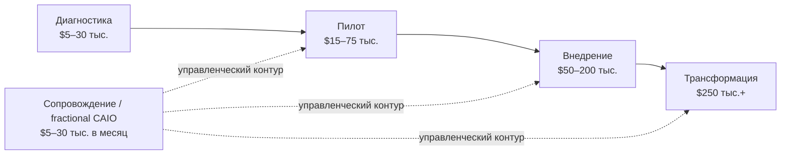

# Boomdevs: ценообразование AI-консалтинга в 2026 году

## Коротко

- Источник дает широкий рыночный ориентир: от **$100 до $1,200+ в час** и от **$5,000 до $500,000+ за проект** в зависимости от масштаба, состава исполнителя и определения готового результата.
- Большинство самостоятельных проектов авторы помещают в диапазон **$20,000–$200,000**. Полная корпоративная трансформация может превышать **$500,000**.
- Цена собственно консультационной или инженерной работы не равна полному бюджету. Подготовка данных, лицензии и использование моделей, управление изменениями и сопровождение могут увеличить бюджет первого года примерно до **145–175% базовой стоимости**.
- Для консультационной практики полезна не одна «рыночная ставка», а лестница форматов: диагностика → пилот → внедрение → масштабирование → постоянное сопровождение.
- Цифры нужно использовать как ориентиры, а не как независимо подтвержденный отраслевой стандарт. Boomdevs опирается на смесь материалов поставщиков и институциональных исследований; сами ценовые диапазоны в основном взяты из публикаций участников рынка.

## Самое важное для моей базы знаний

### 1. Разброс цены определяется не только сложностью задачи, но и типом исполнителя

| Тип исполнителя | Типичная ставка | Типичный размер работы | Для чего подходит |
| --- | ---: | ---: | --- |
| Независимый консультант | $100–$300/час | $5,000–$40,000 | Узкая задача, аудит, оценка модели, отдельная интеграция |
| Бутиковая AI-консалтинговая компания | $175–$450/час | $20,000–$150,000 | Работа с участием старших специалистов, стратегия и внедрение для среднего бизнеса |
| Региональная или средняя IT-компания | $250–$600/час | Не указано | Более крупная разработка и широкая команда |
| Big Four / MBB | $400–$1,200+/час | $150,000–$1 млн+ | Корпоративная трансформация, регуляторные требования, глобальный масштаб |

В вводной части источник приводит для независимых консультантов верхнюю границу $350/час, а в основной таблице — $300/час. Для сравнения лучше использовать табличный диапазон и считать $350/час расширенной верхней границей.

Управленческий смысл: клиент платит не только за экспертность, но и за пропускную способность команды, институциональное снижение риска, закупочную совместимость и доверие совета директоров.

### 2. Цена меняется по стадии работы

| Стадия | Диапазон | Что входит по логике источника | Ориентир по сроку |
| --- | ---: | --- | --- |
| Проверка готовности и стратегия | $5,000–$30,000 | Данные, команда, сценарий применения, план развития, оценка поставщиков и бюджета | Не указан |
| Proof of Concept / пилот | $15,000–$75,000 | Проверка одного сценария на реальных данных | 4–8 недель |
| Индивидуальная AI-система | $50,000–$200,000 | RAG, автоматизация процессов, AI agents, разговорные интерфейсы | Полное внедрение обычно 3–6 месяцев |
| Корпоративная трансформация | $250,000–$1 млн+ | Несколько подразделений, старые системы, масштабирование и регуляторный контур | Может занимать 9 месяцев — 2 года |
| Fractional Chief AI Officer | $5,000–$30,000 в месяц | Руководство AI-повесткой, выбор поставщиков, управление и правила | Постоянная работа |

Дополнительные границы из источника:

- сфокусированная проверка готовности для малого бизнеса может начинаться примерно от **$2,000**;
- небольшие пилоты чаще находятся в диапазоне **$15,000–$50,000**;
- корпоративное внедрение с тяжелой интеграцией старых систем может превышать **$500,000**;
- Boomdevs указывает 2–4 недели для собственных MVP / tech stack работ и 6–12 недель для стратегии и выхода на рынок, но не публикует цену этих конкретных форматов.

### 3. Размер компании работает как приближение для масштаба, но не заменяет расчет объема

| Размер компании | Типичный бюджет | Распространенный формат |
| --- | ---: | --- |
| Микробизнес | $2,000–$10,000 | Проверка готовности, одна автоматизация |
| Малый бизнес, 10–50 сотрудников | $10,000–$50,000 | Пилот или один процесс |
| Средний бизнес, 50–500 сотрудников | $50,000–$250,000 | RAG или автоматизация нескольких процессов |
| Крупная компания, 500+ сотрудников | $250,000–$1 млн+ | Трансформация нескольких подразделений |

Размер компании здесь является приближением. Реальную цену определяют число процессов, систем и участников, качество данных, требования к безопасности и то, что стороны считают завершенным результатом.

### 4. Отрасль и регион меняют ставку через риск и стоимость исполнения

- Здравоохранение и биотехнологии: источник предлагает закладывать **20–40% надбавки** относительно нерегулируемых отраслей при сопоставимом объеме.
- Финансовые услуги: цена также выше из-за управления риском моделей, аудита и отчетности, но точная надбавка не приведена.
- США и Великобритания: самые высокие ставки.
- Западная Европа: несколько ниже США и Великобритании; ценность экспертизы в GDPR и EU AI Act.
- Восточная Европа: инженерные ставки, по оценке источника, на **30–50% ниже** западных при сопоставимой квалификации.
- Южная и Юго-Восточная Азия: обычно самые низкие почасовые ставки, но старшая стратегическая экспертиза сохраняет премию независимо от региона.

### 5. Базовое предложение скрывает значительную часть полной стоимости

Источник выделяет четыре статьи, которые часто не попадают в первоначальное предложение:

1. подготовка и инженерия данных;
2. лицензии, API, хранение и использование моделей;
3. управление изменениями и обучение команды;
4. мониторинг, переобучение и техническая поддержка.

Авторы предлагают добавлять **30–50%** к базовой стоимости на первые три группы и ежегодно резервировать еще **15–25% первоначальной стоимости разработки** на сопровождение.

Практический вывод для AI-трансформации: бюджет должен покрывать не только создание решения, но и изменение процесса, назначение владельца, контроль качества, поддержку пользователей и эксплуатацию.

### 6. Ускорение работы консультанта с AI не приводит автоматически к снижению цены

Источник утверждает, что поставщики чаще конвертируют выигрыш в скорости в маржу или способность вести больше проектов, а не в скидку клиенту. Это поддерживает переход от оплаты времени к оплате законченного результата или создаваемой ценности.

Это рыночная интерпретация Boomdevs, а не строго доказанная причинная связь. Для покупателя правильный вопрос: **что именно использование AI изменило в объеме, сроке, качестве и цене предложения?**

## Модели ценообразования

| Модель | Когда уместна | Основной риск | Рекомендация из источника |
| --- | --- | --- | --- |
| Почасовая оплата / time and materials | Исследование и консультационная работа с неопределенным объемом | Рост часов без ясного результата | Использовать для открытой стратегии и исследовательской фазы |
| Фиксированная цена | Внедрение с ясными результатами и границами | Споры о границах и изменения объема | Предпочитать для разработки и внедрения |
| Ежемесячный ретейнер | Постоянное сопровождение или частичное внешнее руководство | Оплата доступности без измеримого продвижения | Заранее определить ритм решений и результаты периода |
| Цена от создаваемой ценности | Есть измеримые экономия или прирост выручки | Спор о базовой линии и атрибуции эффекта | Источник приводит ориентир **10–40% созданной ценности** |

## Формула полного бюджета первого года

Обозначения:

- `B` — базовая стоимость проекта;
- `H` — дополнительные расходы на данные, инструменты и внедрение: `30–50% × B`;
- `M` — сопровождение первого года: `15–25% × B`.

```text
Бюджет первого года = B + H + M
                       = B × (1 + 0,30…0,50 + 0,15…0,25)
                       = B × 1,45…1,75
```

Пример источника:

```text
$50,000 базовой стоимости
→ $65,000–$75,000 после дополнительных расходов
→ +$7,500–$12,500 сопровождения
→ примерно $75,000–$90,000 за первый год после округления
```

В краткой формулировке статьи сопровождение названо долей «от общей суммы», но в подробной инструкции и примере оно считается от первоначальной стоимости разработки. В расчетах выше сохранена подробная версия.

Проверка экономического смысла из источника: совокупный эффект от экономии труда или дополнительной выручки должен покрывать бюджет в горизонте **12–18 месяцев**; иначе объем решения, вероятно, слишком велик для задачи.

## Возможная архитектура предложения по AI-трансформации

Это консультационная интерпретация на основе диапазонов источника, а не готовый прайс Boomdevs.



Для собственной практики полезна конструкция из трех раздельных контуров цены:

1. **Решение и управленческая архитектура** — диагностика, приоритеты, мандаты, метрики и план изменений.
2. **Создание и интеграция** — данные, модели, процессы, системы и контрольные точки качества.
3. **Внедрение и управление** — изменение ролей, принятие решения пользователями, контроль эффекта и сопровождение.

Такой расчет не дает спрятать организационную трансформацию внутри технической сметы.

## Практическая интерпретация

### Для CEO

- Сравнивать нужно не почасовые ставки, а одинаковое определение готового результата, полный бюджет первого года и распределение рисков.
- Корпоративную трансформацию не следует покупать как один большой неделимый проект. Диагностика и пилот создают точки остановки до крупных инвестиций.
- При цене от ценности заранее нужны базовая линия, финансовая метрика, период измерения и правило атрибуции эффекта.

### Для CTO / VP Engineering

- В предложении должны быть отдельно видны подготовка данных, интеграции, безопасность, наблюдаемость, использование моделей и сопровождение.
- Фиксированная цена работает только при ясных интерфейсах, ограничениях и критериях приемки; иначе поставщик заложит неопределенность в премию или изменения объема.
- Низкая ставка не компенсирует слабую архитектуру эксплуатации и отсутствие владельца результата после запуска.

### Для Engineering Managers

- В бюджет и план нужно включать участие внутренних инженеров, владельцев процессов и пользователей, а не только внешнюю команду.
- Оценка должна учитывать время на проверку качества, обучение, документацию, реакцию на инциденты и обновление процессов.
- Пилот должен проверять не только техническую работоспособность, но и реальное использование, качество результата и нагрузку на команду.

## Диагностические вопросы

- Что именно считается завершенным результатом: документ, пилот, production-система или изменение процесса с измеримым эффектом?
- Какие решения, данные, интеграции, подразделения и группы пользователей входят в объем?
- Кто готовит данные и кто оплачивает лицензии, API и использование моделей?
- Включены ли безопасность, комплаенс, аудит, наблюдаемость и обработка инцидентов?
- Кто отвечает за управление изменениями, обучение и фактическое внедрение?
- Какой внутренний ресурс клиента нужен и учтен ли он в полном бюджете?
- Как устроены критерии приемки и порядок изменения объема?
- Что входит в сопровождение, каков SLA и как меняется цена при росте использования?
- Какая базовая линия используется для ROI и кто подтверждает созданную ценность?
- Какие точки остановки позволяют прекратить инвестиции, если гипотеза не подтверждается?

## Идеи для постов

### 1. AI ускоряет консультанта, но не обязательно снижает счет

Тезис: ценность AI проявляется в более быстром достижении результата, большей глубине анализа и пропускной способности. Клиенту нужно покупать результат и прозрачную границу работы, а не обещание «мы используем AI».

### 2. Цена AI-трансформации начинается не с модели

Тезис: значительная часть бюджета находится в данных, изменении процесса, обучении, управлении качеством и эксплуатации. Дешевая разработка может быть дорогой трансформацией, если эти контуры не спроектированы заранее.

### 3. Диагностика — это не предварительная продажа, а ограничитель инвестиционного риска

Тезис: этап $5,000–$30,000 имеет смысл, если он заканчивается решением «строить / не строить», приоритетом сценария, экономической моделью и условиями остановки, а не только красивым планом развития.

## Связанные заметки

- [[Frameworks/maps/ai-transformation|AI Transformation]]
- [[Frameworks/models/ai-native-organization|AI-native organization]]
- [[Frameworks/models/architecture-of-manageability|Architecture of manageability]]
- [[Frameworks/models/organizational-operating-model|Организационная операционная модель]]
- [[Frameworks/models/decision-systems|Decision systems]]
- [[Frameworks/source-notes/google-cloud-roi-of-ai-2025|Google Cloud ROI of AI 2025]]
- [[Frameworks/source-notes/mit-nanda-genai-divide-state-of-ai-in-business-2025|MIT NANDA GenAI Divide 2025]]

## Источник

- Оригинал: [[Frameworks/sources/ai-transformation/boomdevs-ai-consulting-pricing-2026.pdf|How Much Does AI Consulting Cost in 2026? A Complete Pricing Guide]]
- Автор: Boomdevs.
- Формат: сохраненная в PDF веб-статья и руководство по ценам.
- Методологическое ограничение: диапазоны собраны из нескольких отраслевых публикаций, преимущественно созданных поставщиками AI-консалтинга. Это ориентир для калибровки предложения, а не репрезентативное исследование рынка или независимо проверенная база сделок.
