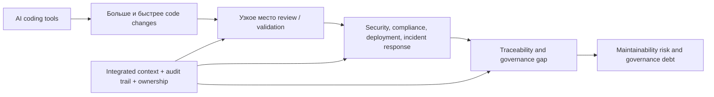

# GitLab: The AI Accountability Report 2026

## Коротко

Отчет GitLab полезен как источник про следующий слой AI-трансформации разработки: после ускорения написания кода главным ограничением становятся контекст, трассируемость, проверка, безопасность, комплаенс, выпуск и ответственность за AI-generated code в production.

Главный тезис для моей базы знаний:

> AI coding уже стал инфраструктурой разработки. Конкурентное отличие смещается от доступа к генерации кода к способности организации объяснить происхождение, намерение, проверку, владельца и состояние AI-generated change на всем жизненном цикле.

Это хорошо поддерживает рамки [[Frameworks/models/ai-native-pdlc|AI-native PDLC]], [[Frameworks/models/governance-mesh|Governance Mesh]], [[Frameworks/models/evidence-bundle|Evidence Bundle]] и [[Frameworks/models/architecture-of-manageability|architecture of manageability]].

## Самое важное для моей базы знаний

### 1. AI coding перешел из эксперимента в инфраструктуру

По данным опроса, организации уже используют не один экспериментальный инструмент, а несколько AI coding tools параллельно:

| Показатель | Значение |
| --- | ---: |
| Организации с двумя и более AI coding tools в активном использовании | 91% |
| Организации с тремя и более AI coding tools | 54% |
| Один AI-инструмент | 8% |
| Два AI-инструмента | 37% |
| Три AI-инструмента | 30% |
| Четыре и более AI-инструмента | 24% |

Практический смысл: управление AI в разработке нельзя строить вокруг одного инструмента или одного поставщика. Нужен слой управления поверх разношерстной среды: атрибуция, политики, audit trail, общая модель контекста и правила допуска изменений.

### 2. ROI и локальная продуктивность уже видны, но узкое место переехало

Отчет подтверждает, что команды видят эффект от AI coding:

| Метрика | Значение |
| --- | ---: |
| ROI от AI coding превысил ожидания | 60% |
| Индивидуальные разработчики пишут и коммитят код быстрее | 78% |
| Качество кода, доходящего до production, улучшилось | 73% |
| ROI не оправдал ожиданий | 9% |

Но это не означает, что ускорился весь контур поставки:

| Сигнал | Значение |
| --- | ---: |
| AI сместил узкое место от написания кода к review и validation | 85% |
| Главная сложность - управлять тем, что происходит с AI-generated code после создания | 84% |
| Индивидуальная продуктивность выросла, но общий процесс поставки не ускорился тем же темпом | 79% |
| Средняя доля времени, которую респонденты тратят на написание нового кода | 16% |

Зоны, где AI дал наименьший эффект на скорость:

| Участок жизненного цикла | Доля респондентов |
| --- | ---: |
| Compliance и audit | 42% |
| Security scanning и vulnerability management | 41% |
| Deployment и release management | 39% |
| Incident response и operations | 38% |
| Code generation / writing | 32% |
| Code review | 31% |
| Testing | 27% |

Практический вывод:

> Если организация ускорила генерацию кода, но не перестроила review, security, compliance и release management, она получила не AI-native delivery, а более быстрый входной поток в старое узкое место.

### 3. Трассируемость становится управленческой способностью

Отчет определяет AI accountability как способность ответить на три вопроса об agentic workflows:

- откуда изменение пришло;
- для чего оно было сделано;
- кто отвечает за него в production.

По инцидентам виден разрыв между уверенностью и фактической способностью:

| Метрика | Значение |
| --- | ---: |
| Команды уверены, что смогут за 24 часа определить, был ли AI-generated code связан с инцидентом или breach | 66% |
| Среди организаций с production incident за последние 12 месяцев не смогли надежно определить, играл ли AI роль | 34% |
| Смогли определить, что AI-generated code был вовлечен | 37% |
| Смогли определить, что AI-generated code не был вовлечен | 29% |

Главные основания уверенности у команд, которые считают, что могут определить AI involvement:

| Основание | Значение |
| --- | ---: |
| Active code review by security or DevOps teams | 48% |
| Logging, monitoring или audit trails | 42% |
| Опыт расследования инцидентов с AI-generated code | 40% |
| Документирование того, как код был создан | 40% |
| Governance policies for AI-generated code | 37% |
| Repository metadata / tags identifying AI-generated code | 36% |
| Tooling that tracks whether code was AI-generated | 36% |

Это не вопрос дисциплины отдельных инженеров. Это вопрос архитектуры доказуемости: изменение должно оставлять следы в задачах, commit history, merge request, CI/CD, security findings, approvals, deployment и production telemetry.

### 4. Барьеры трассируемости структурные, а не человеческие

Отчет отдельно показывает, что слабое место не в "люди плохо документируют", а в разрывах между системами:

| Барьер | Значение |
| --- | ---: |
| Сложно отличить AI-generated code от human-written code | 43% |
| Фрагментированная цепочка инструментов, инструменты не делятся контекстом | 40% |
| Системы не отслеживают происхождение или intent кода | 39% |
| Нет устоявшейся практики документирования AI code | 37% |
| Недостаточно пропускной способности команды для поддержки документации | 34% |

Только 28% организаций говорят, что инструменты жизненного цикла разработки полностью интегрированы через общие данные и процессы. Еще 50% говорят о mostly integrated, 20% - partially integrated, 2% - largely fragmented.

Практическая интерпретация:

> Контекст нельзя требовать от людей как дополнительную ручную работу, если платформа не собирает его по ходу процесса. Иначе AI увеличивает объем изменений быстрее, чем организация успевает строить память об этих изменениях.

### 5. Governance уже начался, но он отстает от adoption

Сильная часть отчета - числа про незрелость управления:

| Сигнал | Значение |
| --- | ---: |
| Организации с comprehensive formal policy или guidelines для AI-generated code | 77% |
| Организации со сложностями управления вокруг AI-generated code | 92% |
| AI coding tools были внедрены быстрее, чем политики управления ими | 80% |
| Организация считает governance достаточным, но controls на деле incomplete | 78% |
| Existing code review processes не рассчитаны на масштаб output от AI tools | 78% |
| Без clear governance AI-generated code может быстрее накапливать technical debt | 86% |

Governance связан с проверкой человеком:

| Сравнение | Значение |
| --- | ---: |
| Организации с formal governance, где 70-100% AI-generated code проходит human review | 86% |
| Организации без formal governance, где 70-100% AI-generated code проходит human review | 50% |

Главные governance challenges:

| Сложность | Значение |
| --- | ---: |
| Code attribution | 48% |
| Traceability to intent | 41% |
| Documentation that scales | 40% |
| Tooling that fits AI-generated code volume | 39% |
| Compliance frameworks | 37% |
| Clear ownership | 34% |

Отдельный риск: 83% организаций считают накопление AI-generated code риском, которым нужно управлять сейчас; 44% называют его top technology risk.

### 6. Следующая инвестиционная волна - governance, traceability, maintainability

Отчет показывает, что рынок уже двигается от "купить copilot" к "управлять AI-generated changes":

| Сигнал | Значение |
| --- | ---: |
| Вероятно будут инвестировать в tools/processes для governance, traceability или maintainability AI-generated code в следующие 12 месяцев | 91% |
| Уже выделили бюджет или ожидают бюджет в следующий год | 98% |
| Бюджет выделен, решения активно оцениваются | 51% |

Это полезный advisory-сигнал: у CEO / CTO уже есть бюджетное окно для разговора не только про продуктивность, но и про управляемость AI-native engineering.

## Ключевые модели, рамки и формулы из отчета

### Модель 1. Три вопроса AI accountability

| Вопрос | Управленческий смысл | Нужный артефакт |
| --- | --- | --- |
| Where did it come from? | происхождение изменения, инструмент, человек / агент, данные контекста | attribution, metadata, audit trail |
| What was it meant to do? | связь изменения с intent, requirement, issue, архитектурным решением | traceability to intent, specification, issue graph |
| Who is responsible for it once it is in production? | зона ответственности после release, incident и maintenance | ownership, approval history, runtime telemetry |

### Модель 2. Четыре pillars of AI accountability

| Pillar | Смысл | Связь с моими моделями |
| --- | --- | --- |
| Integrated tooling | контекст сохраняется по всему жизненному циклу разработки | [[Frameworks/models/internal-developer-platform|Internal Developer Platform]] |
| Traceability to intent | каждую строку кода можно связать с исходным intent | [[Frameworks/models/specification-driven-development|Specification-Driven Development]] |
| Governance with active human review | управление масштабируется вместе с adoption | [[Frameworks/models/governance-mesh|Governance Mesh]] |
| Long-term maintainability | документация и контекст поддерживают AI-generated code as volume grows | [[Frameworks/models/quality-and-risks|quality and risks]] |

Сопутствующие сигналы:

- 85% согласны, что организации, которые не могут trace or govern AI-generated code, столкнутся с растущими операционными и security risks;
- 85% согласны, что следующая фаза AI in software development будет меньше про generating code и больше про governing it;
- 86% согласны, что AI-generated code создает новые accountability challenges across development, security и operations teams.

### Модель 3. Где именно ломается масштабирование AI coding

Практический смысл: AI coding не снимает необходимость в операционной модели. Он повышает цену слабой операционной модели.

### Модель 4. Traceability playbook

Минимальный playbook, который следует из отчета:

| Способность | Что должно быть в системе |
| --- | --- |
| AI attribution | human / AI source, tool, session, model, repository metadata |
| Intent traceability | связь с requirement, issue, specification, архитектурным решением |
| Review evidence | кто проверял, какие gates прошли, какие findings закрыты |
| Audit trail | logs, timestamps, actors, targets, approvals |
| Ownership | кто владеет изменением после deployment |
| Maintainability context | документация, зависимости, known risks, production behavior |

Это практически совпадает с логикой [[Frameworks/models/evidence-bundle|Evidence Bundle]], только примененной к AI-generated code на всем SDLC.

## Практическая интерпретация для CEO / CTO / engineering leaders

### Для CEO

- AI coding уже дает локальный эффект, но его бизнес-ценность ограничена скоростью всего контура поставки.
- Риск не в том, что разработчики "используют AI". Риск в том, что организация не может объяснить происхождение, намерение, проверку и владельца AI-generated changes.
- Бюджет на AI-инструменты должен включать governance, traceability, maintainability и перестройку operating model, иначе ROI будет съеден ручной проверкой и накопленным technical debt.

### Для CTO / VP Engineering

- Нужна единая architecture of manageability для AI-generated code: metadata, issue linkage, CI/CD gates, audit trails, security scanning, ownership и production telemetry.
- Review process, рассчитанный на human-scale output, не выдержит agentic-scale output без автоматизации, policy-as-code и risk-based gates.
- IDP / platform layer становится не convenience, а контрольным контуром для AI-native delivery.

### Для Engineering Managers

- Команды должны фиксировать не только результат изменения, но и intent, источник, ограничения, проверки и ownership.
- Human review нужно проектировать как осмысленный контроль, а не как ручной налог на каждый AI-generated diff.
- Главная метрика зрелости - не "сколько кода написал AI", а "можем ли мы быстро объяснить и безопасно сопровождать это изменение".

## Диагностические вопросы

- Можно ли за 24 часа определить, был ли AI-generated code связан с production incident?
- Где фиксируется происхождение AI-generated code: commit metadata, MR, issue, отдельный журнал, nowhere?
- Есть ли связь между AI-generated change и исходным intent / requirement?
- Какой процент AI-generated code проходит human review, и что именно проверяется?
- Какие security и compliance gates масштабируются под больший поток изменений?
- Кто владеет AI-generated code после deployment?
- Как команда отличает рост productivity от роста governance debt?
- Где сегодня ломается lifecycle: review, testing, security scanning, compliance, deployment или incident response?

## Возможные модели или идеи для постов

### Идея 1. "AI ускорил не delivery, а входной поток в старые bottlenecks"

Тезисы:

- разработчики пишут быстрее, но review, security, compliance и deployment не ускорились тем же темпом;
- без платформенной перестройки AI создает очередь на проверку;
- настоящая AI-трансформация начинается там, где ускоряется весь lifecycle, а не только code generation.

Стадия воронки: [[Personal/marketing/linkedin-gtm-playbook#TOFU верхний этап контентной воронки|TOFU]].

### Идея 2. "Следующий дефицит в engineering - не код, а доказуемость"

Тезисы:

- когда code generation становится commodity, ценность смещается к traceability и accountability;
- организации должны отвечать: откуда изменение, зачем оно сделано, кто отвечает в production;
- это превращает IDP, audit trail и governance mesh в стратегические capabilities.

Стадия воронки: [[Personal/marketing/linkedin-gtm-playbook#MOFU средний этап контентной воронки|MOFU]].

### Идея 3. "Governance debt - новый technical debt AI-native разработки"

Тезисы:

- AI-generated code может накапливаться быстрее, чем организация успевает его сопровождать;
- долг возникает не только в коде, но и в отсутствии attribution, ownership, intent traceability и audit trail;
- управляемость должна быть встроена в процесс, а не добавлена после инцидента.

Стадия воронки: [[Personal/marketing/linkedin-gtm-playbook#BOFU нижний этап контентной воронки|BOFU]].

## Ограничения источника

- Отчет основан на опросе 1,528 DevSecOps professionals, проведенном The Harris Poll по заказу GitLab с 6 по 21 апреля 2026 года в North America, Europe и Asia-Pacific.
- Выборка включает IT operations, IT security и software development; audience split: 50% developers и 50% technology buyers.
- Это отчет, подготовленный по заказу поставщика. Исследовательские числа полезны как сигнал рынка, но продуктовые страницы про GitLab Duo Agent Platform, GitLab Orbit и "only platform" нужно читать как позиционирование GitLab, а не независимое доказательство.
- Часть данных основана на самооценке респондентов, поэтому выводы про ROI, качество и зрелость governance лучше использовать как сигнал восприятия и внедрения, а не как объективную метрику результативности.

## Связанные заметки

- [[Frameworks/models/ai-native-pdlc|AI-native PDLC]]
- [[Frameworks/models/governance-mesh|Governance Mesh]]
- [[Frameworks/models/evidence-bundle|Evidence Bundle]]
- [[Frameworks/models/internal-developer-platform|Internal Developer Platform]]
- [[Frameworks/models/architecture-of-manageability|architecture of manageability]]
- [[Frameworks/models/quality-and-risks|quality and risks]]
- [[Frameworks/source-notes/dora-roi-of-ai-assisted-software-development-2026|DORA ROI of AI-assisted Software Development 2026]]
- [[Frameworks/source-notes/ai-disrupt-pdlc-whitepaper-2026|AI-Disrupt PDLC Whitepaper 2026]]

## Источник

- PDF: [[Frameworks/sources/ai-transformation/gitlab-ai-accountability-report-2026.pdf|GitLab: The AI Accountability Report 2026]]
- Отчет: The AI Accountability Report. A survey of 1,528 DevSecOps professionals on context, traceability, and governance in AI-powered software development.
- Автор / заказчик: GitLab.
- Опрос: The Harris Poll, 6-21 апреля 2026 года.
