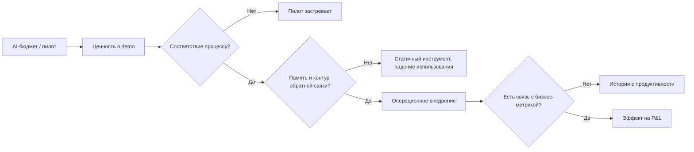
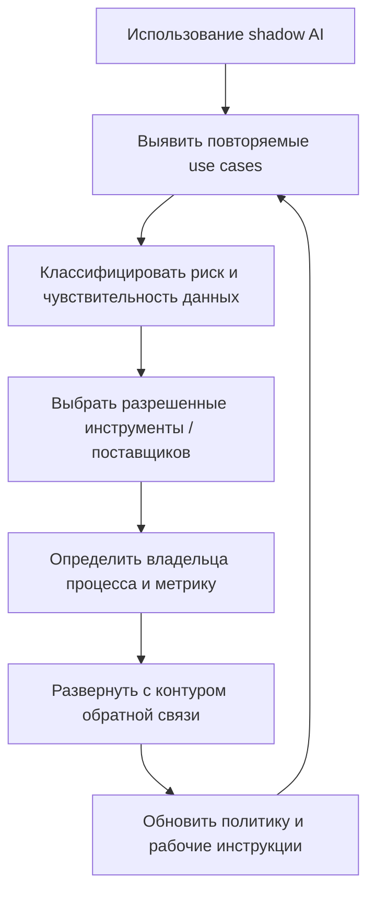

# MIT NANDA: The GenAI Divide. State of AI in Business 2025

## Резюме

Отчет полезен как сильный аргумент против поверхностного внедрения AI.

Главный тезис: компании массово покупают и пилотируют GenAI, но редко превращают его в управляемую операционную способность. Проблема не в моделях, не в бюджете и не только в регулировании. Проблема в том, что большинство внедрений не встроены в реальные процессы, не накапливают контекст и не учатся от обратной связи.

Для консультационной работы это источник под тезис:

- AI transformation нельзя мерить количеством пилотов;
- индивидуальная продуктивность не равна влиянию на P&L;
- [[Frameworks/models/ai-native-organization|AI-native organization]] строится вокруг контуров обучения, зон ответственности и интеграции в процессы;
- высокий ROI чаще находится в back-office и внешних расходах, а не в видимых front-office use cases;
- buy/partner часто практичнее, чем internal build, если поставщик способен глубоко адаптироваться под процесс.

## Самое важное для моей базы знаний

### 1. GenAI Divide: высокая активность, низкая трансформация

Отчет описывает разрыв между внедрением и трансформацией:

- $30-40B корпоративных инвестиций в GenAI;
- более 80% организаций исследовали или пилотировали general-purpose tools;
- около 40% сообщили о deployment general-purpose LLM tools;
- только 5% интегрированных AI-пилотов дают измеримый эффект на P&L;
- 7 из 9 крупных секторов показывают мало структурных изменений.

Практический вывод:

> Внедрение AI без изменения операционной модели создает активность, но не управляемый бизнес-результат.

Это поддерживает рамку [[Frameworks/models/architecture-of-manageability|architecture of manageability]]: AI должен быть встроен в систему принятия решений, ответственности, данных, контроля качества и обратной связи.

### 2. Главное узкое место — разрыв в обучении

Отчет формулирует ключевую причину провала пилотов: инструменты не учатся.

Типовые симптомы:

- система требует каждый раз заново вводить контекст;
- не помнит предпочтения, решения и исправления;
- ломается на пограничных случаях;
- плохо встраивается в существующие процессы;
- выглядит полезной в demo, но не выдерживает операционную реальность.

Это важнее, чем "качество модели" само по себе. Пользователи уже видят, как выглядит хороший личный AI-опыт, поэтому хуже терпят корпоративные статичные инструменты.

### 3. Shadow AI показывает реальную траекторию внедрения

Официальная закупка LLM subscription есть примерно у 40% компаний, но сотрудники из более чем 90% опрошенных компаний регулярно используют личные AI-инструменты для работы.

Это не просто риск безопасности. Это диагностический сигнал:

- сотрудники уже нашли реальные use cases;
- официальная AI-программа часто отстает от фактической практики;
- ценность рождается ближе к реальной рабочей поверхности, а не в центральной лаборатории;
- запрет shadow AI без легального канала переводит практику в серую зону.

Практический вывод для [[Frameworks/models/organizational-operating-model|организационной операционной модели]]:

> Shadow AI нужно не только контролировать, но и использовать как механизм discovery: где люди сами применяют AI, там часто находится реальная операционная боль.

### 4. Enterprise paradox: больше ресурсов, хуже масштабирование

Enterprise-компании запускают больше пилотов и выделяют больше людей, но хуже переводят инициативы в production. Mid-market действует быстрее: лучшие компании сообщали о пути от пилота до внедрения примерно за 90 дней, тогда как enterprise часто занимал 9 месяцев и больше.

Интерпретация:

- проблема не в "медленном принятии AI";
- проблема в сложности управления, закупок, зон ответственности и интеграции;
- централизованная AI-программа без полномочий у линейных руководителей часто производит портфель пилотов, а не бизнес-способность.

### 5. ROI смещен не туда

По данным интервью, значительная часть бюджета идет в sales и marketing, потому что там легче показать board-friendly метрики: demo volume, response time, lead scoring, outbound volume.

Но более устойчивый ROI часто лежит в back-office:

- клиентская поддержка и обработка документов;
- finance / procurement;
- проверки рисков;
- расходы на агентства;
- BPO replacement;
- внутренняя оркестрация процессов.

Это хороший аргумент против AI-портфеля, собранного только по видимости. Нужен контур выбора use cases по экономике процесса, а не по презентабельности.

### 6. Buy/partner часто сильнее internal build

В выборке отчета стратегические партнерства достигали deployment примерно в 2 раза чаще, чем internal builds:

- external partnership: около 66-67% deployments;
- internal build: около 33% deployments.

Ограничение: это self-reported выборка, не строгий причинный вывод. Но управленческий сигнал сильный: internal build часто недооценивает сложность соответствия процессу, внедрения, сопровождения и непрерывного обучения.

Для CTO это не означает "не строить". Это означает:

- строить только там, где есть стратегический контекст, данные и зона ответственности;
- покупать/партнериться там, где поставщик быстрее встроится в процесс;
- оценивать не benchmark модели, а операционный результат.

## Модели / фреймворки / формулы

### Модель 1. Воронка от AI-пилота к production

| Категория                      | Исследовали | Пилотировали | Успешно внедрили |
| ------------------------------ | -----------: | ------: | -----------------------: |
| General-purpose LLMs           |          80% |     60% |                      50% |
| Embedded / task-specific GenAI |          60% |     20% |                       5% |

Интерпретация:

- general-purpose tools выигрывают как слой личной продуктивности;
- task-specific systems выигрывают только при интеграции в процесс и способности к обучению;
- успех закупки нельзя считать по количеству пилотов.

### Модель 2. Индекс изменений по отраслям

| Сектор                | Оценка изменений | Сигнал                                                 |
| --------------------- | ----------------: | ------------------------------------------------------ |
| Technology            |    выше остальных | AI-native challengers, изменения процессов             |
| Media & Telecom       |               2.0 | AI-native content, changing ad dynamics                |
| Professional Services |               1.5 | прирост эффективности, но модель поставки в основном прежняя |
| Healthcare & Pharma   |               0.5 | documentation / transcription pilots                   |
| Consumer & Retail     |               0.5 | автоматизация поддержки, мало влияния на лояльность    |
| Financial Services    |               0.5 | backend automation, устойчивые клиентские отношения    |
| Advanced Industries   |               0.5 | пилоты в сопровождении, мало изменений цепочек поставок |
| Energy & Materials    |                 0 | почти нет внедрения                                    |

Вывод:

> GenAI уже меняет отдельные процессы, но еще редко меняет отраслевую структуру.

### Модель 3. Матрица способности к обучению

|                    | Низкая память / обучение | Высокая память / обучение        |
| ------------------ | ----------------------- | -------------------------------- |
| Низкая кастомизация | Copilot, GPT wrappers   | ChatGPT with memory              |
| Высокая кастомизация | хрупкие внутренние разработки | agentic workflows, vertical SaaS |

Управленческий смысл:

- низкая кастомизация годится для ad-hoc work;
- высокая кастомизация без обучения превращается в хрупкий внутренний инструмент;
- зона стратегической ценности: системы под конкретный процесс, которые помнят, адаптируются и улучшаются.

### Модель 4. Где ломается внедрение AI



### Модель 5. Операционная модель покупателя

Успешные покупатели действуют не как SaaS-покупатели, а как клиенты BPO / consulting:

| Практика                                    | Что это меняет                       |
| ------------------------------------------- | ------------------------------------ |
| Глубокая кастомизация под внутренний процесс | меньше разрыв между demo и рабочей реальностью |
| Операционные метрики вместо benchmark модели | меньше показного внедрения AI         |
| Совместная эволюция с поставщиком            | инструмент учится вместе с процессом |
| Use cases от frontline managers              | ближе к реальным узким местам        |
| Ответственность руководства                  | меньше бесхозных пилотов             |

## Цифры и доказательная база

| Показатель                                                  |              Значение | Интерпретация                                                 |
| ----------------------------------------------------------- | --------------------: | ------------------------------------------------------------- |
| Корпоративные инвестиции в GenAI                            |               $30-40B | большой объем расходов не конвертируется автоматически в P&L  |
| Интегрированные AI-пилоты с измеримой ценностью             |                    5% | основной разрыв между экспериментами и трансформацией         |
| Организации, исследовавшие / пилотировавшие general-purpose tools |             >80% | внедрение высокое                                             |
| Организации, сообщившие о deployment general-purpose tools  |                  ~40% | deployment есть, но часто на уровне личной продуктивности     |
| Enterprise-grade systems evaluated                          |                   60% | интерес высокий                                               |
| Enterprise-grade systems reached pilot                      |                   20% | большой спад до пилота                                        |
| Enterprise-grade systems reached production                 |                    5% | production остается редким                                    |
| Компании с официальной LLM subscription                     |                   40% | формальное внедрение отстает                                  |
| Сотрудники, регулярно использующие личные AI-инструменты    |                  >90% | фактическое внедрение уже произошло                           |
| AI preferred for quick tasks                                |                   70% | AI выиграл simple work                                        |
| Human preferred for complex high-stakes work                |                   90% | память, ответственность и суждение остаются критичны          |
| Руководители, которым нужны системы, обучающиеся на обратной связи |          66% | способность к обучению становится критерием закупки           |
| Руководители, требующие сохранения контекста                |                   63% | память важнее generic UX                                      |
| Доля deployment через внешние партнерства                   |               ~66-67% | партнерская модель в выборке сильнее internal build           |
| Internal build deployment rate                              |                  ~33% | build чаще застревает                                         |
| Ускорение квалификации лидов                                |           на 40% быстрее | измеримый выигрыш front-office                              |
| Улучшение удержания клиентов                                |                   10% | ценность через follow-up и messaging                          |
| BPO elimination                                             |       $2-10M annually | back-office ROI часто сильнее                                 |
| Сокращение расходов на агентства                            |                   30% | снижение внешних расходов вместо layoffs                      |
| Экономия на аутсорсинге управления рисками                  |          $1M annually | финансовый ROI в операционном контроле                        |
| Смещение customer support / admin                           |                 5-20% | эффект концентрируется в стандартизированных outsourced functions |
| Current U.S. labor value automation potential               |                 2.27% | текущая автоматизация ограничена                              |
| Latent automation exposure                                  | $2.3T / 39M positions | потенциал станет активным при memory + autonomous integration |

## Консультационная интерпретация

### Для CEO

- Не спрашивать "сколько AI-пилотов у нас запущено".
- Спрашивать: какие процессы уже дают измеримый эффект на P&L, кто владелец, какая метрика, какой контур обратной связи.
- Не строить AI-стратегию только вокруг видимости sales / marketing.
- Проверить back-office, BPO, расходы на агентства, закупки, поддержку, финансы и операции управления рисками.
- Считать AI не как покупку ПО, а как изменение операционной модели.

### Для CTO / CIO

- Разделить AI use cases на разовую личную продуктивность и критичные для процесса системы.
- Для критичных для процесса систем требовать память, сохранение контекста, контур обратной связи, интеграцию и аудитируемость.
- Не пытаться строить все внутри: строить только там, где стратегический контекст и данные создают устойчивое преимущество.
- В закупках оценивать не качество модели, а операционное соответствие:
  - подключение к существующим системам;
  - ответственность за точность и исключения;
  - границы данных;
  - адаптация со временем;
  - стоимость смены решения после накопленного обучения.

### Для COO / функциональных лидеров

- Использовать shadow AI как карту реальных болевых точек.
- Давать линейным руководителям право инициировать use cases, но фиксировать бизнес-ответственность.
- Начинать с узких процессов: видимая боль, низкая сложность запуска, измеримый результат.
- Не автоматизировать неуправляемый процесс: сначала прояснить зоны ответственности, входы, выходы, исключения и критерии качества.

### Для Engineering Managers

- Не сводить AI-грамотность к "умению писать prompts".
- Учить команду распознавать задачи, где AI подходит:
  - черновики;
  - суммаризация;
  - рутинный анализ;
  - повторяемые инженерные задачи.
- Отдельно фиксировать задачи, где нужен человек:
  - многонедельные проекты;
  - управление клиентами;
  - решения с высокой ценой ошибки;
  - неоднозначная зона ответственности;
  - работа, требующая накопленного контекста и ответственности.

## Диагностические вопросы

- Где у нас AI уже используется неофициально?
- Какие сценарии shadow AI повторяются у разных людей?
- Какие пилоты имеют владельца, метрику и дату решения?
- Какие пилоты существуют только как отчет об активности?
- Где AI требует каждый раз ручного ввода одного и того же контекста?
- Какие инструменты не учатся на исправлениях и обратной связи?
- Какие use cases выбраны из-за видимости для совета директоров, а не из-за экономики процесса?
- Где у нас самые большие внешние расходы: BPO, агентства, консультанты, outsourced processing?
- Какие процессы достаточно стандартизированы, чтобы дать быстрый AI ROI?
- Где internal build оправдан стратегически, а где это просто рефлекс контроля?
- Кто владеет внедрением: central AI team или владелец бизнес-процесса?
- Как мы измеряем ценность через 6 месяцев после пилота?

## Возможные фреймворки на основе отчета

### 1. Воронка AI-трансформации

```text
Исследование -> Пилот -> Интеграция в процесс -> Контур обучения -> Бизнес-метрика -> Изменение операционной модели
```

Использование:

- аудит AI-портфеля;
- разделение пилотов на полезные / застрявшие / показные;
- разговор с советом директоров о трансформации вместо внедрения.

### 2. Контур управления shadow AI



### 3. Build / Buy / Partner Decision

| Вопрос                                            | Если да                       | Если нет                    |
| ------------------------------------------------- | ----------------------------- | --------------------------- |
| Это ключевая стратегическая способность?          | рассмотреть build / hybrid    | buy / partner               |
| У нас есть уникальные данные и знание процесса?   | build может дать moat         | поставщик быстрее           |
| Процесс стабилен и описан?                        | можно автоматизировать глубже | сначала управлять процессом |
| Поставщик способен учиться на обратной связи?     | партнерство жизнеспособно     | риск статичного SaaS        |
| Есть ясная бизнес-метрика?                        | кандидат на масштабирование   | оставить как эксперимент    |

### 4. Карта ценности AI

| Область                      | Тип ценности                         | Риск ошибки                       |
| ---------------------------- | ------------------------------------ | --------------------------------- |
| Личная продуктивность        | экономия времени                     | не конвертируется в P&L           |
| Sales / marketing            | видимые метрики верхнего уровня      | избыточные инвестиции из-за видимости |
| Back-office                  | снижение затрат / cycle time         | недооценка из-за слабой атрибуции |
| Support / admin              | замена BPO                           | риск для рабочей силы и качества  |
| Engineering                  | ускорение повторяемых задач          | налог на проверку и качество кода |
| Procurement / finance / risk | контроль и снижение внешних расходов | границы данных и аудитируемость   |

## Идеи для постов

### Пост 1: "95% AI pilots fail" — неправильный вывод

Хук:

> Проблема не в том, что AI не работает. Проблема в том, что компании внедряют AI как инструмент, а не как операционную способность.

Тезисы:

- внедрение высокое, трансформация низкая;
- ChatGPT работает для людей, но корпоративные инструменты ломаются в процессе;
- ключевой дефицит — память, обучение, зоны ответственности;
- AI transformation начинается не с лицензий, а с операционной модели.

### Пост 2: Shadow AI как диагностика организации

Хук:

> Если сотрудники используют личный ChatGPT чаще, чем корпоративный AI-инструмент, это не только проблема безопасности. Это управленческий сигнал.

Тезисы:

- shadow AI показывает реальные болевые точки;
- запрет не создает управляемость;
- нужен контур управления: наблюдать, классифицировать, разрешать, интегрировать, измерять;
- power users могут стать источником AI-портфеля.

### Пост 3: AI ROI чаще лежит не там, где его ищет board

Хук:

> Самые видимые AI use cases не всегда самые прибыльные.

Тезисы:

- sales/marketing получают бюджет из-за понятных метрик;
- back-office часто дает более прямое снижение затрат;
- снижение внешних расходов реалистичнее широких сокращений;
- AI-портфель надо строить по экономике процессов.

## Связанные заметки

- [[Frameworks/models/ai-native-organization|AI-native organization]]
- [[Frameworks/models/architecture-of-manageability|architecture of manageability]]
- [[Frameworks/models/decision-systems|системы принятия решений]]
- [[Frameworks/models/organizational-operating-model|организационная операционная модель]]
- [[Frameworks/models/quality-and-risks|качество и риски]]
- [[Frameworks/models/systemic-management|системное управление]]
- [[Frameworks/source-notes/dora-roi-of-ai-assisted-software-development-2026|DORA ROI of AI-assisted Software Development 2026]]

## Источник

- PDF: `Frameworks/sources/ai-transformation/v0.1_State_of_AI_in_Business_2025_Report.pdf`
- Извлеченный текст: `/private/tmp/state_ai_business_2025.txt`
- Методология в отчете: 300+ публичных AI-инициатив, 52 структурированных интервью, ответы survey от 153 senior leaders.

## Оговорки

- Отчет отмечен как preliminary findings.
- Показатели успеха и ROI основаны на интервью, survey и анализе публичных внедрений, а не на аудированной финансовой отчетности.
- Сравнение build-vs-buy является направленным: внешние партнерства могут коррелировать с более сильными организационными способностями, а не только с выбором sourcing.
- Индекс отраслевых изменений основан на наблюдаемых индикаторах и может пропускать частную / внутреннюю трансформацию.
