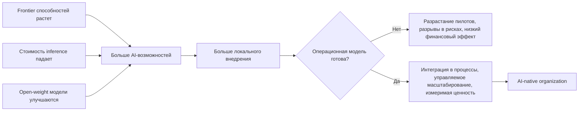
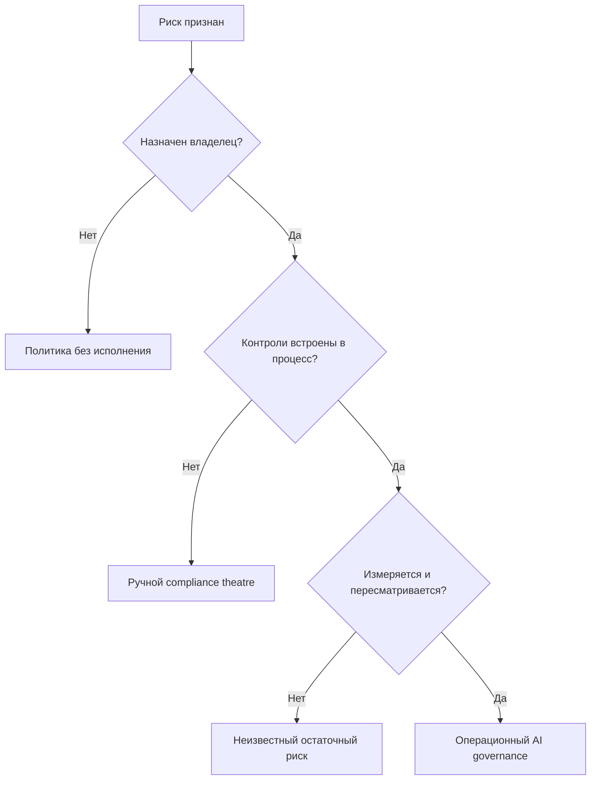

# Stanford HAI: AI Index Report 2025

## Резюме

AI Index 2025 полезен как опорный отчет для разговора с советом директоров об AI transformation.

Главный вывод для базы: **AI становится дешевле, доступнее и мощнее быстрее, чем организации успевают перестроить управление, риски и операционную модель**.

Это не отчет про "какая модель лучше". Это отчет про системное давление на компанию:

- frontier способностей быстро растет;
- стоимость inference резко падает;
- open-weight и закрытые модели сближаются;
- внедрение в бизнесе стало массовым;
- финансовый эффект пока чаще низкий и локальный;
- Responsible AI признан важным, но операционные меры защиты отстают;
- регулирование и публичная инфраструктура становятся частью конкурентной среды.

Для консультационной работы это источник под тезис:

> AI advantage переходит от доступа к модели к способности организации управляемо встраивать AI в процессы, ответственность, данные, риски и принятие решений.

## Самое важное для моей базы знаний

### 1. Внедрение AI стало массовым, но трансформации еще нет

По McKinsey-данным внутри отчета:

- 78% организаций используют AI хотя бы в одной функции в 2024 году;
- 71% используют generative AI хотя бы в одной функции;
- годом ранее показатели были 55% и 33%.

Но финансовый эффект остается ограниченным:

- экономия затрат чаще всего видна в service operations, supply chain и software engineering;
- большинство reported cost savings ниже 10%;
- прирост выручки чаще виден в marketing/sales, supply chain и service operations;
- наиболее частый уровень роста выручки ниже 5%.

Практический вывод:

> Внедрение AI уже перестало быть differentiator. Differentiator — способность конвертировать использование AI в управляемый экономический эффект.

Это поддерживает рамку [[Frameworks/models/ai-native-organization|AI-native organization]]: важно не наличие инструментов, а способность операционной системы компании превращать новые способности в результат.

### 2. Стоимость AI резко падает, значит узкое место смещается в организацию

Отчет фиксирует резкое снижение inference cost:

- стоимость запроса модели уровня GPT-3.5 на MMLU снизилась с $20 за 1M tokens в ноябре 2022 до $0.07 в октябре 2024;
- это более чем 280x снижение примерно за 18 месяцев;
- по оценке Epoch AI, в зависимости от задачи LLM inference cost падал от 9 до 900 раз в год.

Одновременно:

- price-performance аппаратного обеспечения улучшается примерно на 30% в год;
- энергоэффективность аппаратного обеспечения растет примерно на 40% в год;
- small models становятся достаточно сильными для практических задач;
- open-weight gap к closed models сократился с 8.0% до 1.7% по Chatbot Arena.

Управленческий смысл:

> Когда стоимость технологии падает, главным ограничением становится не доступ к AI, а качество [[Frameworks/models/organizational-operating-model|организационной операционной модели]].

Компании, которые продолжают обсуждать AI как закупку лицензий, пропускают основной вопрос: есть ли у них контур выбора use cases, доступ к данным, quality gates, зона ответственности за риски и контуры обратной связи.

### 3. Производительность растет, но ценность зависит от интеграции

Отчет суммирует исследования продуктивности труда:

- AI дает прирост продуктивности примерно 10-45% в разных доменах;
- в customer support рост resolved issues per hour составил 14.2%;
- в software development field experiment на 4,867 разработчиках показал +26.08% task completion;
- natural experiment на 187,489 разработчиках показал +12.4% core coding activities и -24.9% времени на задачи управления проектами;
- junior / low-skill workers часто получают больший прирост, чем senior / high-skill workers.

Но самый важный сигнал не в среднем проценте.

Отчет показывает, что высокая интеграция AI коррелирует с 72% вероятностью существенного улучшения продуктивности, а минимальная интеграция — только с 3.4%.

Практический вывод:

> AI-продуктивность — это не свойство модели. Это результат интеграции модели в процесс, данные, роли, критерии качества и систему принятия решений.

Для CTO / VP Engineering это означает: локальный прирост скорости разработки может не стать ценностью для бизнеса, если последующая система не готова к росту потока изменений.

### 4. Agentic AI силен на коротких горизонтах, но слабее на длинных

В RE-Bench frontier AI systems показывают сильный результат на коротких задачах:

- при 2-hour budget лучшие AI systems примерно в 4 раза выше human experts;
- при 8-hour budget люди уже немного впереди;
- при 32-hour budget люди превосходят AI примерно в 2 раза.

Это важный reality check против простого нарратива "agents replace teams".

Практический вывод:

> AI agents уже полезны как ускоритель исполнения на коротких, хорошо ограниченных задачах. Но длинные, контекстные, конфликтные и управленческие задачи требуют операционной модели, а не только автономии агента.

Для [[Frameworks/models/architecture-of-manageability|architecture of manageability]] это означает: агентов нужно встраивать в систему контроля, передачи работы, эскалации, audit trail и человеческого суждения.

### 5. Способность AI в software engineering быстро растет, но это увеличивает нагрузку на управление качеством

SWE-bench:

- в конце 2023 лучшая модель решала 4.4% задач;
- к началу 2025 top model решала 71.7% SWE-bench Verified.

Это резкий скачок в способности AI работать с реальными GitHub issues и multi-function code changes.

Но рост generation capability усиливает старые системные ограничения:

- code review;
- архитектурная согласованность;
- automated testing;
- security checks;
- управление зависимостями;
- владение изменениями;
- incident response.

Практический вывод:

> AI снижает стоимость производства изменений, но не снижает автоматически стоимость понимания, проверки и эксплуатации этих изменений.

Это хорошо связывается с [[Frameworks/models/quality-and-risks|качеством и рисками]] и DORA-логикой из [[dora-roi-of-ai-assisted-software-development-2026]].

### 6. Responsible AI: признание есть, операционная зрелость отстает

Отчет показывает разрыв между признанием риска и управляемым действием.

AI-риски: релевантность против активного снижения:

| Риск                               | Релевантен | Активно снижается | Разрыв |
| ---------------------------------- | -------: | -----------------: | ----: |
| Cybersecurity                      |      66% |                55% | 11 pp |
| Регуляторный комплаенс             |      63% |                53% | 10 pp |
| Personal privacy                   |      60% |                50% | 10 pp |
| Inaccuracy                         |      60% |                46% | 14 pp |
| Intellectual property infringement |      57% |                38% | 19 pp |
| Organizational reputation          |      45% |                29% | 16 pp |
| Explainability                     |      40% |                31% |  9 pp |
| Equity and fairness                |      34% |                26% |  8 pp |
| Workforce labor displacement       |      20% |                12% |  8 pp |
| Environmental impact               |      16% |                 9% |  7 pp |
| National security                  |      11% |                 7% |  4 pp |
| Political stability                |       6% |                 4% |  2 pp |
| Physical safety                    |       3% |                 4% | -1 pp |

Разрыв = `релевантен - активно снижается`. В строке physical safety доля mitigated чуть выше relevant share; оставляю как в исходной диаграмме.

Основные препятствия внедрения RAI:

- разрывы в знаниях и обучении — 51%;
- ограничения ресурсов / бюджета — 45%;
- регуляторная неопределенность — 40%;
- нехватка поддержки руководства — только 16%.

Практический вывод:

> Проблема Responsible AI уже не столько в отсутствии executive buy-in. Проблема в операционализации: компетенции, процессы, инструменты, зоны ответственности и регулярные проверки.

Это сильный аргумент для фреймворка AI governance как операционной способности, а не как policy document.

### 7. Управление становится внешним ограничением и конкурентным фактором

Раздел policy фиксирует ускорение регулирования и публичных инвестиций:

- в 2024 году в США появилось 59 федеральных AI-related regulations против 25 в 2023;
- число AI laws на уровне штатов США выросло до 131 за год;
- упоминания AI в законодательных обсуждениях по 75 странам выросли на 21.3% в 2024 и более чем в 9 раз с 2016;
- EU AI Act принят European Parliament в марте 2024;
- NIST выпустил GenAI risk framework в июне 2024;
- AI safety institutes расширяются и координируются международно.

Управленческий смысл:

> AI governance перестает быть внутренней опцией. Она становится частью license to operate, готовности к закупкам и доверия enterprise-клиентов.

Для CEO это значит: AI-стратегия должна включать не только use cases и бюджет, но и регуляторную позицию, права на данные, аудитируемость и ответственность.

### 8. Data commons сжимается

Отчет отмечает рост ограничений на использование публичных web data:

- в actively maintained domains из C4 common crawl доля restricted tokens выросла с 5-7% до 20-33% за 2023-2024.

Практический вывод:

> Доступ к данным становится стратегическим ограничением. AI-native organization должна управлять не только моделями, но и правами на данные, происхождением данных, согласием, лицензированием и доступностью внутренних знаний.

Это особенно важно для компаний, которые хотят строить proprietary AI advantage на внутреннем контексте.

### 9. Поверхность AI-рисков расширяется быстрее, чем практики контроля

В отчете есть важный риск-сигнал: AI-риски перестали быть абстрактной темой ethics / policy и стали операционным классом рисков.

AI Incident Database зафиксировала:

- 233 reported AI incidents в 2024 году;
- это record high и +56.4% к 2023 году;
- реальное число, вероятно, выше, потому что база зависит от публичных media reports.

Примеры incidents в отчете показывают разные типы ущерба:

- ложная идентификация и репутационный ущерб от facial recognition;
- nonconsensual intimate deepfakes;
- unauthorized digital recreation / impersonation;
- вредное взаимодействие с chatbot в контексте mental health;
- election misinformation и deepfake-enabled erosion of trust.

Практический вывод:

> AI-риск нельзя держать только в модели "model safety". Риск возникает на стыке модели, данных, интерфейса, пользователя, процесса, стимулов и управления.

#### Карта рисков для AI transformation

| Класс риска                             | Как проявляется                                                   | Управленческий контур                                            |
| --------------------------------------- | ----------------------------------------------------------------- | ---------------------------------------------------------------- |
| Accuracy / hallucination                | неверные ответы, ложные выводы, ненадежная автоматизация          | evals, human review, confidence thresholds, rollback             |
| Cybersecurity                           | prompt injection, jailbreaks, misuse агента, утечка данных        | threat modeling, red teaming, sandboxing, access control         |
| Privacy / data governance               | утечка персональных данных, нарушения согласия, неясные права на данные | классификация данных, retention policy, access logs, DPA / DPIA |
| IP / copyright                          | конфликты training / output / reuse, неясное владение             | source tracking, licensing checks, vendor terms review           |
| Bias / fairness                         | неявная дискриминация несмотря на явное устранение bias           | bias testing, segment metrics, appeal process                    |
| Explainability                          | невозможность обосновать выводы в high-stakes workflows           | decision logs, rationale requirements, interpretable checks      |
| Репутация                               | публичный сбой, offensive outputs, вредная автоматизация          | путь эскалации, incident response, comms protocol                |
| Регуляторный комплаенс                  | EU AI Act, GDPR, отраслевые правила, требования аудита            | AI inventory, risk tiering, control evidence                     |
| Риск для рабочей силы                   | deskilling, тревога из-за displacement, shadow AI                 | политика внедрения, обучение, redesign ролей, manager enablement |
| Экология / инфраструктура               | рост энергопотребления, carbon emissions, energy constraints      | workload governance, model sizing, compute budgets               |
| Общество / misinformation               | deepfakes, liar's dividend, manipulation                          | provenance, watermarking where useful, media policy              |
| National security / political stability | dual-use capabilities, export controls, influence operations      | geopolitical risk review, vendor restrictions, policy monitoring |
| Physical safety                         | autonomous systems, robotics, safety-critical environments        | formal safety case, simulation, human override                   |
| Agentic / multiagent risk               | cascading failures, unauthorized actions, tool misuse             | scoped autonomy, permissions, simulation, kill switches          |

#### Почему agents требуют отдельной модели риска

Отчет выделяет agentic AI как особую область RAI.

Причина: agents не просто генерируют текст. Они могут:

- планировать цепочки действий;
- использовать инструменты;
- взаимодействовать с внешними системами;
- менять состояние среды;
- действовать в неструктурированных сценариях;
- взаимодействовать с другими agents.

Исследование ToolEmu показало, что даже наиболее safety-optimized LM agents failed in 23.9% of critical scenarios. Ошибки включали dangerous commands, misdirected financial transactions и traffic control failures.

Отдельный сигнал — multiagent vulnerabilities. В симуляциях infectious jailbreak через одну adversarial image мог почти полностью распространиться по сети до 1 млн MLLM agents за 27-31 interaction rounds. Практических мер снижения риска для такого класса отчет не фиксирует.

Практический вывод:

> Agentic AI нельзя масштабировать по тем же правилам, что chat assistants. Чем больше у агента инструментов, прав доступа и связей с другими agents, тем ближе он к операционной системе, несущей риск.

#### Риск рассуждений: сильные модели все еще ненадежны в логике

Отчет прямо отмечает, что complex reasoning остается проблемой:

- модели сильны на отдельных benchmarks и coding tasks;
- но все еще ненадежны на logic, arithmetic и planning tasks, где существуют provably correct solutions;
- это ограничивает пригодность для high-risk applications.

Управленческий смысл:

> Высокий benchmark score не заменяет domain-specific verification. Для high-stakes процессов нужен не "лучший LLM", а проверяемая система принятия решений.

#### Разрыв в safety benchmarks

Отчет подчеркивает отсутствие консенсуса по стандартным safety / responsible AI benchmarks.

Ситуация:

- capability benchmarks вроде MMLU, GPQA, MATH используются широко;
- сопоставимого консенсуса по RAI / safety benchmarks нет;
- новые benchmarks появляются: HELM Safety, AIR-Bench, FACTS, SimpleQA;
- но внедрение еще не стало отраслевым стандартом.

Практический вывод:

> Компании не могут ждать зрелого рынка evals. Им нужен собственный минимальный eval stack под свои процессы, допустимый уровень риска и регуляторную экспозицию.

#### Экологический и инфраструктурный риск

Несмотря на рост эффективности аппаратного обеспечения, общее энергопотребление frontier training растет:

- power required to train frontier models, по Epoch AI, doubling annually;
- GPT-3 training emissions оценены примерно в 588 tons CO2e;
- GPT-4 — 5,184 tons CO2e;
- Llama 3.1 405B — 8,930 tons CO2e.

Для большинства компаний это не прямой риск обучения моделей, а косвенный инфраструктурный / vendor / procurement риск:

- стоимость вычислений;
- доступность энергии;
- обязательства устойчивого развития;
- концентрация поставщиков;
- управление рабочими нагрузками.

Практический вывод:

> AI governance должен включать не только legal / security, но и compute governance: какие модели, для каких задач, с каким профилем стоимости, задержки, углеродного следа и риска.

## Модели / фреймворки

### Модель 1. Карта давления на AI transformation

### Модель 2. От доступа к модели к организационному преимуществу

| Стадия      | Что кажется главным            | Что на самом деле ограничивает ценность               |
| ----------- | ------------------------------ | ----------------------------------------------------- |
| Доступ      | Купить tools / API             | безопасность, доступ к данным, закупки                |
| Внедрение   | Поднять usage                  | соответствие процессу, обучение, принятие менеджерами |
| Integration | Встроить в процессы            | зоны ответственности, качество данных, quality gates  |
| Масштаб     | Расширить на функции           | управление, метрики, операционная модель              |
| Преимущество | Получить стратегический эффект | контуры обучения, proprietary context, системы принятия решений |

### Модель 3. Операционный разрыв Responsible AI

### Модель 4. Граница развертывания agents

| Задача                                 | Соответствие AI agent | Управленческий контроль                 |
| -------------------------------------- | -------------- | --------------------------------------- |
| Короткая, ограниченная, проверяемая    | Высокое        | автоматизированные тесты, review, rollback |
| Повторяемая операционная задача        | Среднее / высокое | SOP, метрики, путь эскалации          |
| Длинная R&D-задача                     | Среднее        | milestones, human steering, audit trail |
| High-stakes decision                   | Низкое / assisted | ответственность человека, explainability |
| Межфункциональное организационное изменение | Низкое     | управление, зоны ответственности, decision forums |

## Цифры и доказательная база

| Показатель                                               |        Значение | Интерпретация                                    |
| -------------------------------------------------------- | --------------: | ------------------------------------------------ |
| Организации, использующие AI хотя бы в одной функции     |             78% | внедрение стало массовым                         |
| Организации, использующие AI хотя бы в одной функции, 2023 |           55% | рост внедрения ускорился после стагнации         |
| Организации, использующие GenAI хотя бы в одной функции  |             71% | GenAI перешел из эксперимента в рабочий слой     |
| Организации, использующие GenAI хотя бы в одной функции, 2023 |       33% | использование GenAI более чем удвоилось          |
| Глобальные корпоративные инвестиции в AI, 2024           |         $252.3B | рынок снова растет после замедления              |
| Рост глобальных корпоративных инвестиций в AI, 2024      |          +25.5% | рост total corporate investment                  |
| Рост глобальных частных инвестиций в AI, 2024            |          +44.5% | капитал снова ускоряет AI ecosystem              |
| Частные инвестиции в Generative AI, 2024                 |          $33.9B | более 20% private AI investment                  |
| Рост частных инвестиций в Generative AI, 2024            |          +18.7% | финансирование GenAI продолжает расти            |
| Новые профинансированные AI-компании, 2024               |           2,049 | startup activity снова растет                    |
| Новые профинансированные GenAI-компании, 2024            |             214 | почти 7x к 2019 году                             |
| Частные инвестиции США в AI, 2024                        |         $109.1B | сильное лидерство США по распределению капитала  |
| Экономия затрат от AI в service operations               | 49% respondents | самая частая reported cost-saving function       |
| Экономия затрат от AI в supply chain / inventory         | 43% respondents | вторая по частоте reported cost-saving function  |
| Экономия затрат от AI в software engineering             | 41% respondents | инженерный эффект уже виден, но чаще <10%        |
| Прирост выручки от AI в marketing and sales              | 71% respondents | самая частая reported revenue-gain function      |
| Прирост выручки от AI в supply chain / inventory         | 63% respondents | вторая по частоте reported revenue-gain function |
| Прирост выручки от AI в service operations               | 57% respondents | третья по частоте reported revenue-gain function |
| Прирост продуктивности труда по исследованиям            |          10-45% | эффект зависит от контекста и интеграции         |
| Вероятность роста продуктивности при высокой vs минимальной интеграции AI | 72% vs 3.4% | ценность зависит от интеграции в процесс |
| Снижение стоимости inference для GPT-3.5-level MMLU      |           >280x | доступ к модели становится commodity             |
| Разрыв open-weight vs closed-weight                      |    8.0% to 1.7% | доступ к frontier становится менее концентрированным |
| Лучший результат SWE-bench                               |   4.4% to 71.7% | coding capability быстро растет                  |
| Доля отказов ToolEmu в критических сценариях             |           23.9% | agents требуют отдельной модели риска            |
| AI incidents в AI Incident Database, 2024                |             233 | risk surface растет                              |
| Рост инцидентов к 2023 году                              |          +56.4% | управление должно масштабироваться быстрее       |
| Средний балл Foundation Model Transparency Index         |      37% to 58% | прозрачность улучшается, но остается неполной    |
| Федеральные AI-related regulations в США, 2024           |              59 | управленческое давление растет                   |
| FDA-approved AI medical devices к 2023                   |             223 | AI уже входит в регулируемые домены              |

## Консультационная интерпретация

### Для CEO

- AI-стратегию нельзя строить вокруг "мы внедрили GenAI".
- Вопрос для совета директоров: где AI меняет экономику процесса, а где только добавляет активность.
- AI governance должен быть частью бизнес-операционной модели, а не приложением от legal / security.
- Главный риск: компания покупает способность быстрее, чем строит ответственность.
- Главная возможность: снижение стоимости inference делает AI применимым к большему числу процессов, включая низкомаржинальные операционные процессы.

### Для CTO / VP Engineering

- Open-weight и small models создают больше архитектурных выборов: build / buy / host / fine-tune / RAG / agentic workflow.
- Быстрый рост coding capability увеличивает нагрузку на проверку, архитектурные стандарты и platform engineering.
- AI-ценность в engineering нужно считать не только по скорости написания кода, а по lead time, change failure rate, нагрузке на review, incident rate и доработкам.
- Agents нужно внедрять через контролируемые рамки, evals, observability и rollback.
- Внутренние данные и контекст становятся важнее новизны модели.

### Для COO / Transformation Lead

- Прирост продуктивности требует интеграции в процесс, иначе остается индивидуальной эффективностью.
- Нужно выбирать use cases по экономике процесса: объем, вариативность, риск, стоимость проверки, доступность данных.
- Блокеры RAI в основном операционные: навыки, ресурсы, неопределенность, технические ограничения.
- Управление должно быть встроено в lifecycle: intake, design, deployment, monitoring, incident response.

### Для Engineering Managers

- AI сильнее помогает junior / lower-skill workers, но это требует новых стандартов review и mentoring.
- Роль менеджера смещается от распределения задач к управлению quality gates, контекстом, контурами обучения и эскалацией.
- Ускорение разработки без ясных зон ответственности увеличивает скрытую стоимость координации.

## Диагностические вопросы

- Какие AI use cases уже дают измеримый эффект на P&L, а какие только метрики использования?
- Где AI уже используется shadow / unofficially, и что это говорит о реальных узких местах?
- Кто владеет AI-риском в каждом бизнес-процессе: бизнес, продукт, engineering, legal, security?
- Какие AI-риски признаны релевантными, но не снижаются?
- Есть ли AI inventory: системы, поставщики, модели, источники данных, владельцы, уровень риска?
- Как измеряется AI-продуктивность: объем результата, cycle time, качество, доработки, инциденты, эффект для клиента?
- Какие процессы имеют достаточный доступ к данным и quality gates для масштабирования AI?
- Где снижение стоимости inference делает возможной автоматизацию, которая раньше была экономически невыгодной?
- Какие решения нельзя отдавать AI без human accountability?
- Какой минимальный управленческий контур нужен до масштабирования agents?

## Возможные фреймворки на основе отчета

### 1. Готовность к AI как операционная готовность

Тезис:

- Готовность к AI = доступ к модели + интеграция в процесс + управление + права на данные + контроль качества.
- Без операционной готовности компания получает внедрение без трансформации.

### 2. Разрыв в управлении

Тезис:

- компании уже признают AI-риски;
- но снижение рисков отстает почти по всем категориям;
- значит, проблема не в осведомленности, а в системе исполнения.

### 3. Сдвиг экономики AI

Тезис:

- когда стоимость inference падает на порядки, AI перестает быть дорогим экспериментом;
- появляется новая категория use cases в операционных процессах;
- узкое место переносится в discovery, integration, governance и управление изменениями.

### 4. Agents Need Management Architecture

Тезис:

- agents сильны на коротких горизонтах;
- на длинных горизонтах выигрывает не автономия, а управляемый контур: milestones, зоны ответственности, review, escalation.

## Идеи для постов

### Пост 1: Внедрение AI больше не преимущество

Хук:

> 78% компаний уже используют AI. Значит, сам факт внедрения перестал быть стратегией.

Тезис:

- массовое внедрение не равно трансформации;
- финансовый эффект пока низкий;
- преимущество смещается в операционную модель.

### Пост 2: AI стал дешевле, управление стало дороже

Хук:

> Когда стоимость inference падает в 280 раз, главным узким местом становится не модель.

Тезис:

- доступ к модели становится commodity;
- ценность ограничивают данные, зоны ответственности, quality gates и управление;
- AI transformation — это управленческая архитектура.

### Пост 3: Responsible AI проваливается не на уровне принципов

Хук:

> Большинство компаний уже видят AI-риски. Но гораздо меньше компаний реально их снижает.

Тезис:

- осведомленность есть;
- разрыв исполнения остается;
- RAI нужен как операционная способность, а не как policy.

## Связанные заметки

- [[Frameworks/models/ai-native-organization|AI-native organization]]
- [[Frameworks/models/architecture-of-manageability|architecture of manageability]]
- [[Frameworks/models/decision-systems|системы принятия решений]]
- [[Frameworks/models/organizational-operating-model|организационная операционная модель]]
- [[Frameworks/models/quality-and-risks|качество и риски]]
- [[Frameworks/models/systemic-management|системное управление]]
- [[dora-roi-of-ai-assisted-software-development-2026]]
- [[mit-nanda-genai-divide-state-of-ai-in-business-2025]]

## Источник

- PDF: [[Frameworks/sources/ai-transformation/hai_ai_index_report_2025.pdf|hai_ai_index_report_2025.pdf]]
- Локальный путь: `Frameworks/sources/ai-transformation/hai_ai_index_report_2025.pdf`
- Цитирование из отчета: Nestor Maslej et al., "The AI Index 2025 Annual Report," AI Index Steering Committee, Institute for Human-Centered AI, Stanford University, April 2025.
- DOI: `10.48550/arXiv.2504.07139`
- Извлеченный текст для обработки: `/private/tmp/hai_ai_index_report_2025.txt`
