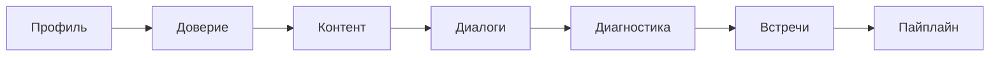
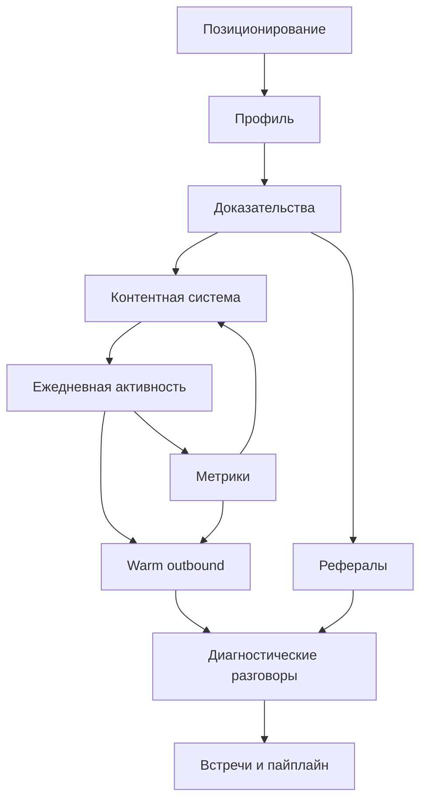

# LinkedIn GTM Playbook

Внутренняя инструкция по построению предсказуемого канала продаж через LinkedIn.

Это не инструкция для генерации идей постов. Использовать как операционную рамку для упаковки профиля, контентной системы, ежедневной активности, теплого outbound, рефералов и контроля метрик.

---

## 1. Цели и ключевые метрики

### Ваши цели на LinkedIn

Как `[роль клиента: Founder / Head of Sales / CEO / CTO / advisor]`, фокусные задачи:

1. Встречи: `[20-30]` целевых встреч в месяц из LinkedIn: inbound + warm outbound.
2. Рост пайплайна: `[40-80%]` рост квалифицированного пайплайна в течение `3-6` месяцев.
3. Личный бренд: позиционирование как эксперта в нише `[ваша ниша]`.

### Главные KPI LinkedIn

Еженедельно:
- профильные просмотры;
- количество входящих запросов и ответов: DM, ответы на комментарии, ответы на outreach;
- количество встреч, забронированных из LinkedIn.

Ежедневно:
- количество качественных комментариев у лиц, принимающих решения, и ICP;
- количество новых коннектов ICP;
- количество исходящих релевантных DM: warm + follow-ups.

### Практическая настройка для advisory

Для консультационной или advisory-практики LinkedIn не должен измеряться только охватом. Базовая логика:



Охват важен только если он усиливает переход в содержательные диалоги с правильной аудиторией.

---

## 2. Профиль: фундамент для social selling

Профиль должен быстро отвечать на четыре вопроса:
- для кого вы работаете;
- какую проблему помогаете решить;
- какой результат создаете;
- в каком формате с вами можно взаимодействовать.

### 2.1. Headline

Формула:

```text
[ICP] -> [Проблема] -> [Результат] -> [Формат работы]
```

Шаблон:

```text
Помогаю [целевая аудитория] из [гео / рынка] строить [процесс]:
от [начальный этап] до [конечный результат].
```

Пример для advisory-позиционирования:

```text
Помогаю CEO и CTO технологических компаний выстраивать управляемую инженерную организацию:
от разрозненного delivery до прозрачной операционной модели, ответственности и качества.
```

Более узкий вариант:

```text
Помогаю CEO и CTO B2B SaaS-компаний превращать инженерную функцию в управляемую систему:
роли, решения, качество, delivery и масштабирование без ручного контроля.
```

### 2.2. About / Info

Структура описания состоит из трех блоков.

#### 1. Кто вы и с кем работаете

Указать:
- ниши: `[ваши ниши]`;
- география: `[ваши рынки]`;
- роль: `[ваша роль / экспертиза]`.

Пример:

```text
Работаю с CEO, CTO и Engineering Leaders в технологических компаниях,
где рост команды уже опередил управленческую систему.
Фокус: инженерная операционная модель, зоны ответственности,
качество решений, delivery и архитектура управляемости.
```

#### 2. 3-5 типичных исходов работы

Примеры исходов:
- рост квалифицированного пайплайна;
- больше целевых встреч в месяц;
- рост узнаваемости в конкретной нише;
- сокращение управленческого шума;
- ясность ролей, мандатов и решений;
- переход от ручного контроля к системному управлению.

Для advisory лучше избегать абстрактных обещаний. Результат должен быть сформулирован как изменение в управленческой системе.

#### 3. CTA

Базовый пример из playbook:

```text
Получите бесплатный аудит уже сегодня.
```

Более зрелые варианты для advisory:

```text
Если вы видите, что команда растет быстрее управленческой системы,
можно начать с короткой диагностики операционной модели.
```

```text
Для CEO и CTO, которые хотят понять, где именно теряется управляемость:
в ролях, решениях, качестве, delivery или архитектуре ответственности.
```

### 2.3. Proof-секции

#### Featured

Добавить:
- `2-3` кейса с конкретными цифрами: рост demo, выручки, конверсии, pipeline, качества delivery, скорости решений;
- `1-2` полезных гайда или lead magnet для аудитории.

Для advisory-профиля лучше работают не просто “кейсы успеха”, а материалы, которые показывают способ мышления:
- диагностика операционной модели;
- модель управленческих контуров;
- пример разбора роли Engineering Manager;
- разбор decision flow;
- чеклист качества инженерной организации.

#### Recommendations

Запросить `3-5` отзывов от клиентов или партнеров с фокусом:
- что было до;
- что стало после;
- за какой срок;
- какое изменение в управлении или бизнес-результате произошло.

Хороший отзыв должен подтверждать не “приятное сотрудничество”, а изменение в системе.

---

## 3. Контент-система: TOFU -> MOFU -> BOFU

Контентная система нужна не для регулярной публикации ради публикации. Ее роль — связывать внимание, доверие и диалог.

Связанные рамки:
- [[#TOFU верхний этап контентной воронки|TOFU]] — верхний этап воронки: внимание, узнавание проблемы, профильные просмотры.
- [[#MOFU средний этап контентной воронки|MOFU]] — средний этап воронки: экспертность, рабочая модель, доверие.
- [[#BOFU нижний этап контентной воронки|BOFU]] — нижний этап воронки: диалог, диагностика, встреча.

### 3.1. Три типа постов

#### TOFU — верхний этап контентной воронки

`TOFU` — верхний этап контентной воронки.

Цель: привлечь внимание через точное наблюдение, управленческое напряжение или ошибку мышления.

Подходящие форматы:
- истории про продажи;
- ошибки рынка;
- наблюдения за индустрией;
- узнаваемая управленческая боль;
- наблюдение из практики;
- управленческое напряжение;
- личный опыт без избыточной биографичности;
- конфликт между heroics и architecture.

Метрики:
- охват;
- новые подписчики;
- профильные просмотры.

Роль в системе контента:

`TOFU`-пост должен быстро показать узнаваемую проблему и связать ее с системным взглядом автора.

Хороший `TOFU` не продает напрямую. Он помогает читателю увидеть собственную ситуацию точнее.

Для advisory `TOFU` должен показывать точное наблюдение, а не продавать услугу.

#### MOFU — средний этап контентной воронки

`MOFU` — средний этап контентной воронки.

Цель: показать глубину мышления и практическую применимость.

Подходящие форматы:
- разбор фреймворка;
- чеклист;
- мини-кейс: “как мы сделали X за Y дней”;
- разбор управленческого паттерна;
- decision flow;
- разбор операционной модели.

Метрики:
- показать глубину понимания проблем клиента;
- превратить наблюдение в рабочую рамку;
- дать аудитории способ диагностировать свою ситуацию.

Роль в системе контента:

`MOFU`-пост должен превращать наблюдение в рабочую модель: критерии, структуру, порядок диагностики или управленческий инструмент.

Хороший `MOFU` усиливает экспертность без перегруза и показывает, как автор мыслит в реальных управленческих ситуациях.

`MOFU` — основной слой для демонстрации интеллектуальной собственности.

#### BOFU — нижний этап контентной воронки

`BOFU` — нижний этап контентной воронки.

Цель: инициировать диалог, разбор или консультацию.

Подходящие форматы:
- приземленные офферы;
- разборы;
- приглашения на созвоны;
- приглашение на разбор;
- предложение аудита;
- пост с ограниченным advisory-оффером;
- ограниченные advisory-форматы;
- диагностика конкретной ситуации;
- разбор типовой ситуации с мягким CTA.

Метрики:
- инициировать DM;
- перевести интерес в диагностический разговор;
- забронировать встречу.

Роль в системе контента:

`BOFU`-пост должен связывать проблему читателя с понятным следующим шагом: обсуждением, диагностикой, аудитом или advisory-разбором.

Хороший `BOFU` не давит продажей. Он формулирует зрелый повод для разговора и показывает, кому этот разговор действительно полезен.

### 3.2. Контент-расписание

Минимальная частота: `3-5` постов в неделю.

Базовый ритм:
- понедельник: TOFU-история — боль рынка, личный опыт, вывод;
- среда: MOFU-фреймворк, чеклист или мини-кейс;
- пятница: BOFU-пост с оффером, например “3 места на разбор”.

Структура поста:
1. `1-2` строки хука: проблема, цифра, конфликт.
2. `3-5` тезисов: история, шаги, вывод.
3. Мягкий CTA: “Напишите `[слово]` — скину шаблон / гайд”.

### Внутреннее правило

Эта инструкция не используется для генерации тем. Для идей постов есть отдельный процесс. Здесь важны:
- дисциплина канала;
- связь профиля, контента и диалогов;
- измеримость;
- регулярная операционная рутина.

---

## 4. Ежедневная рутина: 2 часа в день

Цель: превратить LinkedIn в предсказуемый канал встреч, а не просто ленту.

### Утро: 90 минут

#### 1. Комментарии у ICP: 20 минут

Сделать:
- найти `10-15` постов целевой аудитории или лидеров мнений;
- написать содержательные комментарии;
- добавить опыт;
- задать уточняющий вопрос;
- поделиться мини-кейсом.

Пример комментария для advisory:

```text
Здесь часто проблема не в том, что у команды нет процессов,
а в том, что решения, роли и ответственность живут в разных контурах.
Процесс появляется, но управляемость не растет.
```

#### 2. Исходящие коннекты + warm DM: 40 минут

Сделать:
- `15-20` целевых коннектов в день, только ICP;
- персонализированная заметка: отсылка к посту или проблеме;
- `10-15` warm DM тем, кто лайкал контент или с кем уже были созвоны.

Пример connect-запроса:

```text
Увидел ваш пост про масштабирование инженерной команды.
Я работаю с CEO и CTO над операционными моделями для engineering,
будет интересно следить за вашим опытом.
```

#### 3. Ответы и follow-up: 30 минут

Сделать:
- ответить на все входящие DM;
- ответить на значимые комментарии;
- сделать `5-10` follow-up по теплым диалогам.

### Вечер: 30-60 минут

Сделать:
- написать или отредактировать пост на завтра;
- зафиксировать метрики дня: комментарии, коннекты, DM, встречи;
- отметить, какие диалоги требуют продолжения.

### Минимальный дневной контроль

| Контур | Минимум в день | Зачем |
|---|---:|---|
| Комментарии у ICP | 10-15 | Видимость в правильной аудитории |
| Новые коннекты ICP | 15-20 | Расширение целевой сети |
| Warm DM | 10-15 | Перевод внимания в диалог |
| Follow-up | 5-10 | Не терять теплые контакты |
| Метрики | 1 запись | Сохранять управляемость канала |

---

## 5. Prospecting sequence: 6 шагов на 10-14 дней

Цель: вывести теплых ICP к встрече без агрессивного питча.

### День 1: Follow + like + comment

Действия:
- подписаться на ICP;
- лайкнуть свежий пост;
- написать осмысленный комментарий.

### День 1-2: Connect-запрос

Шаблон:

```text
Наткнулся на ваш пост про [тема].
Я как раз помогаю компаниям с [проблема],
интересно следить за вашим опытом.
```

### День 3: Soft DM

Без питча, только value.

Шаблон:

```text
У нас был похожий кейс в вашей нише.
Если интересно, могу скинуть короткий разбор.
```

Advisory-вариант:

```text
В похожих командах я часто вижу, что проблема выглядит как delivery,
а корень находится в мандатах, decision flow и контуре качества.
Могу скинуть короткую рамку диагностики, если актуально.
```

### День 5: Пост или кейс у вас

Действия:
- опубликовать релевантный пост;
- в DM отправить ссылку, если она уместна в текущем диалоге.

Шаблон:

```text
Сегодня написал пост про ситуацию, похожую на вашу.
Если интересно, вот ссылка.
```

### День 7: Video DM

Формат: `30-60` секунд.

Содержание:
- кто вы;
- `1-2` наблюдения;
- приглашение на короткий созвон.

Вариант структуры:

```text
Коротко: я посмотрел ваш профиль / сайт / публичные материалы.
Есть два наблюдения по [процесс / позиционирование / GTM / engineering operating model].
Первое: ...
Второе: ...
Если хотите, могу показать, где это обычно влияет на [pipeline / delivery / управляемость / качество решений].
```

### День 10-14: Прямой оффер

Шаблон:

```text
Если хотите, могу сделать бесплатный разбор вашего [процесс]
на 15-20 минут, без питча.
В конце дам 2-3 конкретных шага.
```

Advisory-вариант:

```text
Если актуально, можем сделать короткую диагностику вашей инженерной операционной модели:
роли, решения, качество, delivery и зоны ответственности.
За 20 минут обычно можно понять, где именно теряется управляемость.
```

---

## 6. Рефералы через Sales Navigator

Частота: 1 раз в неделю.

Процесс:
1. Выбрать `5-10` довольных клиентов или контактов.
2. Через Sales Navigator посмотреть их сеть: `2nd degree`, совпадающая с ICP.
3. Попросить у каждого `1-2` intro в месяц.
4. Дать готовый текст для intro, чтобы контакт не тратил усилия на формулировку.

Шаблон intro:

```text
Познакомлю вас с [имя].
[Имя] помогает CEO и CTO разбираться с управляемостью инженерных команд:
роли, ответственность, decision flow, качество и delivery.
Думаю, вам может быть полезно обменяться опытом.
```

Внутреннее правило: реферал должен быть легким для того, кто рекомендует. Чем меньше когнитивная нагрузка на интро, тем выше вероятность, что оно произойдет.

---

## 7. Использование AI и автоматизация

### Для чего использовать AI

Использовать AI для:
- черновиков постов из заметок с митингов, писем, FAQ;
- генерации вариантов хуков и заголовков;
- адаптации одного поста под разные сегменты аудитории;
- подготовки черновиков DM: вы задаете контекст, AI предлагает варианты, вы редактируете под свой стиль.

### Для чего не использовать AI

Не использовать AI для:
- массовых шаблонных сообщений вида `Hi FIRSTNAME...`;
- роботизированных комментариев без реального смысла;
- имитации личного внимания;
- автогенерации тем без связи с позиционированием, опытом и текущей стратегией.

### Принцип автопилота

Контент и профиль должны работать так, чтобы вас находили сами. Однако ежедневная рутина по комментариям и диалогам обязательна для конвертации просмотров в встречи.

Для advisory-практики это означает:
- AI ускоряет черновики, но не заменяет позицию;
- комментарии должны добавлять суждение, а не шум;
- DM должен продолжать контекст, а не начинать продажу с нуля;
- автоматизация допустима только там, где она не разрушает доверие.

---

## 8. План внедрения на 4 недели

### Неделя 1: Упаковка

Сделать:
- переписать Headline и About по схемам выше;
- обновить Featured: кейсы + гайды;
- начать публиковать 3 раза в неделю: понедельник, среда, пятница.

Контрольный результат:
- профиль понятно отвечает, кому и с какой проблемой вы помогаете;
- есть доказательства;
- есть первый контентный ритм.

### Неделя 2: Активность

Сделать:
- внедрить утреннюю рутину на 90 минут;
- внедрить вечерний recap;
- запустить первую 6-шаговую последовательность на `20-30` ICP.

Контрольный результат:
- появились первые теплые диалоги;
- daily metrics фиксируются;
- outbound не выглядит холодным питчем.

### Неделя 3: Углубление

Сделать:
- добавить Video DM в шаг 5 последовательности;
- сделать один сильный пост-кейс с цифрами.

Контрольный результат:
- контент и диалоги начинают поддерживать друг друга;
- кейс показывает не только результат, но и управленческую логику.

### Неделя 4: Масштабирование

Сделать:
- запустить реферальный процесс через Sales Navigator;
- подготовить и анонсировать lead magnet, webinar или разбор для сбора лидов.

Контрольный результат:
- канал перестает зависеть только от публикаций;
- появляются три источника встреч: контент, warm outbound, рефералы.

---

## 9. Операционная модель канала



Канал становится управляемым, когда каждый контур связан с метриками:
- профиль усиливает доверие;
- контент создает поводы для диалога;
- комментарии дают видимость в правильной аудитории;
- warm DM продолжает уже возникший контекст;
- рефералы добавляют доверенный доступ;
- еженедельный review показывает, где канал проседает.

---

## 10. Еженедельный review

Раз в неделю проверить:
- сколько было профильных просмотров;
- сколько было новых ICP-коннектов;
- сколько было содержательных комментариев;
- сколько было входящих DM;
- сколько было warm DM;
- сколько было follow-up;
- сколько было встреч;
- какие посты привели к диалогам;
- какие темы вызвали не лайки, а содержательные ответы;
- какие сегменты ICP отвечают лучше.

Ключевой вопрос review:

```text
Где сейчас слабое звено канала:
позиционирование, профиль, доказательства, контент, активность, DM, оффер или follow-up?
```

---

## Источник

- `LinkedIn GTM Playbook`
- Файл: `/Users/vladimir/Downloads/LinkedIn GTM Playbook.pdf`
- Извлечено: 5 страниц
